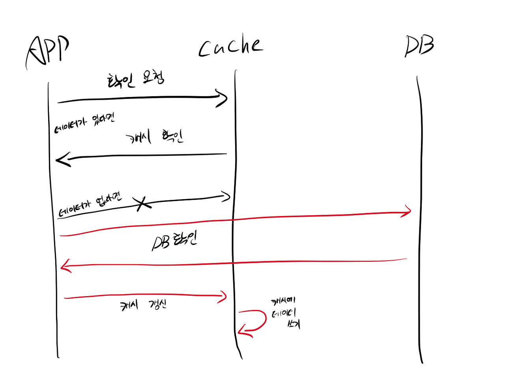
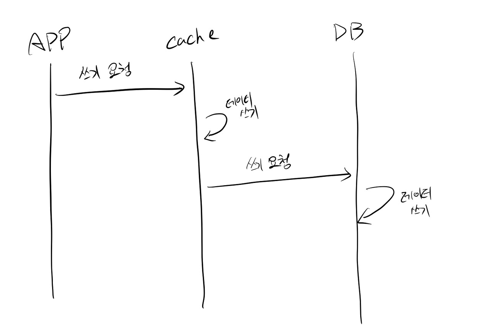
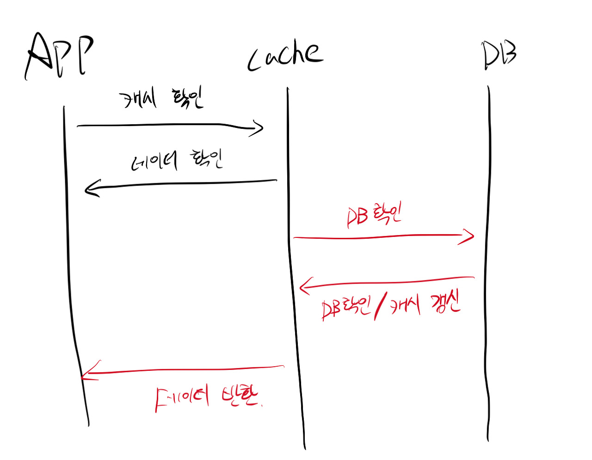
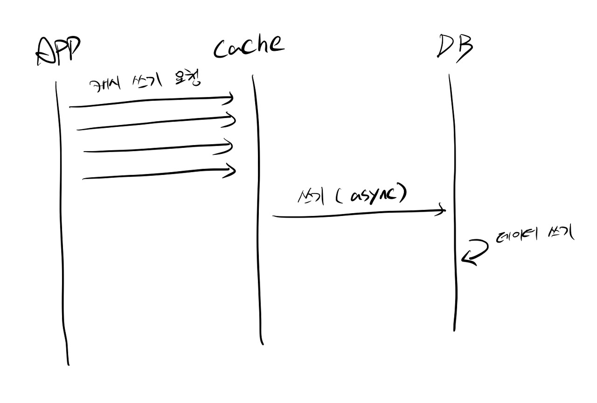

이번에 회사 서비스에 [redis](https://redis.io/)란 것을 도입하게 되었습니다.

**데이터를 메모리에서 처리함으로써 더 빠른 연산을 도모하고 DB의 부하를 덜기 위한 것(캐싱)**
이었습니다.

redis 문서가 잘 되어 있어서 서비스에 도입하는 데까진 문제가 없었습니다.

하지만 redis를 도입하면서도 스스로에게 캐시가 뭐냐고 물었을 때 누구나 말할 수 있는 간단한 답밖에 하지 못한다는 것을 깨달았다.

그래서 이번 기회에 캐시란 무엇인가 정리해보고자 합니다.

---

## 캐시?

> 컴퓨터 과학에서 데이터나 값을 미리 복사해 놓은 임시 장소를 일컫습니다. <br />
> 원본 데이터에 접근하는데 걸리는 시간이 캐시의 접근 시간보다 오래 걸리는 경우나 값을 다시 계산하는데 걸리는 시간을 단축시키고 싶은 경우 사용한다.

예를 들자면, 다이소 본점에 가서 물티슈 하나 사는 것보다 집 앞에 있는 다이소에 가는 게 더 빠르게 사 올 수 있습니다.

### 캐시에는 어떤 정보를 담아야 할까?

캐시에 담을 정보를 생각할 때 많이 고려하는 법칙이 있다. [파레토의 법칙](https://ko.wikipedia.org/wiki/%ED%8C%8C%EB%A0%88%ED%86%A0_%EB%B2%95%EC%B9%99)

파레토의 법칙이란 전체 결과의 80%가 전체 원인의 20%에서 일어나는 현상을 가리킵니다.

약간 말이 아리송한데 해석하자면 이런 뜻입니다.

- 즐겨 입는 옷의 80%는 옷장에 걸린 옷의 20%에 불과하다.
- 20%의 운전자가 전체 교통 위반의 80% 정도를 차지한다.
- 성과의 80%는 근무시간 중 집중력을 발휘한 20%의 시간에 이뤄진다.
- 두뇌의 20%가 문제의 80%를 푼다. 우수한 20%의 인재가 80%의 문제를 해결한다. 혹은 뇌의 20%만 사용하여 문제 해결에 필요한 80%를 해결한다.
- 운동선수 중 20%가 전체 상금 80%를 싹쓸이한다.
- 인터넷 유저의 20%가 80%의 양질의 정보를 생산한다.

이것을 웹 서비스 분야에 적용하자면 전체 요청 중 80%는 나머지 20%가 차지한다.

쉽게 말해 전체 요청 중 80%는 같은 요청이라는 이야기이다.

그래서 캐시에 담을 정보는 본인 서비스에서 어떤 요청이 가장 많은지 파악한 다음 적용해야 한다.

### 지역성

캐시에 담을 정보를 파악하는 데 사용하는 개념이다. 이 개념을 토대로 캐시에 담을 정보를 선별한다.

### 시간 지역성

한번 요청받았던 정보는 가까운 시일 내에 또 요청받을 수 있다는 개념이다.

같은 쿼리로 여러 차례 요청을 받았다면 그 요청만 캐시에 저장해도 성능의 향상을 꾀할 수 있다.

### 공간 지역성

특정 데이터와 가까운 주소가 순서대로 접근되었을 경우를 공간 지역성이라고 한다.

CPU 캐시나 디스크 캐시의 경우 한 메모리 주소에 접근할 때 그 주소뿐 아니라 해당 블록을 전부 캐시에 가져오게 된다.

이때 메모리 주소를 오름차순이나 내림차순으로 접근한다면,

캐시에 이미 저장된 같은 블록의 데이터를 접근하게 되므로 캐시의 효율성이 크게 향상된다.

<br>
예를 들어,

```js
{
  skip: 0,
  limit: 10
},
{
  skip: 10,
  limit: 10
},
{
  skip: 20,
  limit: 10
},
{
  skip: 30,
  limit: 10
}
```

예를 들어 `skip: 30, limit: 10`이 캐시 할 데이터였다고 하더라도 특정 데이터에 접근하려고 순서대로 요청이 온다면 그 요청들을 캐시 하는 것이 성능 향상을 꾀할 수 있다.

### 여기서 드는 의문

캐시가 효율이 좋다면 이렇게 번거롭게 데이터를 선별하지 말고 다 저장하면 되지 않을까?

물론 저장해도 된다... **돈이 많다면!!!**

메모리를 계속 추가해가며 서비스를 유지할 수도 있을 것이다.

하지만 우린 일개 회사에 소속된 개발자이기 때문에 효율을 따져보고 최상의 결과를 내야 한다.

**"CACHE IS CASH"**

---

## 캐싱 전략

캐싱 전략이란 캐시를 위한 방법을 의미한다. 디자인 패턴 같은 개념이라고 생각하면 편하다.

<br >

### Cache Aside

**`cache aside`** 전략이라고 하기도 하고 **`lazy loading`** 전략이라고 하기도 하고 **`look aside`** 전략이라고 하기도 한다. 많은 이름이 있는 만큼 보편적으로 쓰이는 전략이다.



캐시는 DB와 직접 연결되지 않고, 애플리케이션(예를 들면 웹 api 서버)이 주체가 된다.

애플리케이션이 요청을 받으면 , 데이터가 캐시 서버에 있는지 확인을 하며 그 결과에 따라 다음 행동이 결정된다.

캐시에 데이터가 있으면(**Cache Hit**) 그것을 반환한다.

캐시에 데이터가 없으면(**Cache Miss**) DB에서 데이터를 확인한다. 데이터가 있으면 캐시에 그 데이터를 저장하고 사용자에게 반환한다.

#### 장점

이 전략의 장점은 요청받은 데이터만 캐시에 저장한다는 것이다.

따라서 실제로 접근이 있는 데이터만 캐시에 담아서 불필요한 데이터를 캐시에 담지 않는다.

또한 캐시 미스( 캐시에 데이터가 없는 것)가 일어나도 치명적이지 않다. 캐시에 데이터가 없으면 DB에 확인하는 요청을 거치기 때문이다.

#### 단점

**1. 동시성 문제**

캐시에 데이터가 있으면 그것을 바로 반환하기 때문에 캐시에 데이터가 있는 채로 DB의 데이터가 UPDATE 되었다면 캐시와 DB의 데이터가 다를 수 있다.

<br>

**2. 캐시 미스가 일어날 때마다 확인 요청을 거친다.**

- 캐시 미스 발생 시 DB에 확인 요청
- 캐시에 DB에서 받은 데이터 쓰기 요청

캐시 미스가 일어날 때마다 시간이 지연된다.

즉, 처음 받는 요청은 지연이 있다.

#### 해결책

**1. 동시성 문제**

캐시 데이터에 만료 기간을 준다. (TTL: Time to Live)

일정 시간 경과 시 캐시에 있는 데이터를 지워줌으로써 DB와의 동시성을 꾀할 수 있다.

캐시 미스가 일어났을 시 DB에서 데이터를 새로 가져오는 것을 노리는 것이다

<br >

**2. 캐시 미스가 일어날 때 확인 요청 증가**

미리 많은 요청이 일어날 것 같은 데이터를 캐시 해두는 것이다.

예를 들어 메인 페이지에서 쓰는 데이터들이나 상품 페이지 같은 것들이다.

스케줄 작업을 통하여 메인에서 쓰는 데이터나 상품 페이지 ( 전체를 다 하는 건 좀 무리니 1~5페이지 정도..?)를 캐시 해 둔다면 효율일 것이라고 예상된다.

<br >

### Write Through

애플리케이션이 직접 바라보는 것은 DB가 아니라 캐시가 된다.

캐시가 주 DB 역할을 수행한다. DB와 동기화하는 몫은 캐시에 위임된다.

데이터가 캐시와 DB에 모두 반영되었을 때 정상적으로 성공했다고 간주한다.

그리고 요청이 오면 애플리케이션은 캐시에서 값을 읽어서 바로 반환한다.



#### 장점

Cache Aside 전략에서 있던 동시성 문제를 해결할 수 있다.

데이터가 저장되거나 변경되었을 시 캐시 데이터도 갱신해주기 때문에 동시성을 유지할 수 있다.

#### 단점

1. 불필요한 데이터까지도 캐시에 담길 수 있어서 메모리의 낭비로 이어질 수 있다.
2. 값을 쓸 때마다 캐시에도 데이터 갱신을 해야 하기 때문에 쓰기 작업이 많은 서비스라면 성능의 저하가 있을 수 있다.
3. 캐시 미스( 캐시에 데이터가 없을 시)가 발생했을 때 캐시에 데이터를 넣어주기가 애매하다.

<br >

### Read Through

애플리케이션이 바라보는 것은 DB가 아니라 캐시이다. 따라서 DB 동기화하는 몫은 캐시에 위임된다.

최초 데이터 로딩은 미스가 나며, 그때 데이터가 로딩된다. 그 후에는 캐시가 처리한다.

Cache Aside랑 다른 점은 캐시에 데이터를 채우는 것이 애플리케이션이냐 아니냐의 차이이다.



#### 장점

읽기 작업이 많은 경우 적합하다.

#### 단점

cache aside와 비슷하다.

데이터를 처음 요청하면 항상 미스가 일어난다.

### Write Behind

쓰기 요청은 캐시까지 만이다. 캐시에 데이터가 갱신되면 요청은 완료된다.

그리고 별도의 스케줄 작업 등으로 캐시의 데이터가 DB에 동기화된다.



#### 장점

쓰기 작업이 한 번에 많이 일어날 때 적합하다.

예를 들어 요청이 한 번에 많이 몰리는 이벤트, 티켓팅 등이 있다.

한 번에 많이 들어오는 요청들을 캐시에서 처리함으로써 처리 속도를 올릴 수 있다.

그리고 후에 DB에 순차적으로 데이터를 동기화함으로써 DB의 부하를 줄일 수 있다.

#### 단점

캐시에 데이터를 한 번에 모아뒀다가 후에 순차적으로 처리하기 때문에 그 사이에 장애가 발생하면 데이터가 유실될 수 있다.

---

## 결론

캐시에 대해서 알아보았다.

글을 작성하면서 캐시 전략이 있다는 것에 놀랐고 프로젝트에 도입했던 것이 cache aside 전략이라는 이름이 있다는 것에 두 번 놀랐다. 🫢

```toc

```
