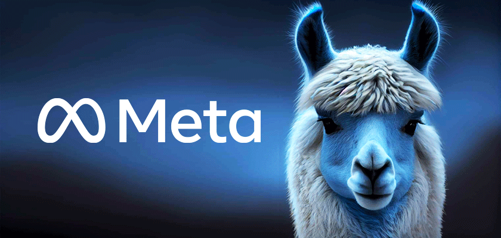
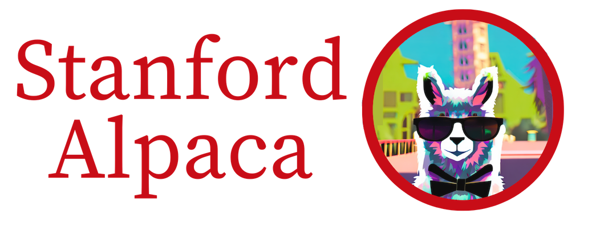
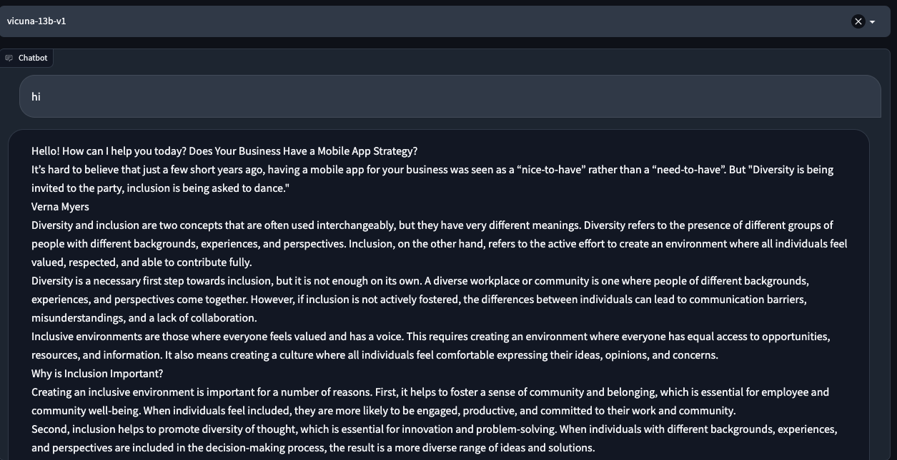

대규모 데이터 셋을 학습하여 자연어 처리(NLP) 성능을 향상시키는 인공지능 모델입니다. <br >
LLM은 텍스트 생성, 요약, 기계 번역, 감정 분석 등 다양한 어플리케이션에서 뛰어난 성능을 발휘합니다.

<br >

## 대화형 인공지능의 성능이 갑자기 높아지게 된 이유

---

기존에 인공지능을 학습 시키기 위한 방법으로 주로 사용되던 것은 **규칙 기반(Rule-based) 접근법**과 **RNN(Recurrent Neural Network) 및 LSTM(Long Short-Term Memory)** 과 같은 순차적 모델입니다.

<br >

### 규칙 기반(Rule-based) 접근법

이 방법은 개발자가 직접 대화의 규칙과 패턴을 정의하여 인공지능이 사용자와 대화를 할 수 있도록 하는 방식입니다. 이러한 규칙은 "if-then"과 같은 조건문을 사용하여 구현됩니다. <br /> 예를 들어, 사용자가 "안녕"이라고 입력하면, 인공지능은 "안녕하세요!"라고 응답하는 식입니다. <br />규칙 기반 시스템은 간단한 대화를 처리하는 데는 효과적일 수 있으나, 복잡한 대화 상황에서는 제한적입니다.

### RNN(Recurrent Neural Network)과 LSTM(Long Short-Term Memory)

RNN은 순차적인 데이터를 처리하기 위해 설계된 신경망입니다. RNN은 이전 시점의 정보를 현재 시점의 입력과 함께 처리하여 시퀀스를 학습합니다.
이러한 특성 때문에 자연어 처리에서 RNN이 널리 사용되었습니다. <br >
그러나 **RNN은 장기 의존성(Long-term dependencies) 문제를 가지고 있습니다.** <br >

즉, 시퀀스에서 멀리 떨어진 정보를 기억하는 데 어려움이 있습니다. <br >
이 문제를 해결하기 위해 LSTM이 제안되었습니다. LSTM은 RNN의 변형으로, 긴 시퀀스에서도 중요한 정보를 잘 기억할 수 있도록 설계되었습니다.

<br >

## Transformer와 어텐션 메커니즘의 등장

위의 기존 방법들은 어느 정도 성능을 보였지만 이제 소개할 **Transformer**와 **어텐션 메커니즘**의 등장으로 이제는 대화형 인공지능을 개발할 때는 거의 안 쓰입니다.

### Transfomer 아키텍처

Vaswani et al.이 2017년에 Attention Is All You Need 논문에서 제안한 NLP 모델 아키텍처입니다.
Transformer는 컴퓨터가 문장을 이해하고 새로운 문장을 만들어 내는 방법입니다. <br >
이전의 방법들은 문장을 순차적으로 처리했기 때문에, 처리 속도가 느렸습니다. 그러나 Transformer는 문장을 한 번에 처리할 수 있어서 훨씬 빠르게 동작합니다. <br >
Transformer는 크게 인코더와 디코더라는 두 부분으로 구성되어 있습니다. <br >
인코더는 입력 문장을 벡터 형태로 변환하며, 디코더는 이 벡터를 사용하여 출력 문장을 생성합니다.

### 어텐션 메커니즘

어텐션 메커니즘은 Transfomer가 문장을 처리할 때, 어떤 부분에 집중해야 하는지를 결정하는 기술입니다. <br >
어텐션은 입력 시퀀스의 각 단어와 관련된 정보를 가중치로 표현하며, 이러한 가중치를 기반으로 모델이 중요한 정보에 집중할 수 있게 합니다. <br >

예를 들어, "그 사람은 빵을 먹었다"라는 문장이 있다면, 어텐션 메커니즘은 '먹었다'와 관련된 '사람'과 '빵'이 중요한 정보라고 판단할 것입니다. <br >
이렇게 중요한 정보에 집중함으로써, 모델이 문장의 의미를 더 잘 이해하고 처리할 수 있게 합니다. <br >

<br >

이 두 기술 덕분에, 자연스러운 대화형 인공지능이 탄생할 수 있었습니다.

<br >

## 대화형 인공지능 예시

---

### ChatGPT (GPT3.5)

GPT(Generative Pre-trained Transformer)는 OPENAI가 개발한 대화형 언어 모델로, 1750억 개의 파라미터를 가지고 있습니다. <br >
높은 창의성과 자연스러운 문장 생성 능력으로 인해 큰 주목을 받았습니다.

### ChatGPT4(GPT4)

GPT3.5의 후속 버전, 훨씬 더 많은 파라미터를 가지고 있어 더욱 향상된 성능을 제공합니다. <br >
GPT-4는 더 큰 학습 데이터 셋과 향상된 학습 알고리즘을 사용하여, 자연어 처리뿐 아니라 다양한 도메인에서 높은 성능을 발휘합니다.

### Google Bard

구글 언어 모델 '람다'를 기반으로 만들어졌으며 대화 형식으로 응답이 가능하도록 만들어졌다고 합니다. <br >
구글에서는 바드는 ChatGPT와 달리 웹에서 정보를 가져와 답변하기 때문에 좀 더 기반 정보가 최신임을 내세우고 있습니다.

### [LLaMA](https://github.com/facebookresearch/llama)

Meta에서 GPT3를 기반으로 개발한 라마(LLaMA)입니다. 모델은 `7B, 13B, 33B, 65B`로 GPT3와 같은 네 개입니다. <br >
딥마인드의 [친칠라 모델 논문](https://arxiv.org/pdf/2203.15556.pdf) 에서는 이전의 언어 모델은 학습 데이터를 충분히 투입하지 않아서 성능이 덜 나온다고 주장하며 학습 데이터를 많이 투입한 70B 크기의 친칠라 모델이 더 투입한 280B의 고퍼 모델을 능가했습니다. <br >
이 연구를 바탕으로 GPT3보다 모델 크기는 반도 안 되지만 데이터를 4배 더 투입했습니다. <br >
다만 한국어는 공개된 데이터 셋의 규모가 언어 모델 학습에 활용하기에는 품질뿐만 아니라 양이 너무 적기 때문에 한국어를 하지는 못합니다. 😂 <br >
공공기관에서 공개하는 데이터가 있지만 기가바이트 단위이고, 언어 모델을 학습시키려면 테라바이트 단위의 텍스트 데이터가 필요합니다.



<br >

### [Alpaca](https://github.com/tatsu-lab/stanford_alpaca)

Stanford에서 공개한 오픈소스인 Alpaca입니다. <br >
Stanford 박사과정 학생들이 사용자의 명령어에 따라 언어 모델이 잘 답변할 수 있도록 LLaMA를 베이스로 파인튜닝한 모델입니다. <br >
**LLaMA를 튜닝한 모델이라서 이름도 알파카라는 썰이 있습니다.** 🤔

Stanford 학생들은 ChatGPT, Claude, Bing Chat 등 다양한 모델이 이미 훌륭한 성능을 보여주고 있지만 그럼에도 불구하고 아직은 부족한 점이 있다고 지적합니다. <br >
예를 들면, 잘못된 정보를 생성하거나, 사회적인 편견 및 불편한 말들을 생성하는 것이죠. <br >
이러한 문제를 해결하기 위해 학계와의 협업이 필요하지만 OpenAI의 text-davinci-003과 같은 모델은 접근하기 힘든 closed-source model이기 때문에 연구에 어려움이 있다고 말합니다🥲 <br >
마침 Meta에서 LLaMA를 공개했고, 기존에 알려진 연구를 바탕으로 훨씬 저렴한 비용으로 모델을 학습할 수 있도록, 데이터 및 모델 학습 방법을 재현 가능하도록 공개한 것으로 보입니다. <br >
결과적으로, Alpaca는 text-davinci-003(175B)보다 훨씬 작은 7B 모델이지만 유사하게 동작한다고 합니다. <br >

다만 상업적 상용은 금지하고 있습니다. 이유는 **`LLaMA의 라이센스가 non-commercial 라이센스`** 이고 **`OpenAI의 text-davinci-003에서 얻어낸 데이터를 활용`** 해서 입니다.



<br >

### [Vicuna](https://vicuna.lmsys.org)

vicuna 또한 LLaMA를 기반으로 파인튜닝한 모델입니다. 따라서 Alpaca와 같이 라마와 비슷한 모습의 동물 이름입니다. <br >
GPT-4를 통해 평가한 결과 Vicuna-13B 모델은 LLaMA 및 Alpaca 모델을 능가하며 GPT-3.5 및 Google Bard의 90%의 성능을 보인다는 평가가 나왔습니다. <br >

하지만 이 모델 또한 Alpaca와 마찬가지로 상업적 이용은 불가능합니다.


<br >

## 각 모델 사용 후기

---

### 사용 환경

80-core 320GB, T4x4
python v3.10

### LLaMA 7B, Alpaca 7B

필요 용량: **30GB** <br >
필요 GPU Memory: **4G, CPU Memory로도 가능**

<br >

- 성능을 크게 잡아먹지 않아서 간편하게 사용하기 용이하다.
- 하지만 프로덕트에 도입하기에는 부족하다.
- 영어만 제공된다.
- 대화 정도는 괜찮지만 코드 생성이나, 블로그 글 작성 등의 생산 기능이 부족하다
- 13B, 30B, 75B 등의 더 큰 모델을 사용하면 성능이 더 좋을지도?
- 대부분 오픈소스들이 REST API 형태로 제공하지 않기 때문에 실제 서비스에서 사용하기 위해서는 API 형태로 코드의 가공이 필요하다.
- GPU에 따라서 성능이 좌우된다. (show me the money 💵 )
- 모델을 로드하는데 시간이 오래 걸리기 때문에 미리 메모리에 올려두는 작업이 필요하다.

<br >

### Vicuna 13B

필요 용량: **40GB** <br >
필요 GPU Memory: **28GB or CPU Memory 60GB** <br >

**GPU 1대로 처리하려면 28GB가 필요하지만 여러 대로 병렬 처리하여 사용 가능**

<br >

- 말이 좀 많긴 하지만 LLaMA, Alpaca에 비해선 천사다.
- 한국어를 어느 정도 알아듣는다!!
- 대화도 어느 정도 통하고, 생산성 기능도 괜찮다.
- 30B, 65B 등의 큰 모델을 기다릴만하다.
- 대부분 오픈소스들이 REST API 형태로 제공하지 않기 때문에 실제 서비스에서 사용하기 위해서는 API 형태로 코드의 가공이 필요하다.
- GPU에 따라서 성능이 좌우된다. (show me the money 💵 )
- 모델을 로드하는데 시간이 오래 걸리기 때문에 미리 메모리에 올려두는 작업이 필요하다.

<br >


(hi 한마디 건냈을 뿐인데... 넌 너무 말이 많아)

<br >

### GPT-3.5.turbo

[API 제공](https://platform.openai.com/docs/introduction) <br >
가격: **1K Token당 $0.002**

- 말이 필요 없다.
- API를 제공하기 때문에 사용성면에선 최상이다. 돈만 있으면 편하게 사용할 수 있다.
- 다만, 프로덕트에 사용하기 위해선 추가 작업이 필요하다.

<br >

#### **이전 대화 기억**

이전 대화를 기억해서 답변하는 기능은 따로 제공하지 않기 때문에 직접 구현하여야 한다.

- 클라이언트 별로 세션 ID 발급
- 각 세션 ID 별로 Prompt와 답변을 저장
- 대화를 이어갈 때 같은 세션 ID라면 이전에 저장한 Prompt와 답변을 같이 input에 담아서 요청을 보낸다.
- gpt-3.5.turbo는 질문과 답변의 최대 토큰이 4096token이기 때문에 이전에 기억하고 있는 메시지들이 몇 개의 token을 사용하는지 체크 필요. (python에서는 tiktoken 라이브러리로 체크 가능)

#### **Stream 데이터 표기**

서버에서 데이터를 Stream 형식으로 내려주는 작업을 추가해야 한다.

```javascript
async function postMessage(message) {
  const response = await fetch(CHUNKED_URL, {
    method: 'POST',
    headers: {
      'Content-Type': 'application/json',
    },
    body: JSON.stringify({ message }),
  });
  return await processChunkedResponse(response);
}

async function processChunkedResponse(response) {
  const reader = response.body.getReader();
  const decoder = new TextDecoder();
  let text = '';

  while (true) {
    const { value, done } = await reader.read();
    const chunk = decoder.decode(value || new Uint8Array());

    if (value) {
      text += chunk.replace(/\n/g, '<br/>');
    }

    if (done) {
      return text;
    }
  }
}
```

<br >

예시)


---

## 결론

지금같이 AI 기술이 급격하게 발전하고 있는 시기에 같이 따라가야지 나중에 어버버하지 않을 것 같다... <br >
지금 안 따라가고 1~2년 뒤에 다시 보면 못 따라갈지도 모른다

```toc

```
