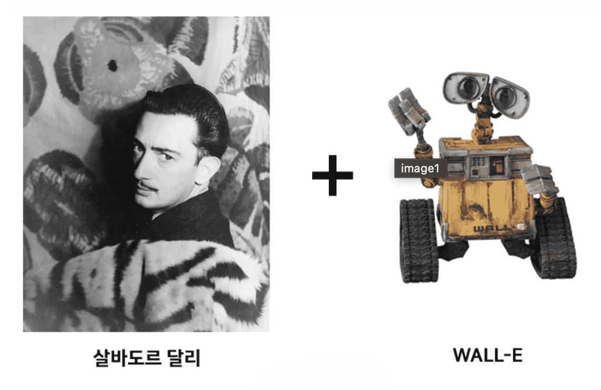
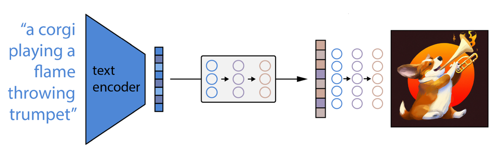

OpenAI에서 개발한 이미지 생성 AI입니다.
텍스트 설명을 기반으로 관련된 이미지를 생성하는 능력을 가지고 있습니다.
DALL-E의 이름은 살바도르 달리와 월-E의 결합에서 생각해냈다고 합니다.



## **DALL-E 1**

---

DALL-E 1은 [GAN](https://pseudo-lab.github.io/Tutorial-Book/chapters/GAN/Ch1-Introduction.html)과 같이 이미를 생성하는 모델이기는 하나, 그 구조는 GAN보다는 GPT-3에 가깝습니다. <br >
GPT-3는 잘 알려진 대로 Transfomer의 Decoder 부분만을 사용하는 Generative 모델로, 입력받은 단어의 token의 sequence를 가지고 다음 단어 token을 차례차례 예측하는 방식입니다. <br >
더물어 매우 많은 데이터로 pre-train 하여 각 단어 간의 관계를 학습한 후 실제 사용 시는 이보다 적은 데이터로 fine-tuning 하게 됩니다. <br >
<br >
DALL-E 1에서도 이런 기본 작동 방식은 같지만 달라진 부분은 출력에서 예측하는 결과가 token이 아니라 이미지의 picxel이라는 것입니다. <br >
입력받은 이미지를 256x256 크기로 조정한 후 이를 **VQ-VAE** 로 처리하여 32x32, 즉 1024개의 token으로 변환합니다. <br >
<br >
원래 데이터를 그대로 학습하려면 약 20만개의 token이 입력되어야 하지만 이를 단 1024개로 줄인 것이다. 실제로는 전체 1280개 token을 입력으로 사용하는데 1024개를 이미지에, 나머지 128개를 이미지를 설명하는 텍스트에 할당합니다.

<br >

## **DALL-E 2는 DALL-E와 무엇이 다를까?**

---

DALL-E 1과 DALL-E 2는 기본적인 동작은 크게 다르지 않습니다.

**큰 그림으로 보면 아래의 3단계로 동작을 설명할 수 있습니다.**

- 먼저 텍스트 프롬프트를 텍스트 인코더에 입력합니다.
- 다음으로, prior 모델이 텍스트 인코딩을 이미지 인코딩으로 매핑하여 프롬프트의 의미 정보를 포착합니다.
- 이미지 디코더가 프롬프트의 의미 정보를 시각적으로 표현한 이미지를 생성합니다.



<br >

### 텍스트 및 시각적 의미 연결

DALL-E 2는 "서울 경복궁 앞을 걸어가는 곰인형"을 입력한 후 다음 이미지를 출력합니다.


<br >

DALL-E 2는 테디 베어와 같은 텍스트 개념이 시각적 공간에서 어떻게 표현되는지 알게 되는 것은, **CLIP**이라는 openAI 모델에 의해서입니다.

CLIP은 OpenAI에서 개발한 텍스트와 이미지 데이터를 모두 이해하는 인공지능 모델입니다. <br >

대규모 데이터 셋을 사용하여 동시에 이미지와 텍스트 데이터를 학습시킵니다.
이 과정에서 모델은 이미지와 텍스트 간의 의미론적 관계를 파악하게 되어, 이미지에 대한 설명을 생성하거나 특정 이미지를 찾는 등의 작업을 수행할 수 있습니다. 이러한 기능은 라벨링 된 데이터 셋이 제한적인 상황에서도 효과적으로 활용될 수 있습니다.

<br >

### CLIP 학습

대규모의 이미지와 텍스트 데이터 셋을 이용하여, 이미지와 텍스트가 서로 연관되도록 모델을 학습시키는 과정입니다. <br >
학습 방법은 **Contrastive Learning**이라는 방식을 사용하며, 이를 통해 모델은 이미지와 텍스트 간의 의미론적 관계를 배우게 됩니다. <br >
Contrastive Learning의 주요 아이디어는 비슷한 특성을 가진 데이터 샘플 간의 거리를 줄이고, 다른 특성을 가진 샘플 간의 거리를 멀게 만드는 것입니다.

#### **학습 단계**

- **데이터 준비**: 대규모의 이미지와 이미지에 대한 텍스트 설명이 포함된 데이터 셋을 준비합니다.
- **텍스트와 이미지 인코딩**: 텍스트와 이미지를 각각의 임베딩 공간으로 인코딩합니다. 텍스트 인코딩은 Transfomer 모델을 사용하고, 이미지 인코딩은 CNN을 사용합니다.
- **Contrastive Learning**: 인코딩된 텍스트와 이미지 쌍을 사용하여, 모델이 이미지와 관련된 텍스트를 구별할 수 있도록 학습시킵니다. <br >이 과정에서 모델은 긍정적인 (이미지/텍스트)와 부정적인 (이미지/텍스트) 사이의 거리를 최대한 멀게 만듭니다.
- **Loss 함수**: 학습 과정에서 모델은 이미지와 텍스트의 거리를 줄이는 방향으로 업데이트됩니다. 이 때 사용되는 Loss 함수는 Contrastive Loss 함수입니다.

[학습 과정 영상](https://www.assemblyai.com/blog/content/media/2022/04/CLIP_training-1.mp4)

<br >

## 사용 후기

---

- openAI에서 API를 제공해 줘서 사용성은 최고이다.
- 현재까지 txt2img, img2img, img2img inpaint 이렇게 3개의 기능을 API로 제공한다.
- inpaint 기능은 사진에서 선택한 영역을 편집하는 기능이다. 다른 물체로 대체할 수도 있고 삭제도 할 수 있다.
- 기본적으로 한글을 이해하지 못하기 때문에 프롬프트는 영어로 적어야 한다. 따라서 한글을 입력받게 하고 싶다면 한글로 입력받은 텍스트를 번역하는 과정이 추가되어야 한다.
- 지원하는 사이즈가 정해져 있다. 256x256, 512x512,1024x1024. 따라서 이 밖의 이미지는 서버에서 리사이즈하는 작업이 추가되어야 한다.
- 리사이즈를 했을 시 투명이 생기는 영역은 DALL-E가 연결해서 그린다. 생각보다 잘 그린다. 🙌

<br >

예시1) inpaint


(원본)

 (눈 감은 표정으로 수정)

<br >

예시2) inpaint


(원본)

 (사람 삭제 및 resize)

<br >

512x512로 이미지 리사이즈 예시 코드 (python)

```python
size = 512
content = await initImage.read()

# 이미지 불러오기
init_image = Image.open(f"test.png")

init_width, init_height = init_image.size

init_new_width = 0
init_new_height = 0

if init_width > init_height:
    init_new_width = size
    init_new_height = int(init_height * (init_new_width / init_width))
else:
    init_new_height = size
    init_new_width = int(init_width * (init_new_height / init_height))

# 이미지 크기 조정
init_resized_image = init_image.resize((init_new_width, init_new_height))

# 새로운 이미지 생성
init_background = Image.new('RGBA', (size, size), (255, 255, 255, 1))

# 이미지 중앙에 배치
x = (size - init_new_width) // 2
y = (size - init_new_height) // 2
init_background.paste(init_resized_image, (x, y))

# 이미지 저장
init_background.save(f"{input_dir}/resize_test.png")
```

---

## 결론

DALL-E를 써본 결과 아직 만족할 만한 성능은 내지 못한다는 결론을 내었다. <br >DALL-E 2로 DALL-E 홈페이지에서 사용한다면 모르겠지만 API로 제공하는 기능은 몇 가지 없기 때문에 프로덕트에 적용하는 것은 시기상조로 보인다.

```toc

```
