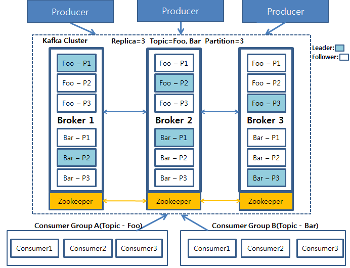
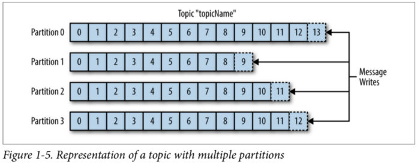
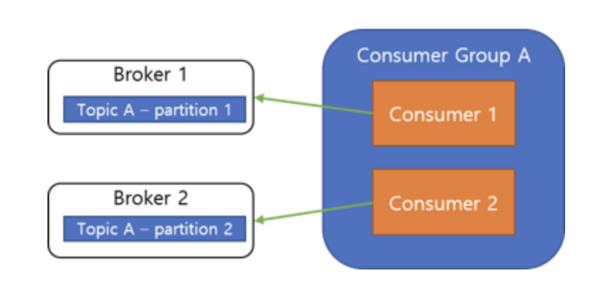
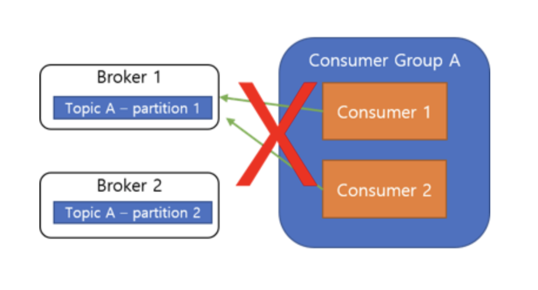
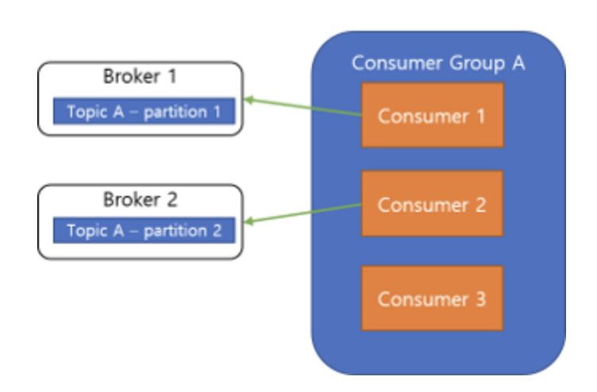
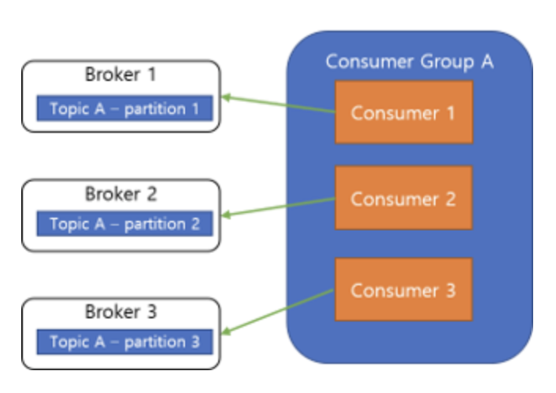

## 1. 카프카(kafka)란?

---

kafka는 `Pub-Sub` 모델의 `메시지 큐`입니다. 분산 환경에 특화되어 있는 특징을 가지고 있습니다. <br >

### 1-1. 아키텍쳐


카프카 클러스터를 중심으로 Producer와 Consumer가 데이터를 Push하고 Pull하는 구조입니다. <br >
Producer, Consumer는 각기 다른 프로세스에서 비동기로 동작하고 있습니다. 아키텍처를 좀 더 자세히 표현하면 아래와 같습니다.
<br >



<br >

## 2. 구성요소

---

### 2-1. Event

`Event`는, kafka에서 Producer와 Consumer가 데이터를 주고받는 단위입니다. 이 글에서는 이벤트 또는 메시지로 표기하겠습니다.

<br >

### 2-2. Producer

`Producer`는 kafka에 메시지를 게시(post) 하는 클라이언트 애플리케이션을 의미합니다.

<br >

### 2-3. Kafka Cluster

Kafka Server로 이루어진 클러스터를 말합니다. Kafka Cluster를 이루는 각 요소는 다음과 같습니다.

#### Broker

> 카프카 서버를 말합니다.

#### Zookeeper

**주키퍼(Zookeeper)는 분산 코디네이션 시스템입니다.** <br >

> Kafka Broker를 하나의 클러스터로 코디네이팅하는 역할을 하며 Kafka Cluster의 리더를 발탁하는 방식도 주키퍼가 제공하는 기능을 이용합니다.

#### Topic

메시지가 쓰이는 곳입니다. Producer는 이 `Topic`에 메시지를 게시합니다. 그리고 Consumer는 Topic으로부터 메시지를 가져와 처리합니다. <br >
Topic은 파일시스템의 폴더와 유사하며, 메시지는 폴더 안의 파일과 유사합니다. <br >
**하나의 Topic은 1개 이상의 Partition으로 구성되어 있습니다.**

> Topic에 저장된 메시지는 필요한 만큼 다시 읽을 수 있습니다.

#### Partition

Topic은 여러 Broker에 분산되어 저장되며, 이렇게 분산된 Topic을 `Partition`이라고 합니다. <br >
어떤 이벤트가 Partition에 저장될지는 메시지의 key(키)에 의해 정해지며, 같은 키를 가지는 메시지는 항상 같은 Partition에 저장됩니다.

> kafka는 Topic의 Partition에 지정된 Consumer가 항상 정확히 동일한 순서로 Partition의 이벤트를 읽을 것을 보장합니다.

#### Leader, Follower

Kafka에서는 각 Partition당 복제된 Partition 중에서 하나의 리더가 선출됩니다. <br >

> 이 리더는 모든 읽기, 쓰기 연산을 담당하게 됩니다. 리더를 제외한 나머지는 팔로워가 되고 이 팔로워들은 단순히 리더의 데이터를 복사하는 역할만 하게 됩니다.

<br >

### 2-4. Consumer

`Consumer`는 이러한 Topic을 구독하고 이로부터 얻어낸 메시지를 처리하는 클라이언트 애플리케이션입니다.

<br >

## 3. Kafka의 주요 개념

---

### 3-1. Producer와 Consumer의 분리

**kafka의 Producer와 Consumer는 완전 별개로 동작을 합니다.** Producer는 Broker의 Topic에 메시지를 게시하기만 하면 되며,
Consumer는 Broker의 특정 Topic에서 메시지를 가져와 처리를 하기만 하면 됩니다.

이 덕분에 높은 Kafka는 높은 확장성을 제공합니다. <br >
즉, Producer 또는 Consumer를 필요에 의해 Scale In, Out 하기에 용이한 구조입니다. <br >
만약, Producer와 Consumer가 직접적으로 연관을 가지고 있다면, 확장 또는 축소 시 이들을 모두 연결 또는 해제를 하기가 매우 번거롭고 어려웠을 것입니다.

<br >

### 3-2. Push와 Pull 모델

kafka의 **`Consumer는 Pull 모델을 기반`** 으로 메시지 처리를 진행합니다. <br >
즉, Broker가 Consumer에게 메시지를 전달하는 것이 아닌, Consumer가 필요할 때, Broker로부터 메시지를 가져와 처리하는 형태입니다.

<br >

이러한 형태는 아래와 같은 장점이 존재합니다.

1. **다양한 소비의 처리 형태와 속도를 고려하지 않아도 됩니다.** <br >
   반대의 경우인 **Push 모델**에서는, Broker가 데이터 전송 속도를 제어하기 때문에, 다양한 메시지 스트림의 소비자를 다루기가 어렵지만, **Pull 모델**은 Consumer가 처리 가능한 때에 메시지를 가져와 처리하기 때문에 다양한 소비자를 다루기가 쉽습니다.

2. **불필요한 지연 없이 일괄처리를 통해 성능 향상 도모** <br >
   Push 모델의 경우에는 요청을 즉시 보내거나, 더 많은 메시지를 한 번에 처리하도록 하기 위해 Buffering을 할 수 있습니다. <br>
   하지만 이런 경우, Consumer가 현재 메시지를 처리할 수 있음에도 대기를 해야합니다. 그렇다고 전송 지연 시간을 최소로 변경하면, 한 번에 하나의 메시지만을 보내도록 하는 것과 같으므로 매우 비효율적입니다. <br >
   Pull 모델의 경우, 마지막으로 처리된 메시지 이후의 메시지를 Consumer가 처리가능한 때에 모두 가져오기 때문에, 이 문제를 해결합니다. 따라서 불필요한 지연 없이 최적의 일괄 처리를 할 수 있습니다.

<br >

### 3-3. 소비된 메시지 추적 (Commit과 Offset)



메시지는 지정된 Topic에 전달됩니다. **Topic은 다시 여러 Partition으로 나뉠 수도 있습니다.** <br>
위 그림에서 각 Partition의 한 칸 한 칸은 **로그**라고 칭합니다.

또한 메시지는 로그에 순차적으로 append 됩니다. 그리고 이 메시지의 상대적인 위치를 **offset**이라고 칭합니다.

메시징 시스템은 `Broker`에서 소비된 메시지에 대한 메타데이터를 유지합니다. <br >
즉, 메시지가 `Consumer`에게 전달되면 Broker는 이를 로컬에 기록하거나, `소비자의 승인`을 기다립니다.

<br >

#### Commit과 Offset

Consumer의 `Poll()`은 이전에 `commit한 offset`이 존재하면, 해당 offset 이후의 메시지를 읽어오게 됩니다. <br >
또 읽어온 뒤, 마지막 offset을 commit을 합니다. 이어서 poll()이 실행되면 방금 전 commit한 offset 이후의 메시지를 읽어와 처리하게 됩니다.

<br >

메시지 소비 중에는 다음과 같은 문제들이 발생할 수도 있습니다.

#### 소비된 메시지 기록 시점

`Broker`가 메시지를 네트워크를 통해 Consumer에게 전달할 때마다 즉시 소비된 것으로 기록하면, Consumer가 메시지 처리를 실패할 때 해당 메시지가 손실됩니다.

<br >

#### 중복 메시지 전송과 멱등성

우선 Consumer가 메시지를 성공적으로 처리하고, 승인을 보내기 전에 Broker가 실패하였다고 판단하고 다시 메시지를 보내게 되면, Consumer는 같은 메시지를 두 번 처리하게 됩니다.

> 따라서, **Consumer는 멱등성을 고려하여야 합니다.** <br> 즉, 같은 메시지를 특수한 상황에 의해 여러 번 받아서 여러 번 처리하더라도 한번 처리한 것과 같은 결과를 가지도록 설계해야 합니다.

<br >

### 3-4. Consumer Group

`Consumer Group`은 하나의 Topic을 구독하는 여러 Consumer들의 모임입니다. Topic을 구독하는 Consumer들을 Group 화하는 이유는, **가용성** 때문입니다. <br >
하나의 Topic을 처리하는 Consumer가 1개인 것보다 여러 개라면 당연히 가용성은 증가할 것입니다.

아래에서 설명드릴 내용이지만, <br > **`Consumer Group`의 각 Consumer들은 하나의 Topic의 각기 다른 Partition의 내용만을 처리할 수 있는데 이를 통해서 kafka는 메시지 처리 순서를 보장한다고 합니다.** <br >
이 때문에, 특정 Partition을 처리하던 Consumer가 처리 불가 상태가 된다면, 해당 Partition의 메시지를 처리할 수 없는 상태가 되어버립니다. 이 때문에 Consumer Group이 필요합니다.

<br >

#### Rebalance

Partition을 담당하던 Consumer가 처리 불가 상태가 되어버리면, Partition과 Consumer를 재조정하여 남은 Consumer Group 내의 Consumer들이 Partition을 적절하게 나누어 처리하게 됩니다.

또한 Consumer Group 내에서 Consumer들 간에 **Offset 정보를 공유**하고 있기 때문에 특정 Consumer가 처리 불가 상태가 되었을 때, 해당 Consumer가 처리한 마지막 Offset 이후부터 처리를 이어서 할 수 있습니다.

이렇게 **Partition을 나머지 Consumer들이 다시 나누어 처리하도록 하는 것을 Rebalance**라고 하며 이를 위해 Consumer Group이 필요합니다.

<br >

#### Consumer Group과 Partition



무조건 Consumer Group 내의 Consumer들은 모두 각기 다른 Partition에 연결되어야 합니다. 이렇게 함으로써, **Consumer의 메시지 처리 순서를 보장**하게 됩니다.

<br >

즉, 아래와 같은 형태로 구성은 불가능합니다.



<br >

#### Consumer 확장

앞서 말씀드린 Consumer Group과 Partition의 관계에 대해 알고 계셔야 Consumer의 성능 향상을 위한 확장을 제대로 하실 수가 있습니다.



Consumer의 성능이 부족해 Consumer를 확장한다고 가정했을 때, 앞서 설명드린 것과 같이 Consumer Group 내의 Consumer는 무조건 각기 다른 Partition에만 연결할 수 있습니다. <br >때문에 **Partition보다 Consumer의 수가 많으면 당연히 새 Consumer는 놀게 됩니다.**



**따라서 Consumer를 확장할 때에는 Partition도 같이 늘려주어야 합니다.**

<br >

### 3-5. 메시지(이벤트) 전달 컨셉

kafka는 메시지를 전달할 때 보장하는 여러 가지 방식이 있습니다.

- **At most once(최대 한번)** <br > **실패나 타임아웃 등이 발생하면 메시지를 버릴 수 있습니다.** <br > 데이터가 일부 누락되더라도 영향이 없는 경우엔 대량처리 및 짧은 주기의 전송 서비스에 유용할 수 있습니다.

- **At least once(최소 한번)** <br > **메시지가 최소 1번 이상 전달되는 것을 보장합니다.** <br > 실패나 타임아웃 등이 발생하면 메시지를 다시 전송하며, 이 경우엔 동일한 메시지가 중복으로 처리될 수 있습니다.

- **Exactly once(정확히 한번)** <br > **메시지가 정확하게 한 번만 전달되는 것을 보장합니다.** <br > 손실이나 중복 없이, 순서대로 메시지를 전송하는 것은 구현 난이도가 높고 비용이 많이 듭니다.

---

[공식 홈페이지](https://kafka.apache.org/documentation)

```toc

```
