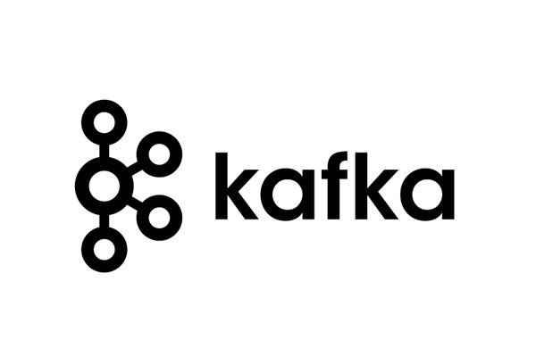
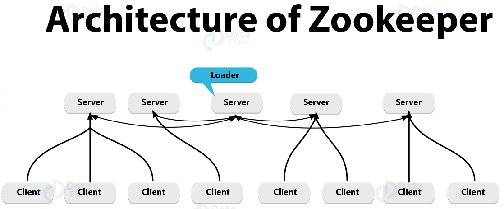
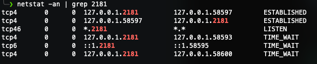
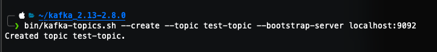
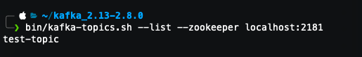
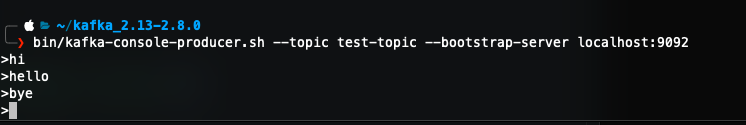
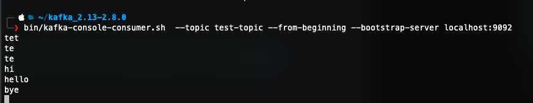
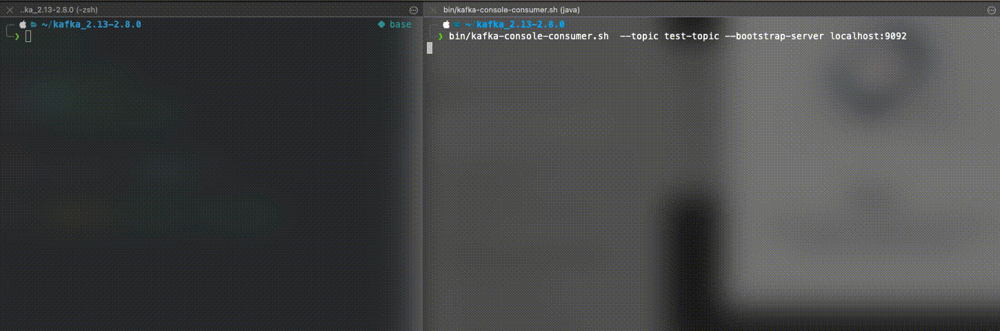
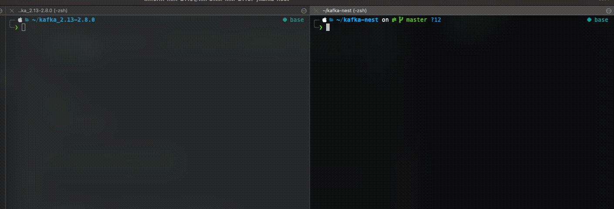

[카프카(kafka)란?](https://j-ho.dev/feature-6)

---

## 설치 방법

### STEP 1. DOWNLOAD KAFKA

```bash

# 다운로드
wget https://archive.apache.org/dist/kafka/2.8.0/kafka_2.13-2.8.0.tgz

# 압축 풀기
tar xvf kafka_2.13-2.8.0.tgz

cd kafka_2.13-2.8.0

```

<br >

### STEP 2. zookeeper 구동

```bash
bin/zookeeper-server-start.sh config/zookeeper.properties
```

백그라운드로 구동시키고 싶을 경우 -daemon 명령어를 추가합니다.

```bash
bin/zookeeper-server-start.sh -daemon config/zookeeper.properties
```

#### [zookeeper](https://zookeeper.apache.org)?

분산 애플리케이션을 구축하다보면, 분산 애플리케이션 관리를 위한 안정적인 코디네이션 애플리케이션이 추가로 필요하게 됩니다. <br >
따라서 안정적인 코디네이션 서비스로 검증된 주키퍼를 많이 사용하게 됩니다.

**주키퍼**는 분산 애플리케이션이 안정적인 서비스를 할 수 있도록 분산되어 있는 각 애플리케이션의 정보를 중앙에 집중하고 구성 관리, 그룹 관리 네이밍, 동기화 등의 서비스를 제공합니다.
<br >



<br >

서버 여러 대를 클러스터로 구성하고, 분산 애플리케이션들이 각각 클라이언트가 되어 주키퍼 서버들과 커넥션을 맺은 후 **상태 정보** 등을 주고 받습니다. <br >
**위의 그림에서 Server는 주키퍼, Client는 카프카가 됩니다.**

<br >

### STEP 3. Kafka 구동

```bash
bin/kafka-server-start.sh -daemon config/server.properties
```

<br >

서비스가 제대로 띄워졌는지 확인해보려면 포트가 정상적으로 리스닝 중인 것을 확인해보면 됩니다.

```bash
netstat -an | grep 2181 # 2181포트는 zookeeper의 client Port
```

<br >



<br >

### STEP 4. TEST

#### 토픽 생성

```bash
bin/kafka-topics.sh --create --topic test-topic --bootstrap-server localhost:9092

# 결과 로그
Created topic test-topic
```

<br >

##### 예시



##### TIP

- --create: 토픽 생성
- --topic [topic-name]: 생성할 토픽 이름
- --partitions [number]: 생성할 토픽의 파티션 개수
- --replication-factor [number]: 각 파티션 내 메시지를 복제할 Replica의 개수
- --bootstrap-server: 연결될 카프카 서버

<br >

#### 토픽 리스트 확인

```bash
bin/kafka-topics.sh --list --zookeeper localhost:2181

# 결과 로그
test-topic
```

##### 예시



<br >

#### 메시지 발행 (Producer)

```bash
bin/kafka-console-producer.sh --topic test-topic --bootstrap-server localhost:9092
```

<br >

명령어 실행 후 > 라인이 생기면 메시지 입력 가능합니다.
enter 키 입력 시 메시지 발행



<br >

#### 메시지 구독 (Consumer)

```bash
bin/kafka-console-consumer.sh --topic test-topic --from-beginning --bootstrap-server localhost:9092
```

<br >

Producer로 발행한 메시지 내용을 확인해 볼 수 있습니다.



<br >

---

## NestJs와 연동하기

NestJs가 기본적으로 설치되어 있다고 가정합니다.

### 1. kafkajs 설치

```bash
yarn add kafkajs
```

<br >

### 2. kafka Service 로직 생성

```typescript
import { Injectable, OnModuleDestroy, OnModuleInit } from '@nestjs/common';
import { Kafka, Producer, Partitioners, Consumer } from 'kafkajs';
import { SUBSCRIBER_FN_REF_MAP, SUBSCRIBER_OBJ_REF_MAP } from './kafka.decorator';
import { KafkaConfig } from './kafka.message';

@Injectable()
export class KafkaService implements OnModuleInit, OnModuleDestroy {
  private kafka: Kafka;
  private producer: Producer;
  private consumer: Consumer;

  constructor(private kafkaConfig: KafkaConfig) {
    this.kafka = new Kafka({
      clientId: this.kafkaConfig.clientId,
      brokers: this.kafkaConfig.brokers,
    });
    this.producer = this.kafka.producer({
      createPartitioner: Partitioners.DefaultPartitioner,
      allowAutoTopicCreation: true,
    });
    this.consumer = this.kafka.consumer({
      allowAutoTopicCreation: true,
      groupId: this.kafkaConfig.groupId,
    });
  }

  async onModuleInit(): Promise<void> {
    await this.connect();

    SUBSCRIBER_FN_REF_MAP.forEach((functionRef, topic) => {
      console.log('subscribe', topic);
      this.bindAllTopicToConsumer(functionRef, topic);
    });

    await this.consumer.run({
      eachMessage: async ({ topic, partition, message }) => {
        const functionRef = SUBSCRIBER_FN_REF_MAP.get(topic);
        const object = SUBSCRIBER_OBJ_REF_MAP.get(topic);
        await functionRef.apply(object, [message.value.toString()]);
      },
    });
  }

  async onModuleDestroy(): Promise<void> {
    await this.disconnect();
  }

  async connect() {
    await this.producer.connect();
    await this.consumer.connect();
  }

  async disconnect() {
    await this.producer.disconnect();
    await this.consumer.disconnect();
  }

  async sendMessage(kafkaTopic: string, kafkaMessage) {
    await this.producer.connect();
    const metadata = await this.producer
      .send({
        topic: kafkaTopic,
        messages: [{ value: JSON.stringify(kafkaMessage) }],
      })
      .catch((e) => console.error(e.message, e));
    await this.producer.disconnect();
    return metadata;
  }

  async bindAllTopicToConsumer(callback, _topic) {
    await this.consumer.subscribe({ topic: _topic, fromBeginning: false });
  }
}
```

<br >

### 3. Kafka Module 생성

```typescript
import { DynamicModule, Global, Module } from '@nestjs/common';
import { KafkaService } from './kafka.service';
import { KafkaConfig } from './kafka.message';

@Global()
@Module({})
export class KafkaModule {
  static register(kafkaConfig: KafkaConfig): DynamicModule {
    console.log('KafkaModule.register', kafkaConfig);
    return {
      global: true,
      module: KafkaModule,
      providers: [
        {
          provide: KafkaService,
          useValue: new KafkaService(kafkaConfig),
        },
      ],
      exports: [KafkaService],
    };
  }
}
```

<br >

### 4. Kafka Type 및 Decorator 생성

```typescript
// type
export class KafkaPayload {
  public body: any;
  public messageId: string;
  public messageType: string;
  public topicName: string;
  public createdTime?: string;

  create?(messageId, body, messageType, topicName): KafkaPayload {
    return {
      messageId,
      body,
      messageType,
      topicName,
      createdTime: new Date().toISOString(),
    };
  }
}

export declare class KafkaConfig {
  clientId: string;
  brokers: string[];
  groupId: string;
}

// ---

// decorator
export const SUBSCRIBER_FN_REF_MAP = new Map();
export const SUBSCRIBER_OBJ_REF_MAP = new Map();

export function SubscribeTo(topic) {
  return (target, propertyKey, descriptor) => {
    const originalMethod = target[propertyKey];
    SUBSCRIBER_FN_REF_MAP.set(topic, originalMethod);
    SUBSCRIBER_OBJ_REF_MAP.set(topic, target);
    return descriptor;
  };
}
```

### 5. App Module에 Kafka Module Import

```typescript
import { Module } from '@nestjs/common';
import { AppController } from './app.controller';
import { AppService } from './app.service';
import { KafkaModule } from './kafka/kafka.module';

@Module({
  imports: [
    KafkaModule.register({
      clientId: `test-id`,
      brokers: ['localhost:9092'],
      groupId: 'consumer-group-id',
    }),
  ],
  controllers: [AppController],
  providers: [AppService],
})
export class AppModule {}
```

<br >

### 6. App Service Producer 함수 생성

```typescript
import { Injectable } from '@nestjs/common';
import { Producer } from 'kafkajs';
import { KafkaService } from './kafka/kafka.service';

@Injectable()
export class AppService {
  constructor(private readonly kafkaService: KafkaService) {}

  async sendMessage() {
    return this.kafkaService.sendMessage('test-topic', 'Hello World!');
  }
}
```

<br >

### 7. Producer Test

```bash
# 메시지 발행
curl -X POST http://localhost:3000/send-message

# ----
# 메시지 구독
bin/kafka-console-consumer.sh  --topic test-topic --from-beginning --bootstrap-server localhost:9092

```

<br >



<br >

### 8. App Service Consumer 함수 생성

```typescript
import { Injectable } from '@nestjs/common';
import { SubscribeTo } from './kafka/kafka.decorator';
import { KafkaService } from './kafka/kafka.service';

@Injectable()
export class AppService {
  ...

  @SubscribeTo('test-topic')
  async subscribeToTestTopic(message: string) {
    console.log('message', message);
  }
}
```

<br >



<br />

---

지금까지 카프카 설치부터 NestJs에 연동하는 방법을 알아보았습니다.

[공식 홈페이지](https://kafka.apache.org/documentation)

```toc

```
