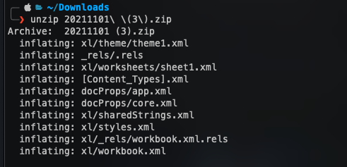
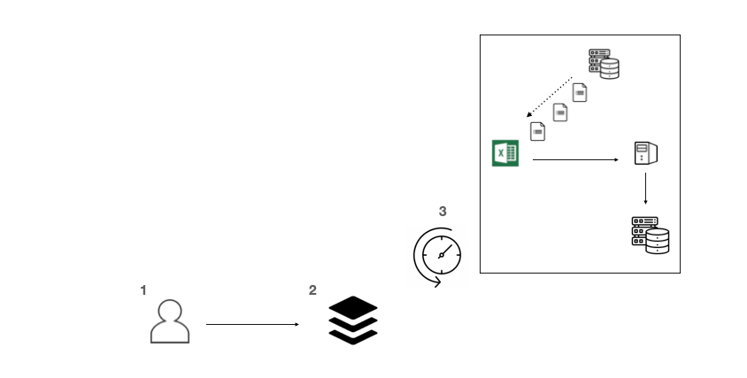

하루는 개발팀에게 CS가 들어왔습니다. 고객이 엑셀 다운로드하려고 하는데 브라우저가 죽는다는 CS였습니다.

확인 결과 DB에서 데이터를 읽어온 후 클라이언트 단에서 엑셀 파일을 생성하고 있는 것이였습니다.

기존에는 `3만 건` 이하의 데이터를 만들고 있었고, 이슈가 된 데이터 수를 확인하니 `18만 건의 데이터`로 확인되었습니다.

<br >

## 엑셀 파일을 만들다가 브라우저가 죽다니?

XLSX 파일의 형식은 OOXML(Open Office XML) 입니다. OOXML 이름 그대로 XML을 기반으로 데이터를 저장하고 표현합니다.
XLSX 파일은 여러 XML 파일을 포함하는 폴더를 압축한 형태입니다. **(확장자를 .zip으로 변경 후 압축을 해제하면 아래와 같은 파일을 볼 수 있습니다.)**



row의 정보는 `{sheetName}.xml` 파일에 저장되는데 이 파일에는 필요한 정보 외에 XML 오버헤드도 굉장히 많기 때문에 몇 만의 row 정보를 한 번에 메모리에 올리면 `OOM`이 발생할 가능성이 큽니다.

따라서 stream처리가 되어야 합니다.

기존 구조는 아래와 같았습니다. 데이터를 읽어와서 클라이언트(브라우저)에서 바로 만드는 것이였습니다.


기존의 데이터 수량으로는 브라우저에서 엑셀 데이터를 만드는 것이 가능했을지 몰라도 이제는 변경해야 한다고 판단하고 개선 작업을 진행했습니다.

<br >

> **저 서비스를 사용하는 유저는 10명 미만으로 아래 방법들은 그것을 고려하여 작은 볼륨으로 작업한 것입니다.**

<br >

## 1. 해결해보자

엑셀 파일을 생성하는 서버에서 엑셀 다운로드 요청이 왔을 때, 빈 엑셀 파일을 우선 생성하고
DB에서 데이터를 Stream으로 읽어와 row 하나씩 엑셀 파일에 append하는 방식입니다.

엑셀 데이터가 완료되면 클라우드 스토리지에 업로드 후 사용자에게 엑셀 파일을 내려 줍니다.


<br >


<br >

> 브라우저가 죽는 현상은 해결되었으나, 데이터가 많아질 수록 사용자가 엑셀이 다운받아질 동안 대기해야하는 문제가 발생

<br >

## 2. 해결해보자

위의 문제를 해결하기 위해 비동기처리를 했습니다.

클라이언트에서 엑셀 파일 요청을 보내면 서버에선 대기열에 쌓아두고 `Status 200`으로 클라이언트에 상태를 내려줍니다.

서버에선 대기열에 쌓인 요청들을 해결 1과 같이 처리를 합니다.

이런 방식으로 하면 유저는 로딩화면을 계속 볼 필요없이 다른 작업을 하다가 엑셀 다운로드 페이지에서 생성된 엑셀을 다운로드하면 됩니다.



<br >


<br >

## 참고

- [NAVER TECH BLOG](https://d2.naver.com/helloworld/9423440)

---

저의 회사 환경과 서비스를 사용하는 유저의 수를 고려해서 작은 볼륨으로 작업할 수 있는 해결 방법을 제안했지만 다른 방법도 많이 있을 것입니다.

```toc

```
