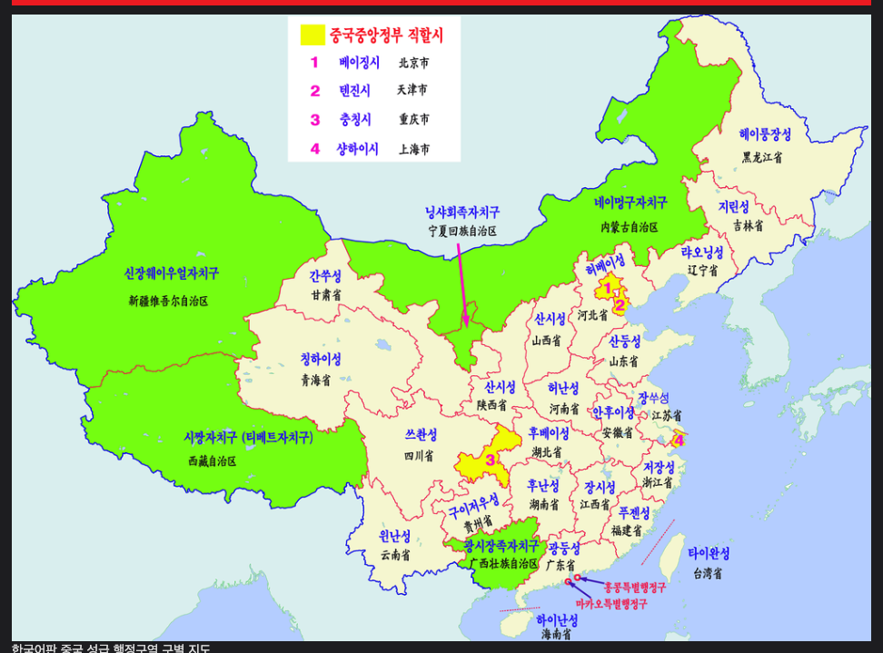
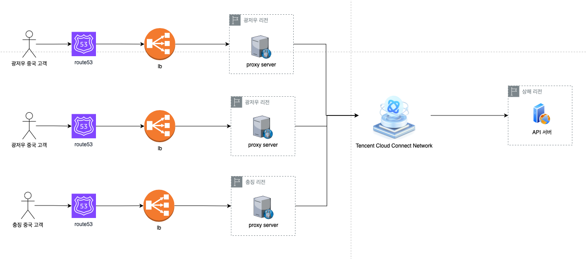

국가 간 API 통신은 일반적으로 느립니다. 예를 들어 한국에서 해외 사이트 접속 시 화면이 늦게 뜨는 등을 예로 들 수 있습니다.

이유가 무엇일까요?

이유를 하나만 꼽자면 바로 **물리적인 거리**를 대표적으로 꼽을 수 있겠습니다.

이번에는 국가 간 API 통신 이슈를 어떻게 해결했는지 공유해보도록 하겠습니다.

<br >

## 현재 회사에서는 중국 고객들을 타깃으로 하는 커머스 플랫폼을 오픈한지 얼마 안 된 때였습니다.

하루는 고객들에게 대량의 CS가 들어왔습니다. CS의 내용의 대부분은 커머스 화면이 너무 늦게 뜬다는 것이였습니다. 그래서 우선 DB 쿼리 시간부터 확인했습니다. `slow query`가 발생하는 지부터 파악해야 한다고 생각했습니다. **하지만 아니였습니다.**

문제의 원인을 고민하던 중 우선 얼마나 늦게 화면이 뜨는지 한국에서 접속해 보았습니다. 접속 요청 후 대략 3~5초 정도 후에 화면이 떴습니다. 일반적인 웹사이트가 이 정도면 엄청 늦게 뜨는 것이겠지만 여긴 한국이고 서버는 중국 상해 리전에 있으니 충분히 감안할 만한 일이었습니다. 더군다나 고객은 중국에서 접속하니 이것보다 더 빠르게 뜰 것이라고 생각했습니다.

> **그것은 저의 착각이였습니다.**

현재 서버는 `상해 리전`에서 운영 중입니다. 그리고 요청한 유저의 위치를 확인해보니 `광저우`였습니다. <br />
처음엔 문제가 뭔지 몰랐으나 중국 지도를 보고 문제를 알 수 있었습니다.

> **상해와 광저우 사이의 거리는 육지로는 912마일(1467km), 비행 거리는 812마일(1306km) 입니다.**


<br >

> **상해와 서울 간의 거리보다 더 먼 것이였습니다. 538마일 (866km)**


<br >

이정도의 거리라면 광저우에 있는 고객이 접속하는 것보다 서울에서 접속하는 것이 더 빠를 수도 있습니다. (대륙...)

<br >

## 해결해보자

문제의 원인을 파악했으니 이제 해결할 차례입니다. 우선 중국을 4등분을 해봅니다. 저는 중국에서 가장 인구수가 많은 지역을 기준으로 `광저우`, `베이징`, `충징`, `상해` 이렇게 나누었습니다.



<br >

그리고 각 리전에 `프록시 서버(Proxy Server)`를 세팅합니다. 각 지역에서 오는 요청을 해당 리전의 프록시 서버로 보냅니다. 요청을 받은 프록시 서버는 Tencent Cloud에서 제공하는 [가속화망](https://www.tencentcloud.com/ko/products/ccn)을 통해 상해로 요청을 전달합니다. 그리고 응답도 마찬가지로 가속화망을 통해 프록시 서버로 와서 유저에게로 전달됩니다.



---

```toc

```
