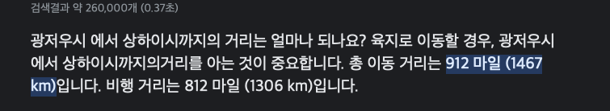
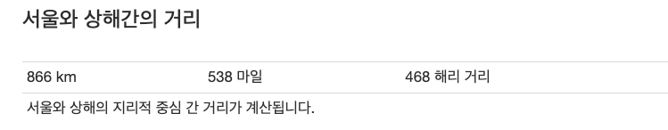

국가 간 API 통신은 일반적으로 느립니다. 예를 들어 한국에서 해외 사이트 접속 시 화면이 늦게 뜨는 등을 예로 들 수 있습니다.

이유가 무엇일까요?

이유를 하나만 꼽자면 바로 **물리적인 거리**를 대표적으로 꼽을 수 있겠습니다.

이번에는 국가 간 API 통신 이슈를 어떻게 해결했는지 공유해보도록 하겠습니다.

<br >

## 화면이 늦게 뜬다구?

서비스를 오픈하고 얼마 지나지 않아서 하루는 고객에게 화면이 너무 늦게 뜬다는 CS가 들어왔습니다. <br >
처음엔 서버 코드의 이슈인지 파악하기 위해 API 들의 실행 시간을 체크했습니다. 하지만 이상이 API 상에는 문제가 없었습니다. DB를 조회하는 코드도 체크를 했기 때문에 `DB에서 slow query`가 발생한 것도 아니였습니다.

<br >

그러던 중 혹시 앱 페이지를 로드할 때 이미지를 가져오는 부분이 문제일 지 모른다고 생각했습니다. 그 이유는 현재 이미지들은 서울 리전의 스토리지에 업로드 되어 있고 앱에선 그 스토리지를 직접 바라보고 있었기 때문입니다. <br />
또한 `HTTP1.1 프로토콜`을 사용하고 있었기 때문에 Network 요청의 수가 제한되어 있었습니다.

그래서 CDN을 도입하고, Network 요청의 제한이 없는 HTTP2 프로토콜을 사용하여 해결을 했다고 생각했습니다.

## CDN이랑 HTTP2를 도입했으니 이제는 괜찮겠지!

하지만 CS는 여전했습니다. 문제의 원인을 고민하던 중 순간 떠오른 부분이 있었습니다. <br >
현재 API 서버는 `상해 리전`에서 운영 중입니다. 그리고 요청한 유저의 위치를 확인해보니 `광저우`였습니다. <br />
처음엔 문제가 뭔지 몰랐으나 중국 지도를 보고 문제를 알 수 있었습니다.

> **상해와 광저우 사이의 거리는 육지로는 912마일(1467km), 비행 거리는 812마일(1306km) 입니다.**



<br >

> **상해와 서울 간의 거리보다 더 먼 것이였습니다. 538마일 (866km)**



<br >

이정도의 거리라면 광저우에 있는 고객이 접속하는 것보다 서울에서 접속하는 것이 더 빠를 수도 있습니다. (대륙...)

사용자가 앱에 접속했을 때 대략적으로 아래와 같은 프로세스를 거칩니다.

1. 앱 접속
2. 퍼블릭 도메인으로 API 요청
3. DNS에서 도메인이랑 매칭되는 IP 주소 조회
4. IP 주소는 상해 리전의 Load balancer IP 주소
5. 상해 리전의 Load balancer로 요청
6. API 서버에서 요청에 맞는 로직 처리 후 반환

**이 경우 고객이 상해에서 요청을 보낸다면 괜찮지만 다른 지역에 있을 경우 레이턴시가 발생할 수 있습니다.**

<br >

## 해결해보자

문제의 원인을 파악했으니 이제 해결할 차례입니다. 우선 중국을 4등분을 해봅니다. 저는 중국에서 가장 인구수가 많은 지역을 기준으로 `광저우`, `베이징`, `충징`, `상해` 이렇게 나누었습니다.


<br >

그리고 각 리전에 `프록시 서버(Proxy Server)`를 세팅합니다. 각 지역에서 오는 요청을 해당 리전의 프록시 서버로 보냅니다. 요청을 받은 프록시 서버는 Tencent Cloud에서 제공하는 [가속화망](https://www.tencentcloud.com/ko/products/ccn)을 통해 상해로 요청을 전달합니다. 그리고 응답도 마찬가지로 가속화망을 통해 프록시 서버로 와서 유저에게로 전달됩니다.


---

```toc

```
