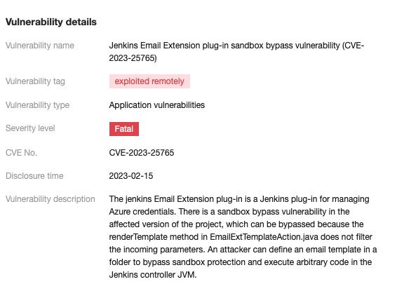

## Jenkins 서버에서 취약점이 발견되었다?

하루는 클라우드 서비스의 `CWPP(Cloud Workload Projection Platform)`에서 Jenkins 서버가 떠있는 인스턴스에 심각한 취약점이 발견되었다고 알람이 왔습니다.



<br >

원인을 파악해보니 `Jenkins Email Extension plug-in` 해당 플러그인에서 취약점이 발견되었다는 것입니다. (이슈 번호 [CVE-2023-25765](https://www.jenkins.io/security/advisory/2023-02-15/#SECURITY-2939))

<br >

## 해결해보자

해당 플러그인의 2.93버전 이하에서 발견되는 이슈였습니다. 간단하게 버전을 2.93.1 이상으로 업그레이드하면 이슈가 해결될 것입니다.

따라서 jenkins 버전을 업그레이드 하기로 결정했습니다.

```bash
# centos 기반
sudo rpm --import https://pkg.jenkins.io/redhat/jenkins.io-2023.key

yum update jenkins -y
```

<br>

> 만약 jenkins 버전을 업데이트했는데 jenkins가 실행이 안된다면 `jdk 버전`을 확인해봐야 합니다. <br /> jenkins v2.375.1-1.1 버전부터는 **jdk11버전** 이상이 필요합니다.

```bash
curl -L https://corretto.aws/downloads/latest/amazon-corretto-11-x64-linux-jdk.rpm -o jdk11.rpm

yum install jdk11.rpm
```

---

```toc

```
