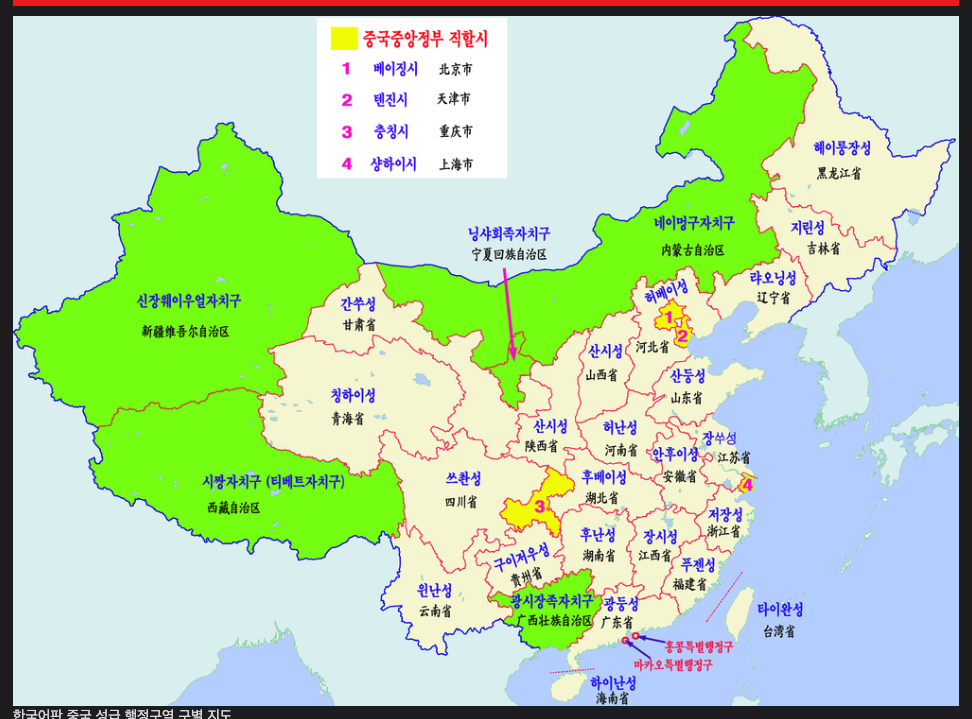
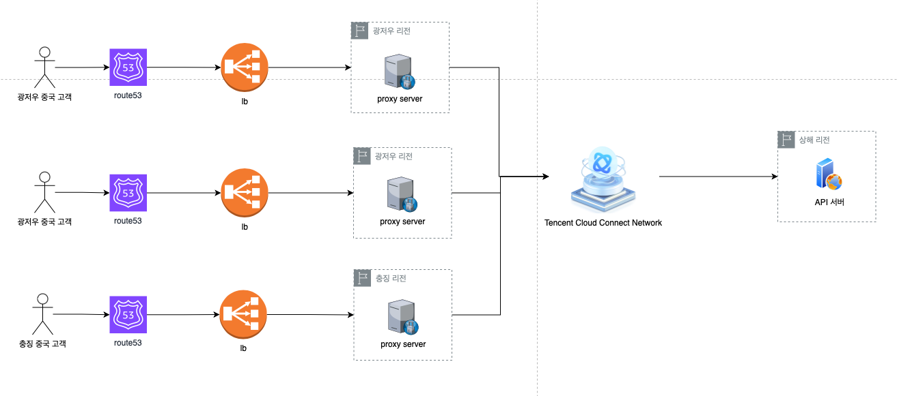

> 중국 고객들을 위한 커머스 플랫폼을 운영할 때 있던 이슈에 대해 공유하려고 합니다.

<br >

## 이슈

커머스 플랫폼을 오픈하고 얼마지나지 않았던 때였습니다. <br >
어느 때처럼 기능 추가와 버그 수정을 하고 있던 때에 CS가 들어왔습니다.
내용을 확인해보니 화면이 늦게 뜬다는 것이였습니다.

<br >

## 원인

원인을 파악해보니 문제는 API 서버의 응답 시간 문제였습니다. <br >
그래서 API 코드를 한줄 한줄 보면서 시간을 체크해봤는데 코드 상에서는 문제가 보이지 않았습니다. <br >
그러던 중 떠오르는 문제가 하나 있었습니다. 현재 API 서버는 `상해 리전`에서 운영 중인데, 요청한 유저의 위치를 확인해보니 `광저우`였습니다. 처음엔 문제가 뭔지 몰랐으나 중국 지도를 보고 문제를 알 수 있었습니다.

**상해와 광저우 사이의 거리는 육지로는 912마일(1467km), 비행 거리는 812마일(1306km) 입니다.**


<br >

**상해와 서울 간의 거리보다 더 먼 것이였습니다. 538마일 (866km)**


<br >

이정도의 거리라면 광저우에 있는 고객이 접속하는 것보다 서울에서 접속하는 것이 더 빠를 수도 있습니다. (대륙...)

<br >

## 해결

문제의 원인을 파악했으니 이제 해결할 차례입니다. 우선 중국을 4등분을 해봅니다. 저는 중국에서 가장 인구수가 많은 지역을 기준으로 `광저우`, `베이징`, `충징`, `상해` 이렇게 나누었습니다.



<br >

그리고 각 리전에 `프록시 서버(Proxy Server)`를 세팅합니다. 각 지역에서 오는 요청을 해당 리전의 프록시 서버로 보냅니다. 요청을 받은 프록시 서버는 Tencent Cloud에서 제공하는 [가속화망](https://www.tencentcloud.com/ko/products/ccn)을 통해 상해로 요청을 전달합니다. 그리고 응답도 마찬가지로 가속화망을 통해 프록시 서버로 와서 유저에게로 전달됩니다.



---

```toc

```
