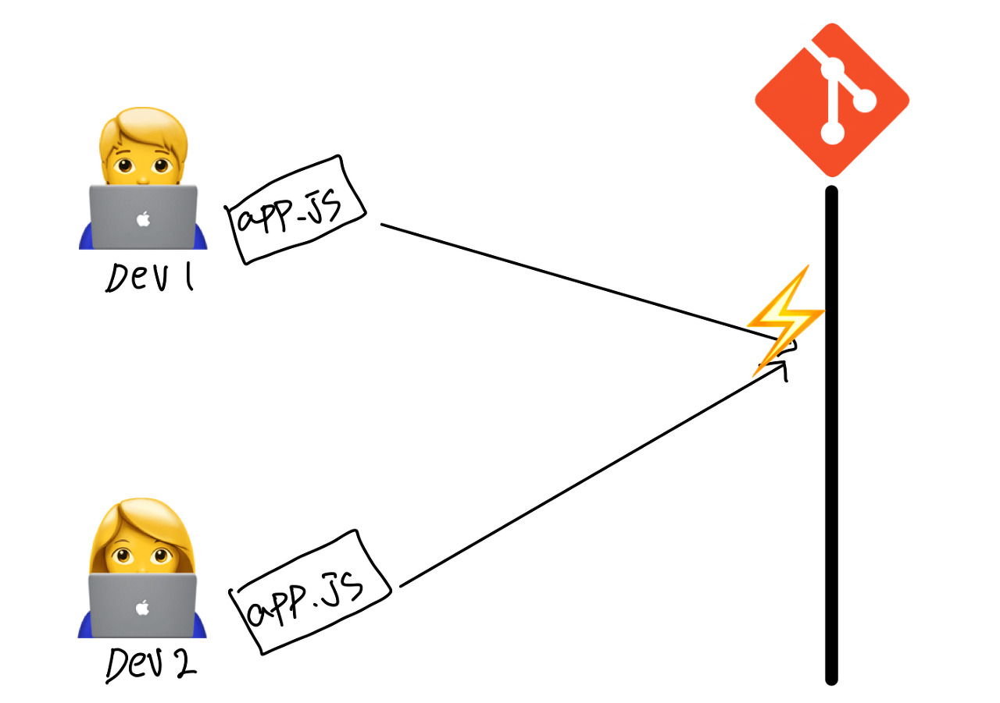
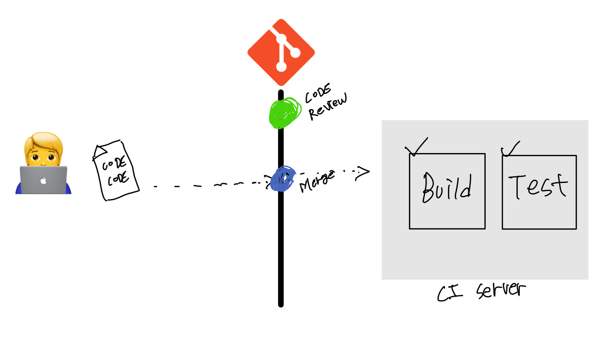
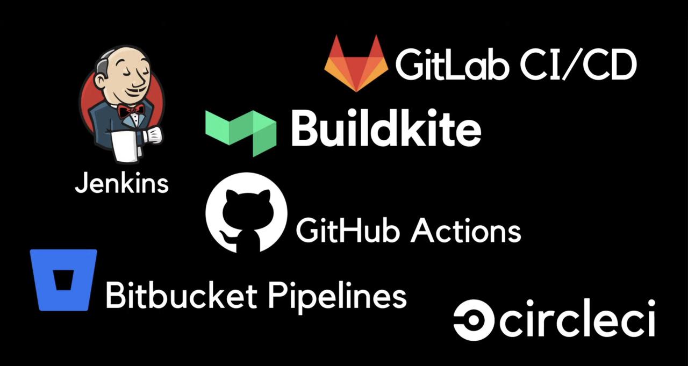

**CI/CD** 란 용어를 알고 계신가요?

요즘 같이 빠르게 진화하고 변화하는 시대에는 어떻게 하면 시장과 고객의 요구에 빠르게 반응해서 제품을 출시, 업데이트할 것인가가 큰 과제입니다.

이 같은 고민을 해결하기 위해 많은 기업들이 **CI/CD**를 개발 프로세스로 사용하고 있습니다.

대부분의 it회사에서 **CI/CD** 환경에서 일하고 있기 때문에 개발자라면 **CI/CD** 란 무엇인지 정확하게 알아두면 좋습니다.

---

## CI/CD?

> 애플리케이션 개발 단계부터 배포 때까지 배포 때까지 이 모든 단계들을 자동화를 통해 조금 더 효율적이고 빠르게
> 사용자에게 빈번히 배포할 수 있도록 만드는 것을 말합니다.

### CI( Continuous Integration ) - 지속적인 통합

> 버그 수정이나 신규 기능들이 메인 Repository에 주기적으로 Build 되고 Test가 되어서 Merge 되는 것을 말합니다.

이 방식은 1991년 **Grady Booch**에 의해 처음으로 사용되었습니다.


후에는 **Extreme Programming** 개발 방법론에도 채택되었습니다.

CI는 2가지를 포인트로 잡고 생각하시면 좋습니다.

#### 1. 개발자들은 코드 변경 사항을 메인 Repository에 주기적으로 빈번하게 Merge 해야 합니다.

예를 들어 동일한 소스파일 위에서 두 명의 개발자가 오랜 기간 서로 작업을 하다가 머지를 하려고 한다면

서로 다른 코드를 어떻게 통합해서 적용해 나갈 건지 고생을 많이 할 것입니다.

이렇게 된다면 새로운 기능을 개발하기 위해서 코드를 작성하는 시간보다, Merge Conflict을 해결하기 위해 더 시간을 써야 할지도 모릅니다.



그렇기 때문에 버그를 수정하거나 신규 기능을 구현할 때는 작은 단위로 나눠서 메인 Repository 반영하거나, 배포하는 것이 중요합니다.

#### 2. 통합을 위한 단계( Build, Test, Merge )의 자동화

주기적으로 머지된 코드의 변경 사항이 자동으로 빌드가 되어서, 성공적 빌드가 완료되는지 확인이 되어야 합니다.

그리고 빌드가 된 코드 변경사항뿐만 아니라 기존 시스템에 다른 버그를 초래하지는 않았는지 자동으로 테스트까지 되어야 합니다.



보통 다른 회사들이 위와 같이 셋업을 많이 합니다

메인 Repository가 있고 개발자들은 하루에도 몇 번씩 코드를 머지합니다. (**물론! 코드 리뷰는 받아야겠죠?**)

이렇게 머지가 되었으면 자동으로 회사에서 만든 CI 스크립트를 통해 자동으로 빌드가 되고 완료된다면 팀에서 작성한 유닛 테스트 등 같은 여러 가지 테스트들도 이 때 실행이 됩니다. (저희 회사는 테스트는 적용하지 않았습니다 ㅠㅠ **바쁘다 바빠 현대사회...**)

빌드와 테스트가 정상적으로 완료되었다면 성공 노티를 보내고 실패를 했다면 실패 노티를 보냅니다. ( Slack 😀 )

<br>

이렇게 CI 방식을 적용했을 때의 장점은

주기적으로 머지를 하기 때문에 **Merge Conflict** 발생 빈도가 적습니다.

따라서 개발 생산성이 향상됩니다. ( **Conflict 해결 시간 단축** 😂)

그리고 머지되는 모든 코드들은 자동으로 빌드되고 테스트되기 때문에 문제점을 빠르게 발견할 수 있습니다.

이렇게 발견되는 버그는 수정이 용이합니다.

이유는 주기적으로 작은 단위로 머지하기 때문에 문제가 된 코드를 빠르게 확인해서 수정할 수 있습니다.

### CD ( Continuous Delivery / Deployment ) - 지속적인 제공 / 배포

> 마지막 배포 단계에서 어떻게 하면 자동화해서 배포를 만들 수 있을지를 고민하는 단계입니다.

#### Continuous Delivery

CI를 통해서 코드들이 자동으로 **빌드, 테스트**되었다면 이제 배포할 준비 과정을 거쳐야 합니다.

**Prepare Release**라고 하는데 여기에서는 준비된 Release가 정상적인지 직접 개발자나 QA가 검증을 한 다음, 검증이 통과되면 **수동적으로 배포**합니다.

#### Continuous Deployment

Continuous Delivery랑 거의 같지만 Release를 자동으로 검증하고 검증이 완료되면 **자동으로 배포**하는 단계를 말합니다.

둘 다 비슷 하지만 최종 단계가 자동인지 수동인지에 따라서 용어가 달라집니다.

CI를 구성한 방식과 Release 검증에 자신이 있다면 자동 배포를 아니라면 수동 배포를 사용합니다. (물론 회사의 상황에 따라 다릅니다.)

회사마다 구성 방식이 다르기 때문에 모든 회사가 같은 CI/CD 거치는 것은 아닙니다.

---

## 결론

CI / CD를 자동화해주는 툴은 여러 가지 있습니다.



회사마다 사용하는 툴이 다르기 때문에 회사에 맞게 공부하시면 되겠습니다.

CI/CD에 대해 알아보았는데 도움이 되었다면 좋겠습니다. 🙌

<br >

> **CI/CD** <br > **CODE => BUILD => TEST => RELEASE => DEPLOY**

```toc

```
