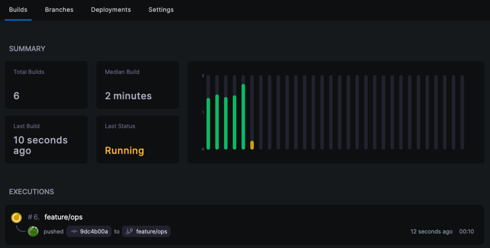

Drone CI는 도커(Docker)를 기반으로 [harness](https://harness.io)에서 개발한 오픈 소스 CI 플랫폼입니다.

모든 구성 요소는 도커 컨테이너(Docker Container)로 되어 있으며 파이프라인 단계 실행도 도커 컨테이너로 수행됩니다.

Go lang으로 작성되어 매우 가볍고 설정 파일도 간단한 YAML 파일로 구성할 수 있어 유지보수, 디버깅이 합니다.

또한 공통적인 파이프라인이 있을 경우 Template을 등록하여 공통적으로 사용할 수도 있습니다.

<br >

## [Drone Server](https://docs.drone.io/server/overview/)

Drone Server는 저장소에서 변경 사항을 모니터링 합니다. 저장소에 저장된 구성 파일(.drone.yml)에 따라 Drone Runner에 task를 추가합니다.

<br >

## [Drone Runner](https://docs.drone.io/runner/overview/)

Drone Runner는 Drone Server에서 task들을 polling합니다. 후에 지정된 pipeline을 실행합니다.

<br >

## For Bitbucket

이 글에서는 Drone CI에 Bitbucket을 연동하는 과정을 설명하겠습니다.

우선 연동을 위해선 Bitbucket OAuth를 위한 key, Secret이 필요합니다.

### BitBucket > Workspace Settings 접속


<br >

### OAuth Consumer > Add Consumer 클릭

그 후 아래와 같이 정보를 입력합니다.


<br>

- **Callback URL**: OAuth 인증을 위한 콜백 URL입니다. Drone Server의 `{URL}/login`으로 입력해주시면 됩니다. 언제든 수정 가능하니 우선 https://example.com/login으로 입력하셔도 됩니다.
- **URL**: Drone Server의 URL을 입력해주세요.

<br >

입력을 완료하신다면 아래와 같이 Key와 Secret Key가 생성됩니다.


<br >

> 창을 닫지 마시고 아래의 단계를 이어서 진행해주세요.

<br >

## 설치

Drone CI 서버를 띄워보겠습니다. 위에서 말씀드렸다시피 Drone CI는 구성 요소가 모두 도커로 되어 있습니다.

따라서 도커 컨테이너로 Drone을 띄우시면 됩니다. 아래는 `docker-compose.yml`입니다.

```yaml
# Docker-compose file

version: '3.1'

services:
  server:
    image: drone/drone:latest
    container_name: drone
    volumes:
      - /var/lib/drone:/data
    environment:
      - DRONE_BITBUCKET_SERVER=https://bitbucket.org
      - DRONE_BITBUCKET_CLIENT_ID={CLIENT_ID}
      - DRONE_BITBUCKET_CLIENT_SECRET={SECRET}
      - DRONE_RPC_SECRET={openssl rand -hex 16} # server와 runner의 RPC_SECERET 동일
      - DRONE_SERVER_HOST={DRONE_SERVER_HOST}
      - DRONE_SERVER_PROTO={DRONE_SERVER_PROTO}
    ports:
      - '12080:80'
      - '12443:443'
    restart: always

  runner:
    image: drone/drone-runner-docker:latest
    container_name: runner
    volumes:
      - /var/run/docker.sock:/var/run/docker.sock
    environment:
      - DRONE_RPC_PROTO={DRONE_SERVER_PROTO}
      - DRONE_RPC_HOST={DRONE_SERVER_HOST}
      - DRONE_RPC_SECRET={openssl rand -hex 16} # server와 runner의 RPC_SECERET 동일
      - DRONE_RUNNER_CAPACITY=2
      - DRONE_RUNNER_NAME=runner
      - DRONE_RUNNER_VOLUMES=/home/centos/drone-runner:/var/lib/drone-runner
    ports:
      - '3000:3000'
    restart: always
```

<br >

**[Drone Server Configuration](https://docs.drone.io/server/provider/bitbucket-cloud/)**

- **DRONE_BITBUCKET_SERVER**: DRONE과 연동될 Bitbucket 서버 URL입니다.
- **DRONE_BITBUCKET_CLIENT_ID**: 아래에서 설명할 BitBucket `OAuth Key`입니다.
- **DRONE_BITBUCKET_CLIENT_SECRET**: 아래에서 설명할 BitBucket `OAuth Secret Key`입니다.
- **DRONE_RPC_SECRET**: Drone Server와 Drone Runner가 서로 RPC 통신을 위해 사용될 Secret Ket입니다. `openssl rand -hex 16` 명령으로 생성합니다.
- **DRONE_SERVER_HOST**: Drone Server의 HOST NAME입니다.
- **DRONE_SERVER_PROTO**: Drone Server의 `protocol`입니다 (ex: http)

**[Drone Runner Configuration](https://docs.drone.io/runner/docker/installation/linux/)**

- **DRONE_RPC_PROTO**: Drone Server의 HOST NAME입니다.
- **DRONE_RPC_HOST**: Drone Server의 `protocol`입니다.
- **DRONE_RPC_SECRET**: Drone Server와 Drone Runner가 서로 RPC 통신을 위해 사용될 Secret Ket입니다. `openssl rand -hex 16` 명령으로 생성합니다.

<br >

> **Drone Server와 Drone Runner의 RPC_SECRET은 같아야 합니다.**

<br>

작성을 완료하셨다면 아래 명령어를 실행합니다.

```bash
docker-compose -f docker-compose.yml -d up
```

<br >

## 접속

브라우저에서 위의 Drone Server에 접속해보신다면 BitBucket Repository가 연동된 것을 확인하실 수 있습니다.


<br >

이 중 하나의 Repository에 접속해보겠습니다.


<br >

Repository를 활성화를 시켜보겠습니다.


Repository가 활성화되었습니다. 보이는 옵션을 간단하게 설명드리면 아래와 같습니다.

- **General**: 해당 Repository의 설정
- **Secrets**: pipeline 실행 시 해당 Repository에서만 사용할 환경 변수

- **Organization > Secret**: 전체 Repository에서 공통으로 사용할 환경 변수
- **Organization > Templates**: pipeline template

자세한 옵션은 [홈페이지](https://docs.drone.io)를 확인해주세요.

<br >

추가로 Repository를 활성화하면 자동으로 해당 Repository에 `drone Webhook`이 등록됩니다.


<br >

## 파이프라인 작성

위에서 Repository를 활성화했을 때 나왔던 옵션을 살펴보면 `.drone.yml`이 있습니다. Drone Runner은 이 파일에 설정된대로 파이프라인을 실행합니다.

프로젝트의 root에 `.drone.yml` 파일을 생성합니다.


<br >

샘플 파이프라인을 작성해보겠습니다.

```yaml
---
kind: pipeline
type: docker
name: deployments

steps:
  - name: step1
    image: alpine
    commands:
      - echo "Hello World"

  - name: step2
    image: alpine
    commands:
      - echo "Hello World2"
```

<br >

위 코드를 작성하고 저장소에 푸시 후 Drone에서 해당 Repository를 확인해보면 파이프라인이 실행되고 있는 것을 확인하실 수 있습니다.




---

Drone CI와 Bitbucket을 연동하는 방법에 대해서 알아보았습니다.

```toc

```
