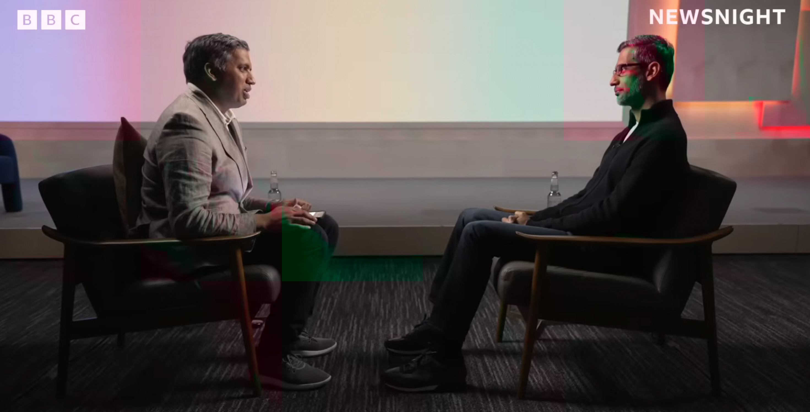

> 이 글은 BBC Newsnight의 순다르 피차이 인터뷰를 바탕으로 재구성되었습니다.



최근 실리콘밸리는 그 어느 때보다 뜨겁습니다. 엔비디아(Nvidia)의 시가총액이 국가 예산을 뛰어넘고, 빅테크 기업들은 천문학적인 자금을 AI 인프라에 쏟아붓고 있습니다. 일각에서는 "닷컴 버블의 재현이 아니냐"는 우려 섞인 목소리도 나옵니다.

이 혼란스럽고도 경이로운 시기에, 구글(Google)의 CEO **순다르 피차이(Sundar Pichai)** 가 BBC Newsnight와의 인터뷰를 통해 입을 열었습니다.

AI 기술의 최전선에 있는 그는 현재의 상황을 어떻게 바라보고 있을까요? 그리고 우리가 마주할 미래는 어떤 모습일까요? 인터뷰의 핵심 내용을 5가지 키워드로 정리했습니다.

<br >

## 1. 투자의 규모: "지난 20년의 작업을 향후 2년 안에 끝낸다"

피차이 CEO는 현재 상황을 **"실리콘밸리 기준에서도 비상식적인(Extraordinary) 순간"** 이라고 정의했습니다. PC, 인터넷, 모바일, 클라우드로 이어진 기술의 역사에서도 AI는 가장 거대한 파도입니다.

가장 놀라운 것은 투자의 규모와 속도입니다.

- 구글의 변화: 불과 4년 전, 구글의 인프라 투자액은 연간 300억 달러 미만이었습니다. 하지만 올해 그 수치는 900억 달러(약 120조 원)를 넘어설 예정입니다.

- 압축 성장: 그는 "과거 10~20년이 걸려 구축했던 인프라를 향후 몇 년 안에 완성하게 될 것"이라고 예고했습니다. 전 세계적으로 1조 달러 이상의 자금이 데이터센터와 AI 칩에 투입되고 있습니다.

<br >

## 2. 버블론에 대한 대답: "이성은 있지만, 과열도 있다"

많은 투자자와 대중이 궁금해하는 질문, "지금 AI 시장은 거품(Bubble)입니까?"

이에 대해 피차이는 매우 균형 잡힌, 하지만 뼈 있는 대답을 내놓았습니다.

> "기대감은 합리적(Rational)입니다. 하지만 산업 전체가 집단적으로 과도하게 투자(Overshoot)하는 순간들도 분명 존재합니다."

그는 닷컴 버블(Internet Bubble) 시기를 예로 들었습니다. 당시 투자는 과열되었고 거품은 꺼졌지만, 인터넷이라는 기술 자체가 가져온 혁신은 진짜였습니다. AI 역시 단기적인 과열 양상이 있을 수 있지만, 이 기술이 세상을 바꿀 것이라는 본질적인 가치는 변함이 없다는 것이 그의 설명입니다.

<br >

## 3. 일자리의 미래: 대체가 아닌 '증강(Augmentation)'

"AI가 내 직업을 빼앗을 것인가?"라는 두려움에 대해 피차이는 AI를 **'에이전트(Agent)'** 로 정의하며 낙관적인 전망을 제시했습니다.

- 영상의학과 전문의(Radiologist)의 예: 해마다 폭증하는 스캔 데이터를 의사 혼자 감당하기는 벅찹니다. AI는 의사를 대체하는 것이 아니라, 의사가 더 정확하고 빠르게 진단할 수 있도록 돕는 '비서' 역할을 하게 됩니다.

- 적응(Adapt)하는 자가 살아남는다: 그는 미래 세대에게 중요한 조언을 남겼습니다.

> "교사든, 의사든 직업 자체는 사라지지 않을 것입니다. 다만, AI 도구를 잘 활용하는 사람이 그렇지 못한 사람보다 앞서 나갈 것입니다."

<br >

## 4. 에너지 딜레마: 기후 위기 vs AI 전력 소모

AI 데이터센터가 막대한 전기를 먹어 치우며 탄소 중립(Net Zero) 목표를 위협한다는 지적에 대해, 피차이는 이를 **'새로운 에너지 혁신의 기폭제'** 로 해석했습니다.

AI의 전력 수요를 감당하기 위해 구글은 현재 다음과 같은 미래 에너지원에 공격적으로 투자하고 있습니다.

- 소형 모듈 원자로(SMR)
- 핵융합(Nuclear Fusion) 에너지
- 지열 발전

그는 AI가 일시적으로는 에너지 소비를 늘리지만, 장기적으로는 AI 기술이 에너지 효율을 최적화하고 새로운 청정 에너지 기술 개발을 앞당겨 문제를 해결할 것이라는 **'기술적 낙관주의'** 를 보였습니다.

<br >

## 5. 생성형 AI 그 너머: 퀀텀과 과학의 발견

인터뷰의 말미에서 그는 챗GPT나 제미나이(Gemini) 같은 생성형 AI 너머의 미래를 언급했습니다.

- 퀀텀 컴퓨팅(Quantum Computing): 현재의 AI가 5년 전 수준이라면, 양자 컴퓨터는 5년 후 폭발적인 성장을 맞이할 것입니다. 이는 자연의 섭리를 시뮬레이션하는 열쇠가 됩니다.

- 알파폴드(AlphaFold)와 노벨상: 구글 딥마인드의 알파폴드는 인간이 수억 년 걸려 밝혀낼 단백질 구조를 단기간에 예측해냈습니다. 이 성과로 데미스 허사비스 등은 노벨 화학상을 수상했습니다. AI는 이미 단순한 챗봇을 넘어 인류의 난제를 해결하는 도구가 되고 있습니다.

<br >

## 결론

순다르 피차이의 인터뷰를 관통하는 핵심 철학은 **"Bold and Responsible(담대하고 책임감 있게)"** 이었습니다.

AI가 가져올 엄청난 기회에 대해서는 담대하게 투자하되, 딥페이크나 가짜 뉴스, 일자리 변동 같은 사회적 문제에 대해서는 책임감을 가지고 대응하겠다는 의지입니다.

우리는 지금 거품 위에 있는 것일까요, 아니면 로켓 위에 있는 것일까요? 피차이의 말처럼 확실한 것은 단 하나입니다. 파도는 이미 밀려오고 있고, 이제 우리는 수영하는 법을 배워야 한다는 사실입니다.

---

[참고 자료]

- 인터뷰 유튜브 링크: [https://www.youtube.com/watch?v=BYx63PKKPvg](https://www.youtube.com/watch?v=BYx63PKKPvg)

```toc

```
