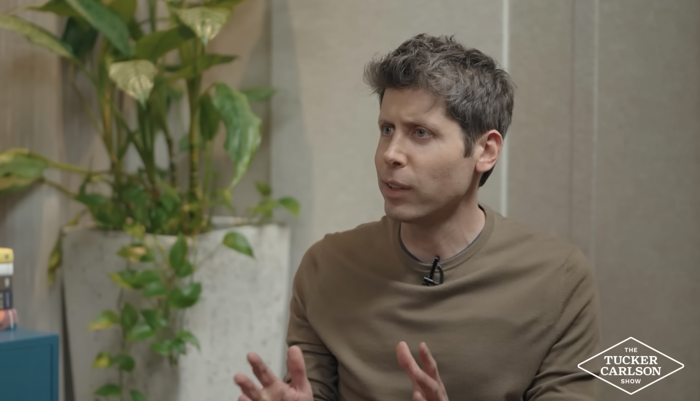

> 이 글은 터커 칼슨 네트워크에서 진행된 인터뷰를 토대로 작성되었습니다.

인공지능(AI) 기술이 급격히 발전하면서, 이 기술이 우리 삶에 미칠 영향에 대한 논의도 깊어지고 있습니다.

최근 터커 칼슨 네트워크(Tucker Carlson Network)에서 진행된 **OpenAI CEO 샘 알트만(Sam Altman)과 터커 칼슨(Tucker Carlson)의 인터뷰**는 기술적 전망을 넘어, AI가 가져올 사회적, 윤리적 변화에 대해 진지한 화두를 던졌습니다.

이번 인터뷰에서 다뤄진 주요 쟁점들을 통해, 다가올 AI 시대에 우리가 고민해야 할 지점들을 정리해 보았습니다.

<br >

## 1. 권력의 이동: 집중될 것인가, 분산될 것인가?

인터뷰의 첫 번째 주제는 '권력'이었습니다. 역사적으로 강력한 신기술은 소수에게 권력을 집중시키는 경향이 있었습니다. 칼슨은 AI 역시 소수의 기술 기업이나 특정 인물에게 과도한 힘을 실어줄 가능성을 우려했습니다.

이에 대해 샘 알트만은 과거에는 자신도 비슷한 우려를 했으나, 현재는 시각이 바뀌었다고 답했습니다.

> "**AI는 모든 사람의 능력을 상향 평준화(Huge upleveling of people) 시킬 것입니다.**"

알트만은 AI가 소수의 전유물이 아니라, 수십억 명의 사람들이 각자의 생산성과 창의성을 높이는 도구가 될 것이라 전망했습니다. 즉, 권력이 소수에게 쏠리기보다는 **개개인이 더 강력한 능력을 갖게 되는 '권력의 분산'** 이 일어날 것이라는 긍정적인 미래를 제시했습니다.

<br >

## 2. 도덕적 기준: AI의 윤리는 누가 정하는가?

가장 깊이 있는 논의가 오간 부분은 AI의 '도덕성'에 관한 것이었습니다. 챗GPT가 내놓는 답변의 기저에 깔린 윤리적 기준은 과연 누구의 가치관을 따르는 걸까요?

칼슨은 AI 모델이 특정 성향이나 가치관을 은연중에 사용자에게 전달할 수 있음을 지적하며, 그 기준을 정하는 주체가 누구인지 물었습니다.

알트만은 이를 위해 **'모델 스펙(Model Spec)'** 이라는 개념을 도입했다고 설명했습니다. 수백 명의 철학자와 윤리학자의 자문을 거쳐 가이드라인을 만들고 있으며, 특정 개인의 생각이 아닌 인류의 '보편적이고 집단적인 도덕관'을 반영하려 노력 중이라는 것입니다. 하지만 그는 개인의 자유와 사회적 안전 사이의 균형을 맞추는 일은 여전히 어려운 과제임을 인정했습니다.

<br >

## 3. AI와 믿음: 기술은 가치 중립적인가?

인터뷰에서 흥미로웠던 점은 사람들이 AI를 대하는 태도에 대한 고찰이었습니다. 칼슨은 현대인들이 중요한 결정이나 삶의 질문을 AI에게 의존하는 현상이 마치 종교적 행태와 유사한 측면이 있다고 비유했습니다.

기존의 종교나 사상은 그들이 지향하는 가치나 교리가 명확히 드러나 있습니다. 반면, AI는 어떤 데이터와 알고리즘을 통해 결론을 도출했는지 일반 사용자가 알기 어렵습니다.

이 대화는 **AI가 단순한 도구를 넘어, 우리의 사고방식과 가치 판단에 영향을 미치는 존재가 될 수 있음**을 시사합니다. 따라서 AI 시스템의 투명성과 그 안에 담긴 가치관에 대한 사회적 합의가 중요해질 것입니다.

<br >

## 4. 예측할 수 없는 변화들 (Unknown Unknowns)

마지막으로 알트만은 AI와 관련하여 가장 우려하는 점으로 생물학 무기 같은 명확한 위협보다는 **"알려지지 않은 미지의 위험(Unknown Unknowns)"** 을 꼽았습니다.

그는 사소한 예로, 많은 사용자가 AI 모델과 대화하며 AI 특유의 말투나 문체를 무의식적으로 따라 하는 현상을 언급했습니다. 이는 기술이 단순히 도구로 쓰이는 것을 넘어, 인간의 행동 양식이나 문화를 미묘하게 변화시킬 수 있음을 보여줍니다. 우리가 예상치 못한 사회적 파장이 일어날 수 있다는 뜻입니다.

<br >

## 5. 생성형 AI 그 너머: 퀀텀과 과학의 발견

인터뷰의 말미에서 그는 챗GPT나 제미나이(Gemini) 같은 생성형 AI 너머의 미래를 언급했습니다.

- 퀀텀 컴퓨팅(Quantum Computing): 현재의 AI가 5년 전 수준이라면, 양자 컴퓨터는 5년 후 폭발적인 성장을 맞이할 것입니다. 이는 자연의 섭리를 시뮬레이션하는 열쇠가 됩니다.

- 알파폴드(AlphaFold)와 노벨상: 구글 딥마인드의 알파폴드는 인간이 수억 년 걸려 밝혀낼 단백질 구조를 단기간에 예측해냈습니다. 이 성과로 데미스 허사비스 등은 노벨 화학상을 수상했습니다. AI는 이미 단순한 챗봇을 넘어 인류의 난제를 해결하는 도구가 되고 있습니다.

<br >

## 결론

이번 대담은 AI 기술의 발전 속도만큼이나, 그것을 받아들이는 우리 사회의 철학적 고민도 깊어져야 함을 보여주었습니다.

샘 알트만은 AI가 인류를 돕는 강력하고 긍정적인 도구가 될 것이라 믿고 있으며, 터커 칼슨은 그 과정에서 우리가 놓치지 말아야 할 인간적 가치와 경계심을 상기시켜 주었습니다.

AI가 우리 삶 깊숙이 들어온 지금, 기술의 편리함을 누리는 동시에 그것이 우리 사회를 어떤 방향으로 이끌고 있는지에 대한 건전한 비판과 토론이 필요한 시점입니다.

---

[참고 자료]

(https://www.youtube.com/watch?v=AUfsW8wpfWM)

```toc

```
