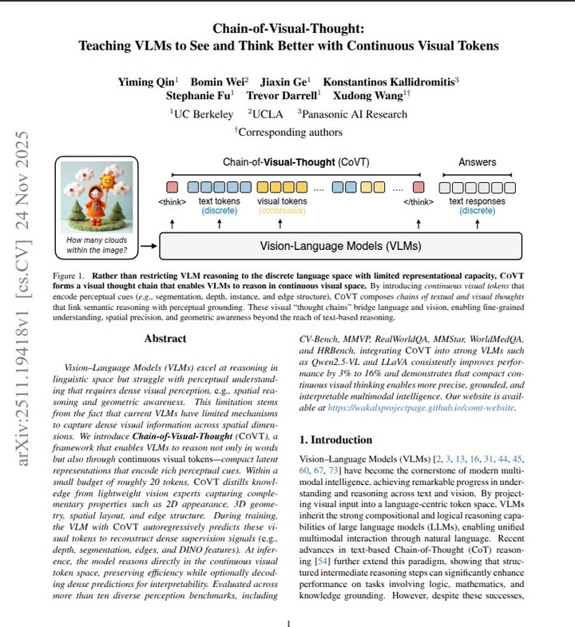

> 이 글은 UC Berkeley와 UCLA 연구진이 발표한 논문 **"Chain-of-Visual-Thought: Teaching VLMs to See and Think Better with Continuous Visual Tokens"** 를 토대로 작성되었습니다.

최근 대형 언어 모델(LLM)의 추론 능력을 획기적으로 향상시킨 '생각의 사슬(Chain-of-Thought, CoT)' 기법은 복잡한 문제를 단계별로 풀어나가는 데 큰 기여를 했습니다. 하지만 Vision-Language Model(VLM) 분야에서 이 방식은 한계가 명확했습니다. "사과가 몇 개 있는가?" 또는 "책상 뒤에 무엇이 있는가?"와 같은 시각적 인식(Perception)이 필요한 문제에서, 텍스트 기반의 추론은 이미지의 풍부한 공간적, 기하학적 정보를 잃어버리기 십상이기 때문입니다.

오늘 소개할 논문 **"Chain-of-Visual-Thought: Teaching VLMs to See and Think Better with Continuous Visual Tokens"** (UC Berkeley, UCLA 등)는 이러한 한계를 극복하기 위해, 모델이 텍스트뿐만 아니라 **'연속적인 시각 토큰(Continuous Visual Tokens)'** 을 통해 사고하는 새로운 프레임워크인 CoVT를 제안합니다.



<br />

## 1. 문제의식: 언어 병목 현상 (Language Bottleneck)

기존 VLM의 CoT는 시각 정보를 텍스트 공간(Discrete Text Space)으로 투영하여 추론합니다. 예를 들어, 이미지 속 물체의 위치 관계를 파악할 때 "A 물체는 왼쪽에 있고, B는 뒤에 있다"라는 텍스트로 변환한 뒤 추론을 이어갑니다.

이 과정에서 **'언어 병목(Language Bottleneck)'** 이 발생합니다.

- **정보 손실**: 엣지(Edge), 깊이(Depth), 세밀한 분할(Segmentation) 정보 등은 텍스트로 완벽히 표현하기 어렵습니다.
- **오류 누적**: 초기 텍스트 변환 과정에서 시각적 오류가 발생하면, 이후의 논리적 추론이 아무리 뛰어나도 결과는 틀리게 됩니다.

CoVT는 모델이 **'시각적 생각(Visual Thought)'** 을 할 수 있도록, 추론 과정에 텍스트 토큰과 함께 시각 토큰을 생성하도록 설계되었습니다.

<br />

## 2. 핵심 원리: 연속적 시각 토큰 (Continuous Visual Tokens)

CoVT의 가장 큰 기술적 특징은 추론 과정(Thinking Process) 중에 생성되는 토큰이 단순한 텍스트가 아니라, **압축된 시각적 잠재 표현(Compact Latent Representations)** 이라는 점입니다.

연구진은 인간의 시각 인지 과정을 모방하여 4가지 핵심 시각 능력을 정의하고, 이를 담당하는 **경량화된 비전 전문가(Lightweight Vision Experts)** 모델들로부터 지식을 증류(Distillation)했습니다.

### **4가지 시각 토큰과 전문가 모델**

CoVT는 VLM이 다음 4가지 유형의 시각 토큰을 autoregressive하게 예측하도록 훈련됩니다.

**1. Segmentation Tokens (객체 인식 및 2D 공간):**

- **역할**: 물체의 위치와 형상을 파악.
- **교사 모델**: **SAM (Segment Anything Model)**.
- **작동 방식**: 생성된 토큰은 SAM Decoder의 프롬프트로 사용되어 마스크를 복원하도록 학습됩니다.

**2. Depth Tokens (3D 공간 관계):**

- **역할**: 픽셀 단위의 깊이 정보 파악 (앞/뒤 관계).
- **교사 모델**: **DepthAnything v2**.
- **작동 방식**: 토큰이 DepthAnything의 인코더 특징과 상호작용하여 깊이 맵(Depth Map)을 재구성합니다.

**3. Edge Tokens (구조 및 기하학):**

- **역할**: 물체의 경계선 및 구조적 단서 파악.
- **교사 모델**: **PIDINet**.
- **작동 방식**: 1x1 Convolution 커널로 작동하여 엣지 맵을 복원합니다.

**4. Semantic Tokens (의미적 이해):**

- **역할**: 이미지의 패치(Patch) 수준의 의미론- 적 특징 파악.
- **교사 모델**: **DINOv2**.
- **작동 방식**: DINO의 특징 벡터(Feature)와 직접 정렬(MSE Loss)됩니다.

<br />

## 3. 모델 아키텍처 및 학습 파이프라인

CoVT는 추론 시 외부 도구(External Tools)를 호출하지 않습니다. 대신, 학습 과정에서 외부 전문가 모델의 능력을 VLM의 파라미터 내재화합니다. 이를 위해 **"Think -> Decode -> Reconstruct"** 구조를 사용합니다.

### 정렬 전략 (Alignment Strategy)

단순히 특징 벡터를 맞추는 것이 아니라, 각 전문가 모델의 특성에 맞춰 정렬 전략을 다르게 가져갑니다.

- **Task-Oriented Alignment**: SAM이나 DepthAnything 같은 모델은 세밀한 출력이 중요하므로, VLM이 생성한 토큰을 **Decoder의 프롬프트**로 사용하여 최종 결과물(마스크, 깊이 맵)을 생성하고, 이를 Ground Truth와 비교하여 학습합니다.
- **Feature Alignment**: DINO와 같은 표현 학습 모델은 특징 벡터 공간에서의 유사도를 학습합니다.

### 4단계 학습 과정 (Four-Stage Training)

모델이 시각적으로 '생각'하는 법을 배우기 위해 커리큘럼 학습을 도입했습니다.

1. **Comprehension (이해)**: 시각 토큰의 의미를 학습하는 초기 단계.
2. **Generation (생성)**: 이미지에 맞는 정확한 시각 토큰을 생성하도록 유도.
3. **Reasoning (추론)**: 질문에 답하기 위해 시각 토큰을 사고 과정(Chain-of-Thought)에 통합.
4. **Efficient Reasoning (효율적 추론)**: 시각 토큰의 일부를 무작위로 드롭(Drop)하여, 일부 정보만으로도 강건하게 추론하도록 학습 (Overfitting 방지 및 효율성 증대).

<br />

## 4. CoVT의 기술적 강점

**A. 해석 가능한 시각적 사고 (Interpretable Visual Thinking)**
기존의 Latent Reasoning 모델들은 내부에서 무슨 일이 일어나는지 알 수 없었습니다. 하지만 CoVT는 생성된 시각 토큰을 디코더(Decoder)에 통과시키면 **사람이 볼 수 있는 이미지(Segmentation Mask, Depth Map 등)** 로 변환할 수 있습니다. 즉, 모델이 "이 물체가 앞에 있어서(Depth), 이것을 가리킨다(Mask)"라고 생각하는 과정을 시각적으로 확인할 수 있습니다.

**B. 외부 도구가 필요 없는 효율성 (Self-Contained)**
Inference 단계에서는 무거운 비전 전문가 모델들을 로드할 필요가 없습니다. VLM은 이미 학습된 가중치를 통해 **연속적인 시각 토큰(Continuous Visual Tokens) 공간**에서 추론을 수행합니다. 필요할 때만 선택적으로 디코딩하여 시각화할 수 있으므로 연산 효율성이 높습니다.

**C. 성능 향상**
실험 결과, **CoVT는 CV-Bench, MMVP, RealWorldQA** 등 다양한 벤치마크에서 기존 모델(Qwen2.5-VL 등) 대비 유의미한 성능 향상을 보였습니다. 특히 **깊이(Depth) 추정이나 개수 세기(Counting)** 와 같이 세밀한 시각 인식이 필요한 작업에서 큰 폭의 향상을 기록했습니다.

<br />

## 5. 결론

Chain-of-Visual-Thought는 VLM이 단순히 이미지를 텍스트로 번역하는 기계가 아니라, **이미지의 물리적, 공간적 특성을 '마음속으로 그리며(Mental Imagery)' 추론하는 모델**로 진화했음을 보여줍니다.

텍스트라는 이산적(Discrete) 상징의 한계를 넘어, 연속적(Continuous)인 시각 토큰을 사고의 도구로 활용한다는 점은 향후 AGI를 향한 멀티모달 연구에 중요한 이정표가 될 것으로 보입니다.

---

[참고 자료]

- Qin et al., "Chain-of-Visual-Thought: Teaching VLMs to See and Think Better with Continuous Visual Tokens", arXiv:2511.19418, 2025.
- 논문 링크: [https://arxiv.org/abs/2511.19418](https://arxiv.org/abs/2511.19418)

```toc

```
