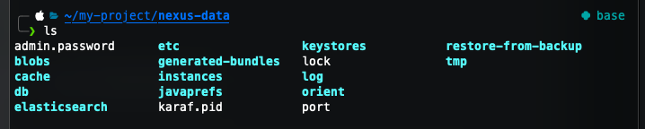

> 애플리케이션을 Docker를 이용해 배포하다보면 Docker Build 후 생성된 Docker Image를 관리할 수 있는 Repository가 필요합니다. 이번 시간엔 Nexus를 이용한 사내 Docker Private Repository를 구축해보겠습니다.

<br >


<br >

## Running

Nexus의 서버를 띄우는 건 Docker compose 파일로 간단하게 하실 수 있습니다.<br />
(**물론 Docker와 Docker compose의 설치는 필수입니다.**)

```yaml
# docker-compose.yml
version: '3.2'

services:
  nexus:
    image: sonatype/nexus3
    volumes:
      - /nexus-data:/nexus-data
    ports:
      - 8081:8081
      - 8082:8082
```

> 8081은 브라우저에서 접속할 포트이고, 8082는 API를 이용할 때 필요한 포트입니다.

<br >
위의 docker-compose 파일이 있는 경로에서 아래 명령어를 실행해줍니다.

```bash
docker-compose up nexus -d
```


<br >

이제 브라우저에서 접속해봅시다. (`http://localhost:8081`)


<br >

## Setup

로그인을 위해서는 초기 비밀번호를 알아야합니다.


<br >

비밀번호는 위에서 설정한 volume 폴더에서 확인하실 수도 있고, 컨테이너 내부의 /nexus-data 폴더에서도 확인 하실 수 있습니다.

<br >

**Volume 폴더**

지정한 Volume폴더로 이동 후 비밀번호를 확인합니다.




<br >

**Container 내부**

Nexus의 Container ID를 확인합니다.


<br >

Container 내부에 접속합니다.


<br >

비밀번호를 확인합니다.


<br >

위에서 확인한 비밀번호로 로그인을 하면 새로운 비밀번호를 설정하라는 팝업이 뜹니다.


<br >

계정 설정이 끝이 났습니다. 이제 본격적으로 Docker Repository를 설정해보겠습니다.

<br >

## Docker Repository 설정

<br>

### Blob Stores

우선 Blob Store를 생성해줍니다. blob store는 실제 데이터가 저장될 장소입니다.

저장소는 로컬에서 생성한 이미지가 저장될 hosted와 외부에서 가져올 proxy가 필요합니다.

<br />

먼저 `hosted`를 생성합니다.


<br />

같은 방식으로 `proxy`를 생성합니다.


<br >

### Repositories

<br >

**Repository Type**

- **Hosted**: 기본 Type으로 private docker image를 관리하는 repository이다.
- **Proxy**: Global Repository처럼 외부 Repository에 대해 Proxy 역할을 한다.

<br >

#### Hosted

먼저 `hosted`부터 생성해보겠습니다. 우선 `Create repository` 버튼을 클릭합니다.


<br >

그 후 `docker(hosted)`를 선택합니다.


<br >

아래 표기된 필드를 입력해줍니다.


<br >

#### Proxy

이어서 `docker(proxy)`를 생성해보겠습니다. 아래 필드를 입력해주시면 됩니다.

remote storage는 Docker hub의 URL입니다.
`https://registry-1.docker.io`


<br >

### Realms 설정

docker repository에 접근할 수 있는 인증을 추가합니다. 이는 Docker Authentication에서 제공하는 기본적인 인증 권한을 사용해 익명으로 docker pull을 허용합니다.


<br >

### insecure-registries 설정

위에서 설정한 작업만으로는 docker image를 push하거나 pull할 때 아래와 에러가 발생할 것입니다.


<br >

이는 Docker에 이미지를 push하거나 할 때 필수 조건이 SSL 설정이라서 그렇습니다.

하지만 사내용으로 쓸 때는 외부에서 접근 불가능한 네트워크에 보통 구성하기 때문에 SSL이 필요 없을 수도 있습니다. 그 때 설정할 것이 `insecure-registries` 설정입니다.

설정은 간단합니다. 도커 엔진의 설정파일이라고 할 수 있는 `daemon.json`에 `insecure-registries` 설정을 추가하기만 하면 됩니다.

말 그대로 보안 설정을 `passing`하는 레지스트리를 등록하는 것입니다.

```bash
# 파일이 없다면 생성해줍니다.
vi /etc/docker/daemon.json
```

```json
{
  "insecure-registries": ["{IP Address}:8082"]
}
```

<br >

설정 완료 후 도커를 재시작해줍니다.

```bash
service docker restart
```

<br >

### Test

이제 설정이 완료되었으니 테스트를 해봅시다. 먼저 `docker login`을 해보겠습니다.

```bash
docker login {IP Address}:8082
```

<br >

`insecure-registries`를 설정하기 전엔 에러를 뱉어내던 것이 이제 정상적으로 로그인이 됩니다.


<br>

테스트로 docker image를 하나 docker hub에서 받아봅니다.

```bash
docker pull busybox
```


<br >

받은 이미지를 구축한 Nexus repository에 push합니다.

```bash
docker tag {image ID} {IP Address}:8082/busybox:v1
docker push {IP Address}:8082/busybox:v1
```

<br >

Nexus에서 push된 이미지를 확인합니다.


---

Private Nexus Docker Repository를 구축해보았습니다. 도움이 되었으면 좋겠습니다.

```toc

```
