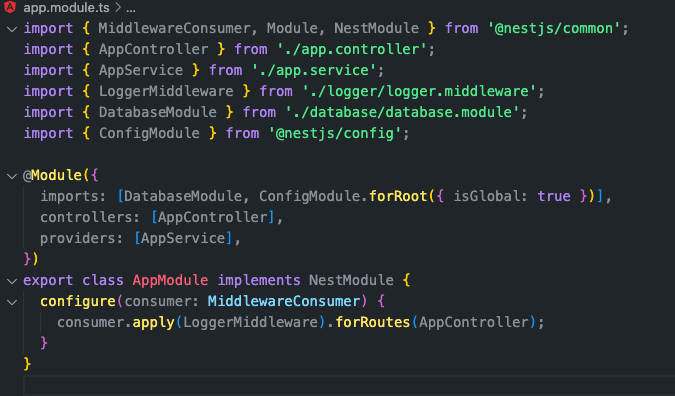

저는 웹 API를 구축할 때 NestJS를 주로 사용합니다. 프로젝트를 새로 시작할 때 이전에 다른 프로젝트의 Repo를 복사하여 필요 없는 부분을 지우고 사용합니다. 그러던 중 공통으로 사용될만한 코드들을 모아서 보일러 플레이트를 만들어두면 편할 것 같다는 생각을 하게 되었습니다.

따라서 주로 사용되는 NestJs + Fastify + MongoDB 가 연동된 보일러 플레이트를 제작하는 과정을 공유하고자 합니다.

> MongoDB는 이미 세팅되어 있는 것을 전제로 하고 있습니다.

---

## Require

- NodeJs 16.20.x

<br >

## Install

우선 `dependency`를 설치해줍니다.

```bash
yarn global add @nestjs/cli

yarn add @nestjs/core @nestjs/common rxjs reflect-metadata @nestjs/platform-fastify
```

<br >

그 후 project를 생성해보겠습니다.

```bash
nest new project-name
```

<br >

위의 명령어를 실행하면 아래와 같은 입력창이 뜰 것입니다. 원하는 `Package Manager`를 선택해줍니다.


<br >

설치가 완료된다면 아래와 같은 폴더 구조가 생성되어 있을 것입니다.


- src: 소스 코드 폴더
- test: 테스트 코드 폴더

<br >

서버를 띄워보겠습니다.

```bash
# package.json에서 명령어를 확인시면됩니다.
yarn start:dev
```

<br >

포트번호는 기본 `3000`번입니다.


<br >

## Swagger

우선 API 문서화 도구인 Swagger부터 설정해보겠습니다. (**미리 설정해두면 편합니다.**)

<br >

`dependency`를 설치해줍니다.

```bash
yarn add @nestjs/swagger
```

<br >

```typescript
const config = new DocumentBuilder()
  .setTitle('Cats example')
  .setDescription('The cats API description')
  .setVersion('1.0')
  .addTag('cats')
  .build();
const document = SwaggerModule.createDocument(app, config);
SwaggerModule.setup('api', app, document);
```

<br >

테스트로 위의 코드를 `src/main.ts`에 추가합니다. 그리고 서버 재시작 후 `http://localhost:3000/api`로 접속을 하면 Swagger를 확인하실 수 있습니다.


<br >

조금 더 코드를 다듬어 보겠습니다. `document.ts`를 생성해줍니다. 그리고 아래와 같이 코드를 작성합니다.

```typescript
import { DocumentBuilder, SwaggerModule } from '@nestjs/swagger';

export class APIDocumentation {
  public builder;

  constructor() {
    this.builder = new DocumentBuilder();
  }

  initializeOptions() {
    return this.builder
      .setTitle(process.env.npm_package_name) // Package.json에서 name 값을 가져옵니다.
      .setVersion(process.env.npm_package_version) // Package.json에서 version 값을 가져옵니다.
      .setDescription('NEST APIS')
      .addBearerAuth({
        // 인증 방식을 JWT로 합니다.
        type: 'http',
        scheme: 'bearer',
        bearerFormat: 'JWT',
        name: 'Authorization',
        description: 'Enter JWT token',
        in: 'header',
      })
      .build();
  }

  setup(app) {
    const documentOptions = this.initializeOptions();
    const document = SwaggerModule.createDocument(app, documentOptions);

    // Swagger 접속을 /api/v1/docs로 합니다.
    SwaggerModule.setup('api/v1/docs', app, document, {
      swaggerOptions: { defaultModelsExpandDepth: -1 },
    });
  }
}
```

<br >

그리고 main.ts에 import합니다.

```typescript
// main.ts
...
const document = new APIDocumentation();
  document.setup(app);
...
```

<br >
타이틀과 버전이 변경되고  Authorize 버튼이 생성되었습니다.


Authorize 버튼 클릭 시 `JWT`토큰을 입력할 수 있고 Swagger로 요청 테스트 시 자동으로 `Header`에 토큰을 추가하여 요청합니다.

<br >

## Logger

Node.js 진영의 대표적인 로깅 라이브러리인 winston을 이용하여 Logging을 추가하겠습니다.

`dependency`를 설치해줍니다.

```bash
yarn add winston nest-winston dayjs
```

<br >

`logger` 폴더 생성 후, `logger.service.ts`와 `logger.middleware.ts` 파일을 생성해줍니다.

logger.service는 log 파일 생성 방식 로직을 담당하고 middleware는 log 파일을 client에서 요청이 들어왔을 시 log 파일을 생성하기 위한 로직입니다.

<br >

`logger.service.ts`부터 작성해보겠습니다.

```typescript
// winston의 기본적인 옵션만 사용했습니다. 자세한 사양은 winston의 docs를 확인해주세요

// core
import { LoggerService as LS } from '@nestjs/common';

// lib
import * as winston from 'winston';
import * as dayjs from 'dayjs';
import { utilities as nestWinstonModuleUtilities } from 'nest-winston';

const { errors, combine, timestamp, printf } = winston.format;

export class LoggerService implements LS {
  private logger: winston.Logger;

  constructor(service: string = 'common') {
    this.logger = winston.createLogger({
      transports: [
        new winston.transports.File({
          level: 'error',
          filename: `error-${dayjs(new Date()).format('YYYY-MM-DD')}.log`,
          dirname: 'logs',
          maxsize: 5000000,
          format: combine(
            errors({ stack: true }),
            timestamp({ format: 'isoDateTime' }),
            printf((info) => {
              return `${info.message}`;
            }),
          ),
        }),
        new winston.transports.Console({
          level: 'debug',
          format: combine(
            timestamp({ format: 'isoDateTime' }),
            nestWinstonModuleUtilities.format.nestLike(service, {
              prettyPrint: true,
              colors: true,
            }),
          ),
        }),

        new winston.transports.File({
          filename: `application-${dayjs(new Date()).format('YYYY-MM-DD')}.log`,
          dirname: 'logs',
          maxsize: 5000000,
          format: combine(
            timestamp({ format: 'isoDateTime' }),
            printf((info) => {
              return `${info.message}`;
            }),
          ),
        }),
      ],
    });
  }

  log(message: string) {
    this.logger.log({ level: 'info', message });
  }
  info(message: string) {
    this.logger.info(message);
  }
  error(message: string, trace: string) {
    this.logger.error(message, trace);
  }
  warn(message: string) {
    this.logger.warning(message);
  }
  debug(message: string) {
    this.logger.debug(message);
  }
  verbose(message: string) {
    this.logger.verbose(message);
  }
}
```

<br >

`logger.middleware.ts`를 작성해줍니다.

```typescript
// log에 어떤 정보를 담을지 정할 수 있습니다.

// core
import { Injectable, NestMiddleware } from '@nestjs/common';

// logger
import { LoggerService } from './logger.service';

// lib
import { Request, Response } from 'express';

@Injectable()
export class LoggerMiddleware implements NestMiddleware {
  constructor() {}
  use(req: Request, res: Response, next: Function) {
    const loggerService = new LoggerService(
      req.url.slice(1).split('/')[req.url.slice(1).split('/').length - 1],
    );
    const tempUrl = req.method + ' ' + req.url.split('?')[0];
    const _headers = req.headers ? req.headers : {};
    const _query = req.query ? req.query : {};
    const _body = req.body ? req.body : {};
    const _url = tempUrl ? tempUrl : {};

    loggerService.info(
      JSON.stringify({
        url: _url,
        headers: _headers,
        query: _query,
        body: _body,
      }),
    );

    next();
  }
}
```

<br >

파일 생성이 완료 되었으면 `app.module.ts`로 이동하여 middleware를 등록해줍니다.

```typescript
// app.module.ts
import { MiddlewareConsumer, Module, NestModule } from '@nestjs/common';
import { AppController } from './app.controller';
import { AppService } from './app.service';
import { LoggerMiddleware } from './logger/logger.middleware';

@Module({
  imports: [],
  controllers: [AppController],
  providers: [AppService],
})
export class AppModule implements NestModule {
  configure(consumer: MiddlewareConsumer) {
    // 로그를 남기고자 하는 controller를 넣어줍니다.
    consumer.apply(LoggerMiddleware).forRoutes(AppController);
  }
}
```

<br >

middleware를 등록 후 터미널을 확인해보면 log가 추가적으로 찍혀있는 것을 확인하실 수 있습니다.


<br >

추가로 logs 폴더가 생성되어 있고 log파일도 생성되어 있습니다.


<br >

## MongoDB

mongoose를 이용해 MongoDB를 Nest Application과 연동해보겠습니다. 위에서 했던 것과 마찬가지로 dependency를 설치해줍니다.

```bash
yarn add mongoose @nestjs/mongoose @nestjs/config
```

<br >

`database` 폴더를 생성 후 database.module.ts를 생성해줍니다. 쉽게 명령어로도 생성 가능합니다.

```bash
nest g module database
```


<br >

`database.module.ts`를 작성해줍니다.

우선 root 경로에 `.env` 파일을 생성해줍니다. 그 후 database정보를 기입해줍니다.

- `DB_ID`: MongoDB Account ID
- `DB_PWD`: MongoDB Account PWD
- `DB_URL`: MongoDB HOST NAME
- `DB_NAME`: MongoDB Database Name

```typescript
import { Module } from '@nestjs/common';
import { ConfigModule, ConfigService } from '@nestjs/config';
import { MongooseModule } from '@nestjs/mongoose';

@Module({
  imports: [
    MongooseModule.forRootAsync({
      imports: [ConfigModule],
      connectionName: 'TEST DB',
      useFactory: async (config: ConfigService) => {
        const DB_ID = config.get('DB_ID');
        const DB_PWD = config.get('DB_PWD');
        const DB_URL = config.get('DB_URL');
        const DB_NAME = config.get('DB_NAME');

        return {
          uri: `mongodb://${DB_ID}:${DB_PWD}@${DB_URL}/${DB_NAME}`,
          autoIndex: true,
        };
      },
      inject: [ConfigService],
    }),
  ],
})
export class DatabaseModule {}
```

<br >

추가로 환경변수를 읽어오기 위해 `ConfigModule`을 `app.module.ts`에 추가합니다.



<br >

### HealthCheck

DB가 제대로 살아있는지 healthCheck 하는 코드를 추가하겠습니다.

마찬가지로 dependency를 추가합니다.

```bash
yarn add @nestjs/terminus
```

<br >

`app.controller.ts`에 다음과 같은 코드를 작성합니다.

```typescript
import { Controller, Get } from '@nestjs/common';
import { AppService } from './app.service';
import { InjectConnection } from '@nestjs/mongoose';
import {
  HealthCheck,
  HealthCheckResult,
  HealthCheckService,
  MongooseHealthIndicator,
} from '@nestjs/terminus';

import { Connection } from 'mongoose';
import { DB_CONN } from './database/const'; // TEST DB

@Controller()
export class AppController {
  constructor(
    private readonly appService: AppService,
    private health: HealthCheckService,
    private mongooseHealth: MongooseHealthIndicator,
    @InjectConnection(DB_CONN) private connection: Connection,
  ) {}

  @Get()
  getHello(): string {
    return this.appService.getHello();
  }

  @Get('/health')
  @HealthCheck()
  async check(): Promise<HealthCheckResult> {
    return this.health.check([
      () =>
        this.mongooseHealth.pingCheck(`${DB_CONN} DB`, {
          connection: this.connection,
        }),
    ]);
  }
}
```

<br >

`app.module.ts`에도 `TerminusModule`을 import해줍니다.

```typescript
@Module({
  imports: [
    DatabaseModule,
    TerminusModule,
    ConfigModule.forRoot({ isGlobal: true }),
  ],
  controllers: [AppController],
  providers: [AppService],
})
```

<br >

Swagger를 확인합니다. `/health`가 추가되어 있는 것을 확인하실 수 있습니다. 해당 API를 실행해보면 현재 연결된 DB의 상태를 확인하실 수 있습니다.


---

이렇게 기본적인 세팅을 해보았습니다. 추가로 공통 에러 처리등을 추가하신다면 더 견고한 템플릿을 만드실 수 있습니다.

전체 코드는 [이곳에서](https://github.com/awesomelon/nest-template-mongo) 확인해주세요.

```toc

```
