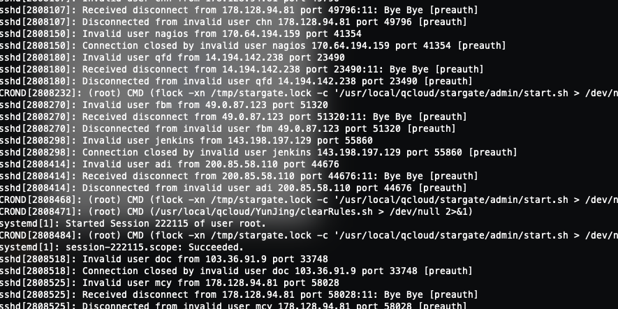

로그를 확인하던 중 아래와 같은 심상치않은 로그를 발견했습니다. 😱



<br >

## 이게 뭐야?

열심히 구글링을 해보니 이것은 매우 일반적인 상황으로 많은 봇넷들이 이런식의 무차별 대입 공격을 하는 것으로 파악됐습니다.

<br >

## 해결 방법은?

해결 방법은 다음과 같습니다.

- 무차별 대입으로도 찾을 수 없는 엄청 복잡한 password 설정
- root에 대한 ssh login 비활성화
- password 기반 인증 비활성화
- 22번이 아닌 다른 포트에서 ssh 서버 실행
- [fail2ban](https://github.com/fail2ban/fail2ban)를 사용하여 공격자의 IP를 자동으로 차단
- 화이트리스트에서만 ssh 허용
- etc...

이렇듯 많은 방법들이 있지만, 사내 상황에 맞는 화이트리스트만 ssh를 허용하는 방법을 채택했습니다. <br >
이유는 저희는 사내 클라우드 인스턴스에 접속 시 password를 사용하지 않고 public/private key 방식으로 로그인하고 있기 때문에 해당이 되지 않고, 나머지 사항은 혹시나 싶을 이슈가 발생할 수도 있기 때문입니다.

---

처음에 로그를 봤을 땐 혹시나 서버가 털렸나 싶어서 등에 식은땀이 났지만 큰 이슈 없이 해결할 수 있어서 다행이였습니다.

```toc

```
