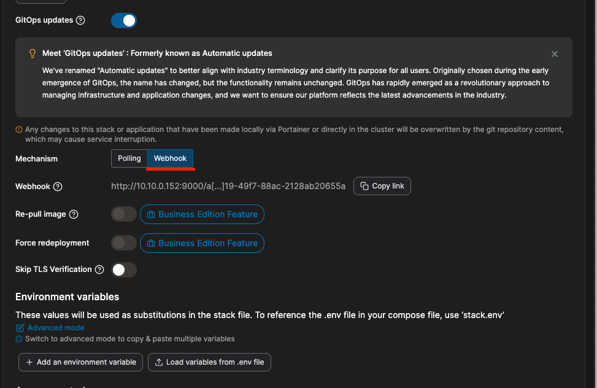

> [Drone CI](https://j-ho.dev/20/) 글과 연결되니 한번 읽어보시는 것을 추천합니다.

<br >

## Portainer란?

### [Accelerate container adoption](https://www.portainer.io)

- 다양한 환경에서 쿠버네티스, 도커, 스웜 등을 쉽게 배포하고 관리할 수 있는 경량화된 관리 도구로서, 웹 UI를 제공합니다.
- 실행 중인 컨테이너, 이미지, 볼륨 등을 직관적으로 확인 가능
- CLI로 작업했던 Docker 관련 작업을 손쉽게 사용 가능

<br >

### [Architecture](https://academy.portainer.io/architecture/#/lessons/LW72Ff_KQ2w4KSKupGE5a3zZ0kUkbn3E)

Portainer는 `Server`와 `Agent` 두 가지 요소로 구성됩니다.

이들은 기존에 구축된 컨테이너 환경에서 가볍게 운영되는 컨테이너로 실행됩니다. **클러스터 내의 각 노드에 Portainer Agent를 설치해야 하며, 이는 Portainer Server 컨테이너에 정보를 전달하도록 설정되어야 합니다.**

`Portainer Server`는 여러 Agent의 연결을 수용할 수 있으며, 이를 통해 하나의 중앙화된 인터페이스에서 여러 클러스터를 관리할 수 있습니다. 이를 위해 Portainer Server 컨테이너는 데이터 지속성이 필요합니다. `Agent`는 상태가 없으며, 데이터는 Server로 전송됩니다.


<br >

## 시작

간단하게 도커 컴포즈로 server와 agent를 컨테이너로 띄워보겠습니다.

```yaml
version: '3.2'

services:
  agent:
    image: portainer/agent:latest
    volumes:
      - /var/run/docker.sock:/var/run/docker.sock
      - /var/lib/docker/volumes:/var/lib/docker/volumes

  portainer:
    image: portainer/portainer-ce:latest
    command: -H tcp://tasks.agent:9001 --tlsskipverify
    ports:
      - '0.0.0.0:9443:9443'
      - '0.0.0.0:9000:9000'
    volumes:
      - portainer_data:/data

volumes:
  portainer_data:
```

<br>

위의 docker-compose.yml로 컨테이너를 시작한 후 브라우저로 접속해보면 아래와 같은 화면이 뜰 것입니다. 현재 `Portainer Server`와 연동된 클러스터들을 보여주는 화면입니다. primary는 현재 Portainer가 떠있는 Docker를 인식한 것입니다.


<br >

`primary`에 접속해보겠습니다. 현재 도커 서버의 환경을 간략히 표시해줍니다.


<br >

### Stack 생성

먼저 Stack을 생성해보겠습니다. Stack이란 다중 컨테이너 어플리케이션의 묶음을 의미합니다. docker-compose로 컨테이너를 여러 개 띄웠을 시 그 여러 개를 합쳐서 하나의 Stack이라고 부릅니다. <br >
`Docker Swarm의 Stack과 의미가 일맥상통합니다.`

<br >

Add Stack 버튼을 클릭합니다.


<br >

그러면 아래와 같이 Stack 정보를 입력하는 화면이 나옵니다.


- `name`: Stack name
- `Build Method`: Stack의 타입입니다. Web editor로 직접 docker-compose 파일을 입력할 수도 있고, upload로 파일을 업로드할 수도 있습니다. **하지만 Web editor, upload는 자동배포가 불가능합니다.**
- `Repository URL`: 변경된 사항이 있는 지 감지할 저장소 주소입니다. 변경된 사항이 있을 시 자동으로 배포합니다.
- `username, personal access token`: 저장소 인증 정보입니다.

<br >



Portainer도 다른 CD 서비스와 마찬가지로 GitOps로 상태를 추적하여 배포합니다. 그 방식은 저장소가 변경되었는지 일정 시간마다 `Polling`하는 방식과 `Webhook`으로 요청을 보내서 바로 배포하는 방식이 있습니다.

<br >

설정 완료 후 하단에 있는 `Deploy the stack` 버튼을 클릭 시 stack이 생성된다. (**지정한 경로에 docker-compose.yml이 있어야 생성 가능**)

<br >

## 확인

빠른 테스트를 위해 Webhook 방식으로 테스트를 해보았습니다. 아래 이미지는 [이 페이지](https://j-ho.dev/20/)에서 작업한 Drone CI의 PIPELINE 진행 화면입니다.


도커 빌드가 완료된 후 Portainer Server의 Webhook으로 요청을 보냅니다.

<br >

요청을 받은 Portainer Server는 해당 Stack에서 변경된 이미지가 있는 컨테이너를 확인하여 컨테이너를 새로 띄웁니다.


---

Drone CI와 Portainer를 이용한 CI/CD를 확인해보았습니다. 경험상으론 Jenkins보단 Drone CI가 pipeline 파일 등을 명확하게 작성할 수 있어서 좋았습니다. (**제가 jenkins를 잘 이용 못 해서 그럴지도...**)

Portainer는 Webhook을 이용한 배포라면 충분히 이용할만 하지만 Polling을 통해 5분마다 자동으로 변경된 것을 체크해 배포해주는 기능은 유료 기능이라서 아쉬웠습니다.

```toc

```
