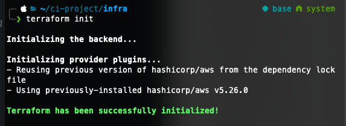

요즘 `DevOps`를 논할 때 빠질 수 없는 용어가 있습니다. 바로 **IaC(Infrastructure as Code)** 입니다.

수동으로 인프라를 구축하는 것이 아닌 코드를 통해 인프라를 생성하고 관리하는 것을 말합니다.

IaC를 사용하면 인프라 사양을 담은 구성 파일이 생성되므로 구성을 편집하고 배포하기가 더 쉬워집니다. 또한 IaC는 매번 동일한 환경을 `프로비저닝`하도록 보장합니다.

IaC를 사용하면 버전 관리, 재사용, 공유할 수 있는 리소스 구성을 정의하여 안전하고 일관되게 인프라를 구축, 변경, 관리할 수 있습니다.

<br >

그중 가장 많이 쓰는 도구로 하시코프(Hashcorp)에서 개발중인 `테라폼(Terraform)`이 있습니다.

[테라폼](https://developer.hashicorp.com/terraform/docs)의 경우 AWS, GCP, Azure와 같은 주요 클라우드 서비스를 비롯한 다양한 서비스를 프로바이더 방식으로 제공하고 있습니다. 이를 틍해 테라폼만으로 멀티 클라우드의 리소스들을 선언하고 관리하는 것도 가능합니다.

<br >

이번에는 Terraform을 이용하여 AWS 인프라를 간단하게 구축해보도록 하겠습니다. (**키 페어와 LB는 이미 존재한다고 가정합니다.**)

> EC2 생성 -> 타켓 그룹 생성 -> LB Rule 추가 후 타켓 그룹 매칭 -> Route53 생성 후 LB 매칭

<br >

## Install

Homebrew를 사용하면 손쉽게 최신 버전을 다운 받으실 수 있습니다.

```bash
$ brew install terraform

$ terraform version
# Terraform v1.6.4
```

<br >

여러 버전을 사용하는 경우 테라폼 버전 관리 도구를 사용하여 설치 (node 진영으로 치면 nvm)

> **tfenv와 terraform을 동시에 설치하면 에러가 종종 발생해서 둘 중 하나만 설치를 권장**

```bash
$ brew install tfenv

# terraform 1.6.4 설치
$ tfenv install 1.6.4

$ terraform version
# Terraform v1.6.4
```

<br >

## setup

폴더를 하나 생성 후 `provider.tf` 파일을 추가해줍니다.

```bash
$ mkdir aws_infra

$ touch provider.tf
```

> 디렉터리 이름과 파일 이름에 특별한 원칙은 없습니다. 테라폼은 디렉터리 내의 모든 .tf 파일을 전부 읽어들인 후, 리소스 생성, 수정, 삭제 작업을 진행합니다.

<br >

### Provider 정의

```HCL
provider "aws" {
    access_key = "<AWS_ACCESS_KEY>"
    secret_key = "<AWS_SECRET_KEY>"
    region = "<AWS_DEFAULT_REGION>"
}
```

<br>

AWS의 AWS_ACCESS_KEY와 AWS_SECRET_KEY를 프로바이더에 등록합니다. 하지만 이런 민감한 정보를 저장소에 기록하다가 큰일날 수도 있으므로 아래와 같이 환경변수로 등록 후 사용하는 것을 권장드립니다.

```bash
export AWS_ACCESS_KEY=""
export AWS_SECRET_KEY=""
export AWS_DEFAULT_REGION=""
```

<br >

환경 변수 등록 후 provider.tf를 아래와 같이 변경해줍니다.

```HCL
provider "aws" {}
```

<br >

## 기본 개념

**프로비저닝(Provisioning)**

어떤 프로세스나 서비스를 실행하기 위한 준비 단계를 뜻합니다. 크게 네트워크나 컴포팅 자원을 준비하는 작업과 준비된 컴퓨팅 자원에 사이트 패키지나 애플리케이션 의존성을 준비하는 단계로 나뉘어집니다. 경계가 불분명하지만 테라폼은 주로 전자를 다룹니다.

<br >

**프로바이더(Provider)**

테라폼과 외부 서비스를 연결해주는 기능을 하는 모듈입니다. 예를 들어 테라폼으로 AWS 서비스의 컴퓨팅 자원을 생성하기 위해서는 aws 프로바이터를 먼저 셋업해야합니다.

<br >

**리소스(Resource)**

특정 프로바이더가 제공해주는 조작 가능한 대상의 최소 단위입니다. 예를 들어 AWS 프로바이더는 `aws_instance` 리소스 타입을 제공하고, 이 리소스 타입을 사용하여 EC2의 리소스를 선언하고 조작하는 것이 가능합니다.

<br >

**HCL(Hashicorp Configuration Languate)**

테라폼에서 사용하는 설정 언어입니다. 테라폼의 모든 설정과 선언은 HCL을 사용해 이루어집니다. 확장자는 `.tf`입니다.

<br >

**PLAN**

디렉터리 내의 모든 .tf 파일의 내용을 실제로 적용 가능한지 확인하는 작업을 plan이라고 합니다. 테라폼은 이를
`terraform plan` 명령어로 제공하며, 이 명령어를 실행하면 어떤 리소스가 생성,수정,삭제될 지 계획을 보여줍니다.

<br >

**APPLY**

디렉터리 내의 모든 .tf 파일의 내용대로 리소스를 생성,수정,삭제하는 일을 apply라고 합니다. 테라폼은 이를
`terraform apply` 명령어로 제공합니다.

<br>

## init

프로바이더 설정이 완료되었으니 테라폼을 초기화하겠습니다. 초기화 시 테라폼은 프로바이더 설정을 참고하여 필요한 플러그인을 설치합니다.

```bash
$ terraform init
```

<br>



<br >

테라폼 버전을 확인하면 현재 테라폼 버전과 사용하고 있는 프로바이더 버전을 확인하실 수 있습니다.

```bash
terraform version
```


<br >

## Security Group

인스턴스를 생성해도 외부에서 접근할 수 없다면 그 인스턴스는 사용할 수 없습니다. 기본적으로 `22번 포트(ssh)`를 열어주는 Security Group을 먼저 생성하겠습니다. `main.tf` 파일을 생성합니다. 그 후 아래와 같이 입력합니다.

> egress 속성도 사용할 수 있습니다.

```HCL
resource "aws_security_group" "sg" {
    name = "allow_ssh_from_all"
    description = "Allow SSH from all"
    ingress = {
        from_port = 22
        to_port = 22
        protocol = "tcp"
        cidr_blocks = ["0.0.0.0/0"]
    }
}
```

<br >

입력을 완료하셨다면 이제 `plan`을 실행해봅니다. 하나의 security group이 추가될 예정임을 확인할 수 있습니다.


<br >

이제 위의 plan을 적용합니다. aws console에서 확인해보면 security group이 생성되어 있는 것을 확인하실 수 있습니다.

```
$ terraform apply
```


<br >

보안 그룹이 이미 존재한다면 `aws_security_group` 데이터 소스를 사용해 가져올 수도 있습니다. id, vpc_id, tags와 같은 필터를 사용해서 필터링 후 가져올 수 있습니다.

```HCL
data "aws_security_group" "sg" {
  name = "allow_ssh_from_all"
}
```

<br >

## EC2

이제 인스턴스를 정의해보겠습니다. 리소스 타입은 `aws_instance`입니다.

```HCL
resource "aws_instance" "this" {
    ami = "ami-06d88f849af021b38"
    instance_type = "t2.micro"
    key_name = "TEST"

    tags = {
        Name = "TEST_EC2"
    }

    vpc_security_group_ids = [
        data.aws_security_group.sg.id
    ]
}
```

리소스의 이름을 `this`로 지정했습니다. 인스턴스 생성 후 반환되는 id, public ip, private ip 등을
`aws_instance.this.id` 형식으로 가져올 수 있습니다.

<br >

`terraform plan` 을 실행해보겠습니다.

```bash
$ terraform plan

data.aws_security_group.sg: Reading...
data.aws_security_group.sg: Read complete after 0s [id=sg-0a5bab6b1b735815b]

Terraform used the selected providers to generate the following execution plan.
Resource actions are indicated with the following symbols:
  + create

Terraform will perform the following actions:

  # aws_instance.this will be created
  + resource "aws_instance" "this" {
      + ami                                  = "ami-06311c5f6a3951ada"
      + arn                                  = (known after apply)
      + associate_public_ip_address          = (known after apply)
  ...
      + vpc_security_group_ids               = [
            + "sg-0a5bab6b1b735815b",
        ]
    }

Plan: 1 to add, 0 to change, 0 to destroy.
```

<br >

바로 적용해보겠습니다. EC2 생성은 20초 ~ 1분 정도의 시간이 소요됩니다. 생성이 완료되면 aws console에서도 확인할 수 있습니다.

```bash
$ terraform apply

aws_instance.this: Creating...
aws_instance.this: Still creating... [10s elapsed]
aws_instance.this: Still creating... [20s elapsed]
aws_instance.this: Still creating... [30s elapsed]
aws_instance.this: Creation complete after 31s [id=i-091eb4dfeef5c01ca]

Apply complete! Resources: 1 added, 0 changed, 0 destroyed.

```

<br >

`terraform console`을 통해 생성된 인스턴스의 id, public ip등의 정보를 확인할 수도 있습니다.


<br >

## Target Group

### create target group

이어서 `main.tf`에 target group resource를 추가하겠습니다.

```HCL
resource "aws_lb_target_group" "target_group_client" {
  name = format("%s-%s", aws_instance.this.id, "example")
  depends_on = [ aws_instance.this ]
  port = 3000
  ip_address_type = "ipv4"
  protocol = "HTTP"
  vpc_id = var.vpc_id
  target_type = "instance"
}
```

`aws_instance`는 타입을 뜻하고 `this`는 resource를 설정할 때 사용한 리소스명입니다. `format`은 두 문자열을 합치는 함수입니다. `%s-%s` 는 두 문자열을 하이픈으로 합칩니다.

<br >

`var`는 `variable`로 `variables.tf`를 생성하여 선언해줍니다. variable은 `var.vpc_id` 형식으로 접근할 수 있습니다.

```HCL
variable "vpc_id" {
    description = "value of vpc"
    default = "vpc-67ae5f0c"
    type = string
}
```

<br >

### attachment target group

생성한 target group에 인스턴스를 참조합니다.

```HCL
resource "aws_lb_target_group_attachment" "target_group_attach" {
  target_group_arn = aws_lb_target_group.target_group_client.arn
  target_id = aws_instance.this.id
  port = 3000
}

```

<br >

## Load Balancer

위 Security Group 섹션에서 이미 존재하는 security group을 가져온 것처럼 Load Balancer도 가져옵니다.

```HCL
data "aws_lb" "this_lb" {
  name = "this-lb"
}
```

<br >

`SSL/TLS 인증서`가 있다면 추가로 필터링을 거친 후 가져올 수 있습니다.

```HCL
data "aws_lb_listener" "this_lb443" {
  load_balancer_arn = data.aws_lb.this_lb.arn
  port              = 443
}
```

<br >

이제 `Listener Rule`을 추가하겠습니다.

```HCL
resource "aws_lb_listener_rule" "rule" {
  listener_arn = data.aws_lb_listener.this_lb443.arn
  priority = 100

  action {
    type = "forward"
    target_group_arn = aws_lb_target_group.target_group_client.arn
  }
  condition {
    host_header {
      values = ["test.example.com]
    }
  }
}
```

<br >

## Route53

마지막으로 Route53의 Record를 추가해줍니다.

```HCL
data "aws_route53_zone" "route53" {
  name = "example.cc"
  private_zone = false
}

resource "aws_route53_record" "www" {
    zone_id = data.aws_route53_zone.route53.zone_id
    name = "test.${data.aws_route53_zone.route53.name}"
    type = "A"
    alias {
        name = data.aws_lb.this_lb.dns_name
        zone_id = data.aws_lb.this_lb.zone_id
        evaluate_target_health = true
    }
}
```

---

테라폼을 사용해본 결과, 장점이 확실한 도구였습니다. 하나하나 aws console에서 세팅하던 것에 비해 빠르게 인프라를 구축할 수 있고 실수가 적어지는 장점이 있었습니다. (**IaC의 장점인 것 같기두?**)

전체 코드는 [이 링크](https://github.com/awesomelon/simple-aws-terraform)를 확인해주세요.

```toc

```
