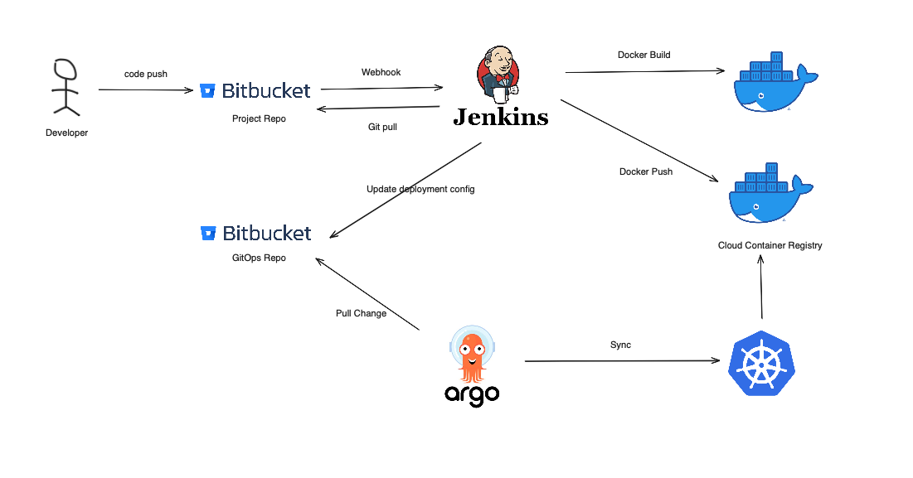
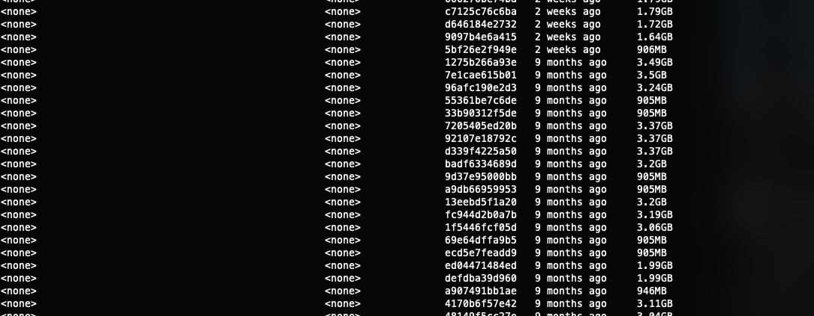
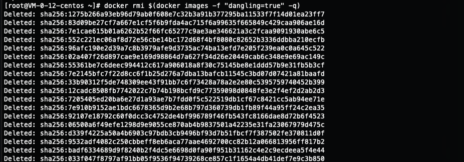
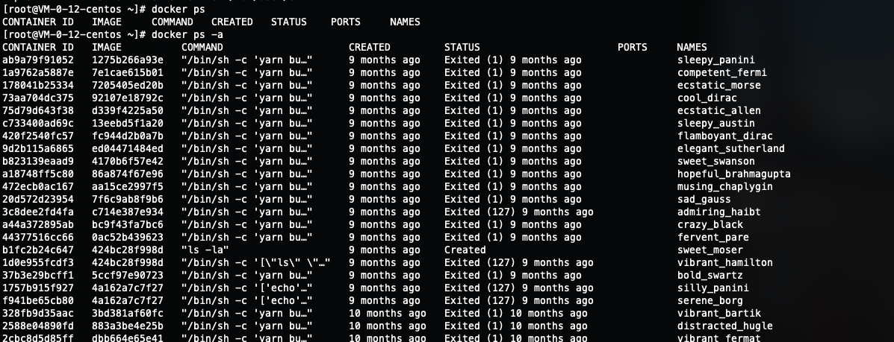
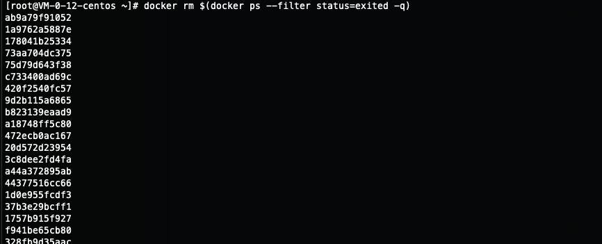
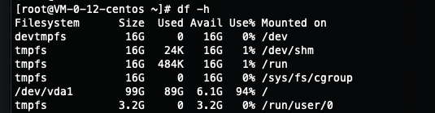
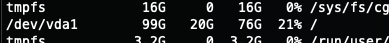

현재 저희 회사의 CI/CD 구조를 간략히 살펴보면 아래와 같습니다.



하루는 서버를 배포하며 로그를 확인하고 있는데 `No space left on device`라는 익숙한 문구가 나오는 것이였습니다.


바로 서버에 남은 용량이 없다는 것이였습니다.

<br >

## 원인

빌드 서버는 빌드 파이프라인을 실행하는 서버라 용량이 부족할 일이 없는데 이게 왜 이럴까 생각하면서 빌드 코드를 확인하는 순간 전 머리를 탁 칠 수밖에 없었습니다.


<br >

바로 도커 이미지를 `Cloud Registry`에 Push하고 **지우는 코드가 존재하지 않았던 겁니다.**



<br >

일단 빌드 스크립트 상에서 `Cloud Registry`에 Push하고 로컬 도커 이미지를 지우는 로직을 추가했지만, 남은 이 이미지들을 어떻게 다 지우지하는 생각이 들었습니다. <br >
Tag가 `<none>`인 이미지를 조회하고 거기서 나온 도커 이미지 ID를 이용해서 삭제하는 스크립트를 작성해서 다 지울까?
**(수동으로 지운다는 생각은 하지 않았습니다. 갯수가 어마무시해서...)**

## 해결

그러던 중 Docker image를 조회할 때 `--filter` 옵션을 사용할 수 있다는 것을 알고 좀 더 확인하던 중 `dangling` 옵션을 확인할 수 있었습니다. `dangling`은 **untagged images**들만 조회할 수 있는 필터였습니다.

그래서 아래와 같은 스크립트를 작성해서 `<none>:<none>` 인 이미지를 전체 삭제할 수 있었습니다.

```bash
$ docker rmi $(docker images -f "dangling=true" -q)
```



<br >

## 추가

도커 이미지를 지울 시 Exited된 docker ps에 바인딩 된 이미지면 삭제가 안 될 수도 있습니다. **(이것들도 목록이 어마무시 했습니다.)**



<br >

untagged 도커 이미지 조회처럼 Exited된 Process를 조회하는 필터도 존재했습니다.

```bash
$ docker rm $(docker ps --filter status=exited -q)
```



---

**용량 깔끔** 👍





```toc

```
