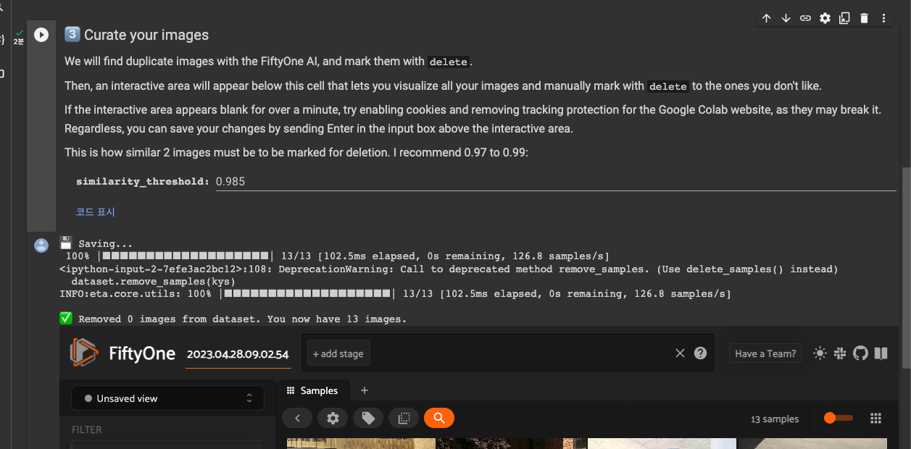
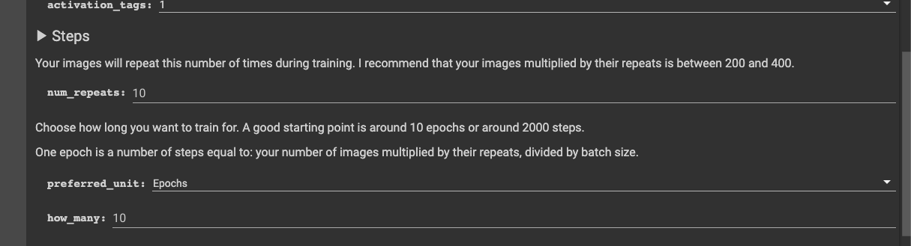

Google Colab을 통해 Stable Diffusion LoRA 학습 방법을 소개하려고 합니다.

<br >

## 준비

- google driver 계정
- 학습할 이미지 (중복되지 않은 최소 20장의 퀄리티 있는 이미지)
  - 원하는 주제의 이미지만 추가할 것 (ex: 아이오닉6를 학습하려면 아이오닉6만 있는 것이 좋음)
- **`인내심`**

### 테스트 이미지

- [아이오닉6](https://j-ho.s3.ap-northeast-2.amazonaws.com/ionic6_images.zip)

<br>

# Data Maker

---

## [Data Maker](https://colab.research.google.com/github/hollowstrawberry/kohya-colab/blob/main/Dataset_Maker.ipynb#scrollTo=HuJB7BGAyZCw) 접속

LoRA 학습 전에 데이터를 정형화하는 작업을 진행해야합니다. 새창으로 Data Maker에 접속해주세요.

<br >

### Setup


project_name을 입력하고 Setup 타이틀 왼쪽에 있는 실행 버튼을 누릅니다.

<br >

정상적으로 완료됐다면 아래와 같은 메시지가 나옵니다.


그리고 Google Driver에 접속하면 Loras > `{project_name}` > dataset 폴더들이 생성되어 있는 것을 확인할 수 있습니다.

**dataset 폴더 안에 앞서 준비한 이미지를 업로드합니다.**

<br >

### Curate your image

중복된 이미지 및 퀄리티가 낮은 이미지를 삭제하는 작업입니다.

2번의 Scrape images from Gelbooru 단계는 무시해주세요. 이미지를 미리 준비 안 했을 시 Gelbooru에서 다운받아서 한다는 의미입니다.


<br >

Curate your image를 실행하면 아래와 같은 화면이 나옵니다. (**한번 더 강조하지만 인내심입니다.**)


<br >

이곳에서 퀄리티 안 좋은 이미지 및 중복 이미지를 제거할 수 있습니다. 작업이 왼료되었다면 input창에 포커스를 두고 엔터를 칩니다. 그러면 아래와 같은 메시지가 나옵니다.



<br >

### Tag your images

이미지 분류를 정하는 단계입니다. 제가 준비한 이미지는 애니메이션이 아닌 사진이기 때문에 photo captions로 했습니다.


<br >

준비하신 이미지에 맞는 방법을 선택하고 실행합니다. <br >

완료가 된다면 아래와 같은 메시지가 나옵니다. (**이미지 양에 따라서 시간이 걸립니다.**)


<br >

## Ready

마지막 Ready를 실행합니다. Curate your tags는 무시해도 됩니다. Ready를 실행하고 나면 아래와 같은 메시지가 나옵니다. Lora trainer로 이동해줍니다. **저 꽃게 버튼 클릭**


<br >

# LoRA Trainer

---

## Setup

project_name은 Data Maker에서 입력한 것과 동일하게 입력해줍니다.


<br >

training_model은 기본적으로 제공하는 stable diffusion v1.5를 사용하셔도 되고 아니면 따로 준비하셔도 됩니다.
**따로 준비하셨다면 optional_custom_training_model_url에 url 형식으로 입력해줍니다.**


<br >

## Step

num_repeats는 아래 표에 맞게 설정하시면 됩니다.

- 20 images × 10 repeats × 10 epochs ÷ 2 batch size = 1000 steps
- 100 images × 3 repeats × 10 epochs ÷ 2 batch size = 1500 steps
- 400 images × 1 repeat × 10 epochs ÷ 2 batch size = 2000 steps
- 1000 images × 1 repeat × 10 epochs ÷ 3 batch size = 3300 steps

이미지 갯수 \* num_repeats이 200~400사이면 됩니다.



<br >

## Structure

저희가 학습할 것은 LoRA이므로 network_dim과 network_alpha를 표에 맞게 설정해줍니다.


<br >

설정을 다 완료하셨다면 실행해줍니다. (**이제부터 진짜 인내심입니다.**)

20장 기준으로 대략 30분정도 시간이 소요됩니다.

<br >

완료된다면 google drive에 프로젝트 폴더 안에 output 폴더가 생성되어 있을 것입니다.


<br >

폴더 안으로 들어가보면 LoRA 파일들이 생성된 것을 보실 수 있습니다.


<br >

이제 이 LoRA 파일들을 테스트해가며 어떤 파일을 쓸지 결정하면 됩니다. 아래는 위에서 생성한 로라들로 테스트한 이미지입니다.


---

```toc

```
