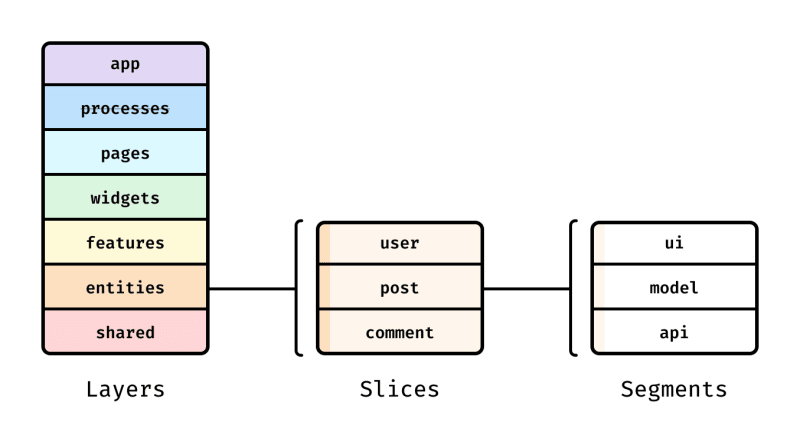
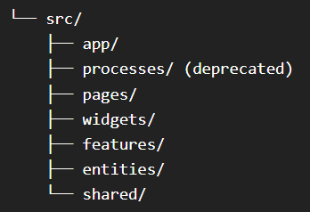
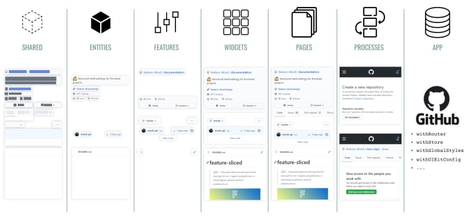
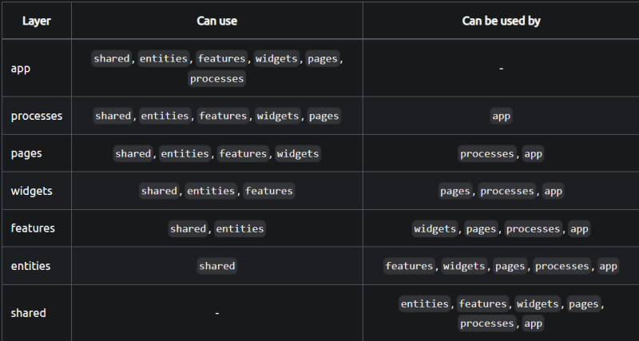
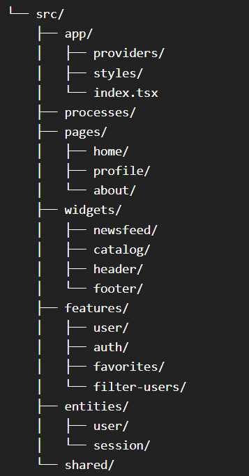
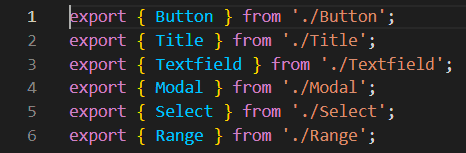
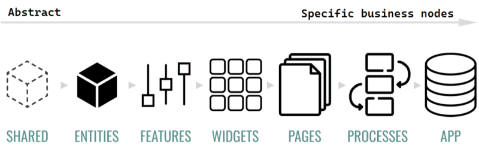
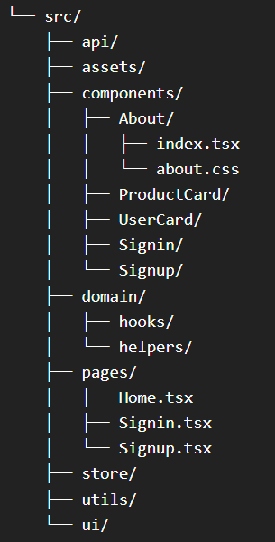

## 소개

프론트엔드 개발자들은 애플리케이션 아키텍처와 관련된 도전에 자주 맞닥뜨립니다. 이러한 문제를 해결하기 위해, 애플리케이션 모듈 사이에서 느슨한 결합과 높은 응집력을 제공하고 손쉽게 확장 가능한 아키텍처가 필요합니다.

이 글에서는 **기능 분할 설계 (Feature-Sliced Design, FSD)** 아키텍처를 다루고 있습니다. 저는 개인적으로 FSD가 제공하는 솔루션들이 현재 사용 가능한 방법론 중에서 가장 우수하다고 생각합니다. 본문에서는 FSD의 이론과 이 아키텍처가 해결하려는 문제점들에 대해 설명합니다. 또한, FSD를 기존의 고전적인 아키텍처 및 모듈러 아키텍처와 비교하면서 각각의 장단점을 분석할 것입니다.

먼저 세 가지 개념인 `레이어(Layer)`, `슬라이스(Slice)`, `세그먼트(Segment)`를 구분해 봅시다.



<br >

## Layers

레이어는 최상위 디렉토리이며 애플리케이션 분해의 첫 단계입니다. 레이어의 수는 최대 7개까지 가능하며 표준화되어 있지만 일부는 선택적입니다. 현재 다음과 같이 레이어가 구분됩니다:



<br >

각 레이어는 독자적인 책임 영역을 가지며 비지니스 지향적입니다. 각 레이어를 개별적으로 살펴보겠습니다.

- **app**: 애플리케이션 로직이 초기화되는 장소입니다. 이곳에서는 프로바이더, 라우터, 전역 스타일, 전역 타입 선언 등이 설정됩니다. 애플리케이션의 시작점으로 기능합니다.
- **processes**: 여러 페이지에 걸친 프로세스, 예를 들어 다단계 등록과 같은 것을 처리합니다. 이 레이어는 사용이 권장되지 않지만 가끔 볼 수 있습니다. 선택적 레이어입니다.
- **pages**: 애플리케이션의 페이지들을 포함합니다.
- **widgets**: 페이지에서 사용되는 독립적인 UI 컴포넌트입니다.
- **features**: 비지니스 가치를 지닌 사용자 시나리오와 기능을 다룹니다. 예를 들어 좋아요, 리뷰 작성, 제품 평가 등이 있습니다. 선택적 레이어입니다.
- **entities**: 비지니스 엔티티를 나타냅니다. 사용자, 리뷰, 댓글 등이 포함됩니다. 선택적 레이어입니다.
- **shared**: 특정 비지니스 로직에 구속되지 않는 재사용 가능한 컴포넌트와 유틸리티를 포함합니다. UI 키트, axios 설정, 애플리케이션 설정, 비지니스 로직에 구속되지 않는 헬퍼 함수 등이 포함됩니다.

이 레이어들은 코드베이스를 체계적으로 구성하여 모듈성, 유지보수성, 확장성 있는 아키텍처를 설계하는 데 도움이 됩니다.



<br >

FSD의 핵심 특징 중 하나는 계층적 구조입니다. 이 구조에서는 features 레이어가 entities 레이어보다 상위 계층이기 떄문에 entities 레이어가 features 레이어의 기능을 사용할 수 없습니다.
마찬가지로 features 레이어는 widgets 레이어나 processes 레이어의 컴포넌트를 사용할 수 없습니다. 이는 모든 계층이 하위 계층만을 활용할 수 있기 때문입니다. 이러한 방식은 데이터 흐름이 한 방향으로만 향하는 선형적인 흐름을 유지하기 위함입니다.



하위 계층의 레이어일수록 코드가 많은 곳에서 사용될 가능성이 높기 때문에, 코드를 변경하는 것이 위험합니다.
예를 들어 shared 레이어는 features, widgets, 심지어 pages 레이어에서도 사용됩니다.

<br >

## Slices

각 레이어에는 하위 디렉토리(슬라이스)가 있으며, 이는 애플리케이션 분해의 두 번째 수준입니다. 슬라이스에서는 추상적인 것이 아니라 특정 비지니스 엔티티와 연결됩니다. 슬라이스의 주요 목표는 코드를 그 가치에 따라 그룹화하는 것입니다.

슬라이스 이름은 표준화되어 있지 않습니다. 왜냐하면 그것들은 프로젝트의 비지니스 영역에 의해 직접 결정되기 때문입니다. 예를 들어, 사진 갤러리에서는 사진, 앨범, 갤러리와 같은 섹션이 있을 수 있습니다. 소셜 네트워크에서는 포스트, 사용자, 뉴스피드와 같은 슬라이스가 필요할 것입니다.

밀접하게 관련된 슬라이스들은 디렉토리 안에서 구조적으로 그룹화될 수 있지만, 다른 슬라이스와 동일한 격리 규칙을 준수해야 하며, 이 디렉토리에 있는 코드는 직접적으로 공유되지 않아야 합니다.



<br >

## Segments

각 슬라이스는 여러 세그먼트로 구성됩니다. 세그먼트는 슬라이스 내의 코드를 목적에 따라 나누는 데 도움을 줍니다. 팀의 합의에 따라 세그먼트의 구성과 명칭은 변경될 수 있습니다. 다음 세그먼트들이 자주 사용됩니다.

- **api**: 서버 요청 및 응답을 처리합니다.
- **UI**: 슬라이스의 UI 컴포넌트
- **model**: 비지니스 로직, 즉 상태와의 상호 작용, actions 및 selectors가 이에 해당되빈다.
- **lib**: 슬라이스 내에서 사용되는 보조 기능
- **config**: 슬라이스에 필요한 구성 값이지만 구성 세그먼트는 거의 필요하지 않음
- **consts**: 필요 상수들

<br >

## Public API

각 슬라이스와 세그먼트는 Public API를 가지고 있습니다. Public API는 index.js 또는 index.ts 파일로 표현되며, 이 파일을 통해 슬라이스나 세그먼트에서 필요한 기능만을 외부로 추출하고 불필요한 기능을 격리할 수 있습니다. 인덱스 파일은 진입점 역할을 합니다.

### Public API 규칙:

- 애플리케이션의 슬라이스와 세그먼트는 Public API 인덱스 파일에 정의된 슬라이스의 기능과 컴포넌트만을 사용합니다.
- Public API에 정의되지 않은 슬라이스나 세그먼트의 내부 부분은 격리된 것으로 간주되며 슬라이스 또는 세그먼트 내부에서만 접근할 수 있습니다.

Public API는 import와 export 작업을 간단하게 만들어주므로, 애플리케이션에 변경이 있을 때도 코드 곳곳의 import를 변경할 필요가 없습니다.



<br >

## 아키텍처에 대해 더 자세히 알아보기

### 추상화 및 비지니스 로직

상위 계층의 레이어일수록 특정 비지니스 노드와 강하게 연결되어 있고 비지니스 로직이 많이 포함됩니다. 반면, 하위 계층의 레이어일수록 추상화 수준이 높고 재사용성이 증가하며, 해당 레이어를 변경하기 어려워집니다.



<br >

### FSD는 문제를 어떻게 해결할까?

FSD의 주요 목표 중 하나는 느슨한 결합과 높은 응집력을 달성하는 것입니다. FSD가 이 목표를 어떻게 달성하는지 이해하는 것이 중요합니다.

객체 지향 프로그래밍에서는 **다형성(polymorphism), 캡슐화(encapsulation), 상속(inheritance), 추상화(abstraction)** 와 같은 개념을 통해 이러한 문제들을 오랫동안 해결해왔습니다. 이러한 개념들은 코드의 격리, 재사용 가능성, 다양성을 보장하며 컴포넌트나 기능의 사용 방법에 따라 다른 결과를 얻을 수 있습니다.

FSD는 이러한 원칙들을 프론트엔드에 적용하는 데 도움을 줍니다.

**추상화(abstraction)와 다형성(polymorphism)** 은 레이어를 통해 달성됩니다. 하위 계층 레이어가 추상적이기 때문에 상위 계층 레이어에서 재사용될 수 있으며, 조건에 따라 컴포넌트나 기능이 매개변수나 Props에 따라 다르게 동작할 수 있습니다.

**캡슐화(encapsulation)** 는 Public API를 통해 달성됩니다. 이는 슬라이스와 세그먼트에서 외부에 필요하지 않은 것을 격리합니다. 슬라이스의 내부 세그먼트에 대한 접근은 제한되며, Public API는 슬라이스나 세그먼트에서 기능과 컴포넌트에 접근할 수 있는 유일한 방법입니다.

**상속(inheritance)** 도 레이어를 통해 이루어집니다. 상위 계층 레이어는 하위 계층 레이어를 재사용할 수 있습니다.

<br >

### 고전적인 아키텍처와 비교

저는 여러분이 고전적인 아키텍처를 여러 번 경험해본 적이 있다고 생각합니다. 그 간단함 때문에 많은 저자들이 블로그나 유튜브에서 이를 설명합니다. 고전적인 아키텍처는 특정한 표준이 없지만, 자주 사용되는 구조는 다음과 같습니다:



고전적인 아키텍처는 눈에 띄는 단점들이 있지만, 가장 큰 문제는 컴포넌트 간의 암묵적인 연결과 모듈의 복잡성으로 인해 프로젝트의 유지 관리가 어려워진다는 것입니다. 고전적인 아키텍처의 단점은 시간이 지남에 따라 더욱 명확해집니다. 프로젝트가 오래 진행될수록 애플리케이션 아키텍처는 점점 더 얽히고설키는 미로가 되어 해결하기 어려워집니다.

고전적인 아키텍처는 지속적인 유지 보수가 필요 없느 작은 프로젝트나 개인 프로젝트에 적합합니다.

FSD는 그 개념과 표준 덕분에 고전적인 아키텍처의 문제들을 방지합니다. 하지만, FSD를 사용하는 개발자들은 고전적인 아키텍처를 사용할 때보다 더 높은 이해도와 기술을 요구합니다. 일반적으로 2년 미만의 경력을 가진 개발자들은 FSD에 대해 들어보지 못한 경우가 많습니다. 그러나 FSD를 사용할 때는 문제들을 `나중에`가 아니라 `지금`해결해야 합니다. 코드의 문제점과 개념에서 벗어난 부분들은 바로 눈에 띄게 됩니다.

<br >

### 단순한 모듈식 아키텍처와의 비교

단순한 모듈식 아키텍처는 몇 가지 단점을 가지고 있습니다.

- 기능을 어떤 모듈이나 컴포넌트에 넣을 지 명확하지 않을 때가 있습니다.
- 다른 모듈 내에서 모듈을 사용하는 데 어려움이 있습니다.
- 비지니스 엔티티를 저장하는 데 문제가 있습니다.
- 전역 함수에서의 암묵적 종속성으로 인해 구조가 복잡해집니다.

복잡한 프로젝트의 경우, 단순한 모듈식 아키텍처보다 FSD를 선호해야 합니다. FSD는 근본적인 아키텍처 문제를 해결하며 단점도 거의 없습니다.

단순함 및 개발 속도 측면에서는 단순 모듈식 아키텍처가 FSD보다 유리할 수 있습니다. MVP가 필요하거나 수명이 짧은 프로젝트를 개발하는 경우에는 단순한 모듈식 아키텍처가 FSD보다 더 적합할 수 있습니다. 하지만 그 이외에는 FSD가 더 바람직합니다.

<br >

### Next.js와 FSD의 충돌

최근에는 Next.js를 FSD와 함께 사용하는 추세가 점점 늘고 있습니다. Next.js는 FSD와 잘 작동하지만, 페이지 내 파일 라우팅과 앱의 부재라는 두 가지 영역에서 충돌이 있습니다.

<br >

**pages**

Next.js에서는 `pages` 디렉터리가 파일 라우팅을 담당하며, 각 컴포넌트가 하나의 라우트를 나타냅니다. 반면에 FSD에서는 `pages`가 평면 목록을 담고 있는 레이어로 사용됩니다. 이로 인해 Next.js의 `pages`와 FSD의 `pages`를 어떻게 결합할지에 대한 충돌이 발생합니다.

Next.js와 FSD를 함께 사용할 때, `[root]/pages/`와 같이 Next.js의 `pages`를 애플리케이션의 루트에 저장할 수 있습니다. 그리고 FSD의 `pages`를 `[root]/src/pages/`와 같이 src 폴더에 저장합니다.

다른 해결 방법으로는 두 개의 디렉터리를 유지하는 것이 있습니다. FSD의 평면 페이지 목록의 이름을 `pages-flat`과 같이 변경하고, Next.js에서는 중첩 라우트를 사용합니다. 페이지 코드는 `pages-flat`에 저장되고, Next.js의 `pages`에는 페이지의 레이아웃이 저장됩니다.

두 방법 중 어느 것을 사용해도 좋지만, 저는 첫 번째 방법을 선호합니다.

<br >

**App**

App 레이어의 모든 기본적인 기능은 Next.js에서 처리합니다. 그러나 페이지와 상관없이 전체 애플리케이션에 독립적으로 실행해야 할 작업이 여전히 필요한 경우, 전체 애플리케이션을 위한 레이아웃을 레이아웃 패턴을 사용하여 만들 수 있습니다.

[Next.js 문서에서 레이아웃 패턴에 대해 설명합니다.](https://nextjs.org/docs/pages/building-your-application/routing/pages-and-layouts#layout-pattern)

<br >

## 기능 분할 설계의 잠재력

FSD는 비교적 젊은 소프트웨어 아키텍처 방법론입니다. 그러나 이미 많은 금융, 핀테크, B2B, 이커머스 회사 등에서 사용하고 있습니다. ([여기 FSD를 사용하는 회사 목록이 있는 링크입니다.](https://github.com/feature-sliced/documentation/issues/131))

이 블로그 글을 게시하는 시점에서 공식 FSD 문서가 있는 Github 저장소는 858개의 별을 받았습니다. 이 문서는 계속 업데이트되고 있으며, FSD 개발팀과 Telegram 및 Discord의 커뮤니티는 아키텍처 관련 질문이 있는 분들을 위해 24시간 도움을 드리고 있습니다.

이 아키텍처의 잠재력은 매우 높게 평가되고 있으며, 전 세계의 다양한 대형 기업들 사이에서 널리 사용되고 있습니다. 제대로 도입한다면, FSD는 프론트엔드 개발 분야에서 주도적인 아키텍처 솔루션으로 성장할 수 있는 잠재력을 가지고 있습니다.

<br >

## FSD의 장단점

### 장점

- 아키텍처 구성 요소를 쉽게 교체, 추가 또는 제거할 수 있습니다.
- 아키텍처를 표준화할 수 있습니다.
- 확장성이 있습니다.
- 개발 스택과 독립적인 방법론입니다.
- 예기치 못한 부작용 없이 모듈 간의 연결이 제어되고 명시적입니다.
- 비지니스 지향 아키텍처 방법론입니다

### 단점

- 다른 아키텍처 솔루션에 비해 진입 장벽이 높습니다.
- 인식, 팀 문화, 개념 준수가 필요합니다.
- 문제와 이슈는 즉시 해결해야 합니다. 코드 문제와 개념에서 벗어난 부분을 즉시 확인할 수 있습니다. 그러나 이는 장점으로도 볼 수 있습니다.

## 결론

FSD는 프론트엔드 개발자가 알고 사용할 수 있어야 하는 흥미롭고 가치 있는 발견입니다.
FSD는 팀에 유연하고 표준화된 확장 가능한 아키텍처와 개발 문화를 제공할 수 있습니다. 그러나 이 방법론을 활용하려면 팀 내에서 이해도를 높이고 개념을 준수해야 합니다.

FSD는 명확한 비지니스 지향성, 엔티티 정의, 기능 및 구성 요소의 조합으로 다른 아키텍처들 중에서 돋보입니다.

또한 프로젝트에서 FSD 사용 사례와 공식 FSD 문서를 살펴볼 수도 있습니다.

- [공식 문서](https://feature-sliced.design)
- [예제 코드(Todo App)](https://github.com/awesomelon/fsd-todo)

글이 조금 길었지만, 여러분이 새로운 것을 배웠기를 바랍니다. 이 글을 끝까지 읽어주셔서 감사 합니다. ❤️

---

> 원문: [Feature-Sliced Design: The Best Frontend Architecture](https://dev.to/m_midas/feature-sliced-design-the-best-frontend-architecture-4noj)

위의 원문을 GPT를 활용해서 번역한 글입니다. 오타 및 잘못된 내용이 있으면 댓글 남겨주세요 🙏

```toc

```
