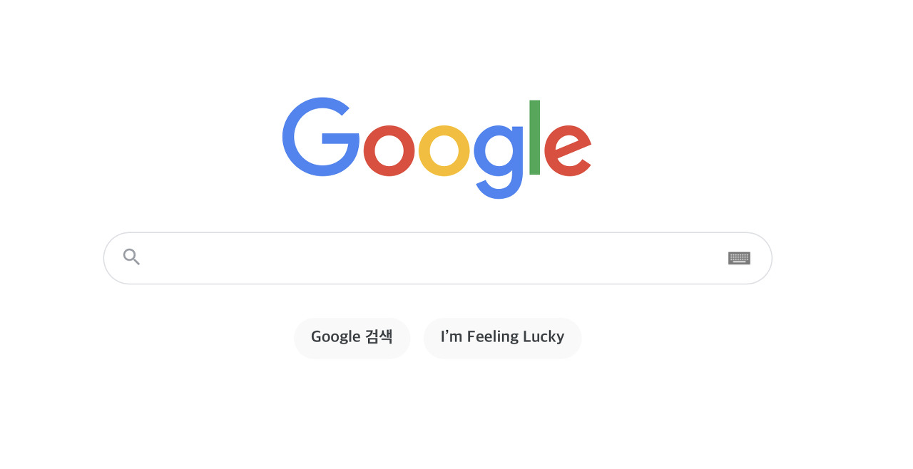
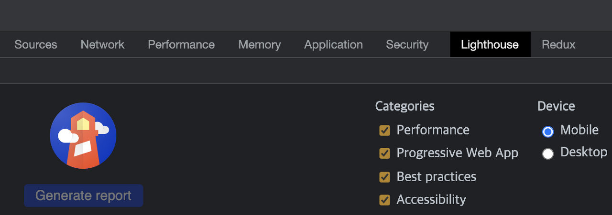

다들 한 번쯤은 구글을 써보았을 것입니다.

그런데 궁금하지 않으신가요?

구글은 어떻게 30조 개가 넘는 웹 페이지들 속에서 사용자가 입력한 검색어에 맞는 결과물을 10개로 추려서 보여줄까요?

**그것도 평균 0.5초 만에!!**

<br >

사용자가 검색어를 입력할 때마다 구글이 그 많은 웹 페이지에 접속하진 않습니다.

대신 DB에 각 웹페이지의 정보를 저장해 두고 알고리즘을 이용해서 무엇을 보여줄지 정합니다.

---

## 크롤링

구글의 알고리즘은 인터넷 상의 모든 웹페이지를 DB에 저장하는 것으로 시작합니다.

이를 위해 **Spider**라는 프로그램을 이용해 웹 페이지를 **크롤링**합니다.

**크롤은 기어 다닌다는 뜻입니다.** 크롤링은 인터넷에 있는 모든 웹 페이지를 찾을 때까지 지속됩니다.

Spider는 일단 몇 개의 웹 페이지를 크롤링해서 **색인**이라고 하는 웹 페이지 목록에 추가합니다.

그리고 각 웹 페이지에서 외부 링크를 따라가서 또 새로운 웹 페이지를 색인에 추가합니다. 그렇게 해서 더는

새로운 웹 페이지를 찾을 수 없을 때까지 이 과정이 반복됩니다.

<br >

> 구글에 크롤링을 검색해보면 나오는 결과물 중 대다수는 <br >
> "파이선으로 크롤링 만들기", "노드로 크롤링 만들기", "인스타 크롤링하기" 등입니다. <br >
> 하지만 웹 페이지 몇 개를 긁는 걸 크롤링이라고 할 수 없습니다. <br >
> 위의 블로그 글들은 그저 1회성 코드에 불과합니다. <br >
> DOM 구조가 약간만 변해도 더 이상 쓸 수 없는 코드인 것입니다. <br ><br > **크롤러는 수 천 많게는 수 만 개의 웹 페이지들을 어떻게 하면 잘 수집할 수 있을까에 대한 고민입니다.**

---

## 페이지 랭크

구글은 키워드 밀도 대신 **페이지 랭크(PageRank)** 라는 알고리즘을 사용합니다.

> **키워드 밀도**
> 키워드가 웹 페이지에 나타나는 빈도입니다. <br >
> 90년대 검색 엔진은 특정 키워드의 출현 빈도를 확인해서 가장 많이 나오는 웹 페이지들을 보여줬습니다. <br>
> 하지만 이 방식은 큰 단점이 있습니다. <br ><br >
> 예를 들어, 네이버라는 단어로 검색을 했다면 당연히 naver.com이 최상위에 표시되어야 합니다. <br >
> 하지만 누군가 페이지에 네이버라는 단어를 잔뜩 써놓는다면 그 페이지가 최상위에 오를 것입니다. <br >
> 이런 결과는 쓸모가 없습니다.

<br>

페이지 랭크는 구글의 창립자 **래리 페이지**와 **세르게이 브린**이 개발했습니다.


<br >

당시 두 사람은 어떤 웹 페이지의 중요도를 측정하려면, 해당 웹 페이지를 링크하고 있는 다른 페이지들을

봐야한다고 판단했습니다.

페이지 랭크는 웹 페이지의 점수를 계산할 때 해당 웹 페이지를 링크한 다른 모든 웹 페이지의 페이지 랭크

점수를 집계합니다.

> 물론 다른 웹 페이지들의 점수 역시 또 다른 웹 페이지들의 점수를 기준으로 계삭되는데 이때 [선형대수학](https://ko.wikipedia.org/wiki/%EC%84%A0%ED%98%95%EB%8C%80%EC%88%98%ED%95%99)이 이용됩니다.

<br >

예를 들어 지금 저의 블로그는 페이지 랭크가 낮을 것입니다.

그러다 다른 구독자가 별로 없는 어떤 블로거가 저의 페이지를 링크한다면 페이지 랭크가 조금 올라가게 됩니다.

페이지 랭크에서 중요시되는 것은 양보다 질입니다. 그래서 인기 없는 블로거 수십명이 저의 글을 링크해도 점수가 별로 안 올라갑니다.😂

하지만 엄청 인기 있는 블로거가 저의 글을 링크한다면 점수가 대폭 상승하게 됩니다😀

<br >

구글은 페이지 랭크 외에도 최근 업데이트 시점을 확인하고 사용자의 현재 위치를 반영합니다.

예를 들어 이디야 커피를 검색한다고 한다면 저의 위치에 가까운 이디야 커피 지점부터 나오게 됩니다.

---

## SEO

**[Search Engine Optimization](https://ko.wikipedia.org/wiki/%EA%B2%80%EC%83%89_%EC%97%94%EC%A7%84_%EC%B5%9C%EC%A0%81%ED%99%94)**, 즉 검색엔진 최적화는

웹 페이지를 검색 결과 최상위에 올리기 위해 구글 검색 알고리즘을 역이용하는 방법입니다.

SEO의 기본은 자신의 웹 페이지를 링크한 웹 페이지를 늘리는 것입니다.

<br >
그 밖에도 웹 페이지의 제목과 본문에 적절한 키워드를 넣고, 동일한 웹 페이지 내의 모든 웹 페이지가 서로 링크 걸게 하는 등의 여러 가지 기법이 동원됩니다.

---

## 결론

구글도 수시로 검색 알고리즘을 수정합니다.

소소한 알고리즘 업데이트가 500건 이상입니다.

예를 들어 18년에 모바일 기기에서 로딩 속도가 빠른 웹 사이트에 유리하게 알고리즘이 변경되었습니다.

<br >

따라서 구글이 만든 성능 측정 라이브러리인 **[lighthouse](https://developer.chrome.com/docs/lighthouse/overview/)** 를 한번 사용하여 페이지 최적화 정도를 측정해보는 것도 좋은 방법입니다.

lighthouse는 크롬 관리자 도구에서 확인하실 수 있습니다.



```toc

```
