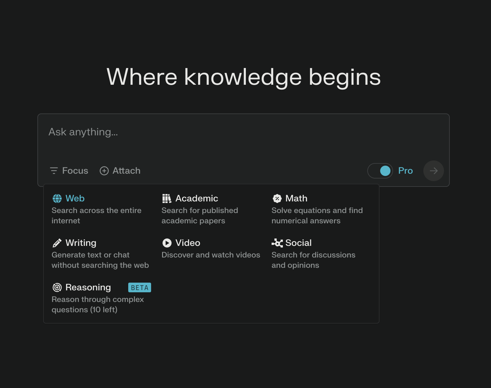
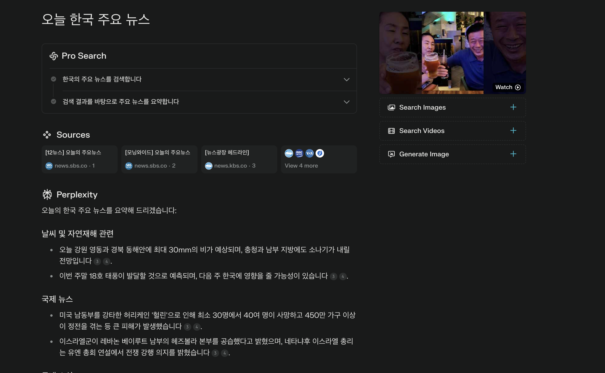
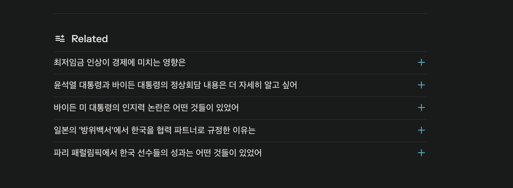
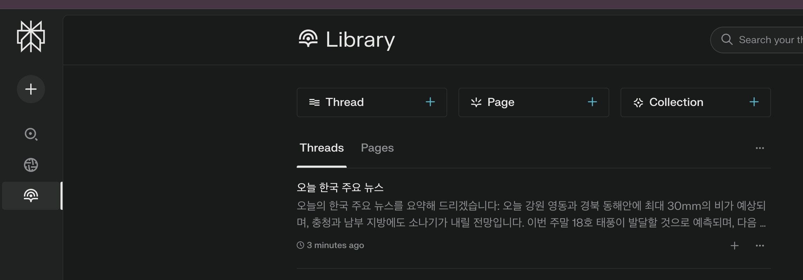
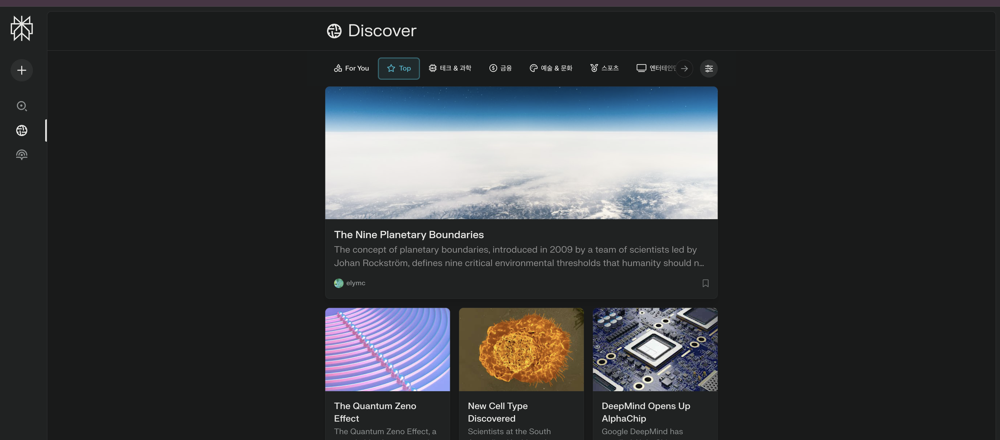

## 소개

[Perplexity AI](https://www.perplexity.ai/)는 기존의 검색 엔진과는 다른 방식으로 작동하는 인공지능 기반 검색 도구입니다.

단순히 키워드에 맞는 웹페이지를 나열하는 것이 아니라, 사용자의 질문을 이해하고 관련 정보를 종합하여 직접적인 답변을 제공하는 검색 플랫폼입니다.


<br />

## 기능 소개

### 1. 맞춤형 검색



사용자는 원하는 정보에 따라서 검색 옵션을 선택할 수 있습니다.

최신 인터넷 정보를 원한다면 `Web` 검색, 학술적인 정보를 원한다면 `Math`, `Academic`  검색, 동영상 검색을 원한다면 `Video`을 선택하여 보다 정확한 검색 결과를 얻을 수 있습니다.


### 2. 대화형 인터페이스 및 정확성



Perplexity AI는 대화형 인터페이스를 통해 사용자의 질문을 자연스럽게 받아들이고, 신뢰할 수 있는 출처에서 정보를 수집하여 답변의 정확성을 높입니다.

제가 특히 좋다고 느낀건 출처들의 링크를 같이 제공하여 사용자가 직접 확인할 수 있게 해준다는 점입니다.

### 3. 연관 질문



Perplexity AI는 사용자의 질문에 대한 답변을 제공하는 동시에, 연관 질문을 제시하여 사용자가 더 정보를 탐험할 수 있도록 도와줍니다.


### 4. 검색 히스토리



사용자는 검색 히스토리를 확인하여 이전에 검색한 내용을 다시 참고할 수 있습니다.

### 5. 주요 뉴스



Perplexity AI는 사용자에게 최신 뉴스와 정보를 제공하여 사용자가 항상 최신 정보를 받아볼 수 있도록 도와줍니다.

<br />

## 제가 느낀 장단점

### 장점

1. **정확성과 신뢰성**
    - 다양한 신뢰할 수 있는 출처에서 정보를 수집하고 분석하여 높은 정확도의 답변을 제공합니다.
    - 최신 정보를 실시간으로 업데이트하여 항상 최신의 데이터를 기반으로 답변합니다.

2. **시간 절약**
   - 복잡한 질문에 대해 즉각적이고 종합적인 답변을 제공하여 사용자의 시간을 크게 절약해줍니다.
   - 여러 웹사이트를 검색하고 정보를 비교할 필요 없이 한 번의 질문으로 원하는 정보를 얻을 수 있습니다.


### 단점 (Cons)

1. **정보의 깊이 제한**
   - 매우 전문적이거나 깊이 있는 주제에 대해서는 전문가 수준의 상세한 정보를 제공하기 어려울 수 있습니다.
   - 복잡한 학술 연구나 전문 분야의 최신 동향을 완벽히 반영하기 어려울 수 있습니다.

2. **맥락 이해의 한계**
   - 때로는 질문의 미묘한 뉘앙스나 문화적 맥락을 완벽히 이해하지 못할 수 있습니다.
   - 복잡한 농담이나 은유적 표현을 이해하는 데 어려움이 있을 수 있습니다.

<br />

## 종합 평가

Perplexity AI를 만약 여타 다른 생성형 AI(ChatGPT, Claude, Gemini...)처럼 데이터를 분석하고 아이디어를 제안받는 등의 작업으로는
아쉬운 점이 있습니다.

하지만 Perplexity AI는 실시간 정보를 기반으로 웹 검색을 하여 최신 정보를 조회하고 사용자의 질문에 답변하는 유용한 플랫폼입니다.
검색 엔진으로서 사용한다면 만족도 100점으로 여러분의 구글 검색 시간을 획기적으로 줄여줄 수 있을 것입니다.


```toc

```
