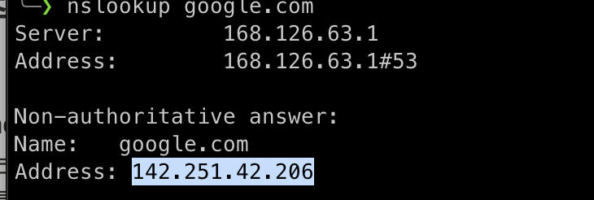
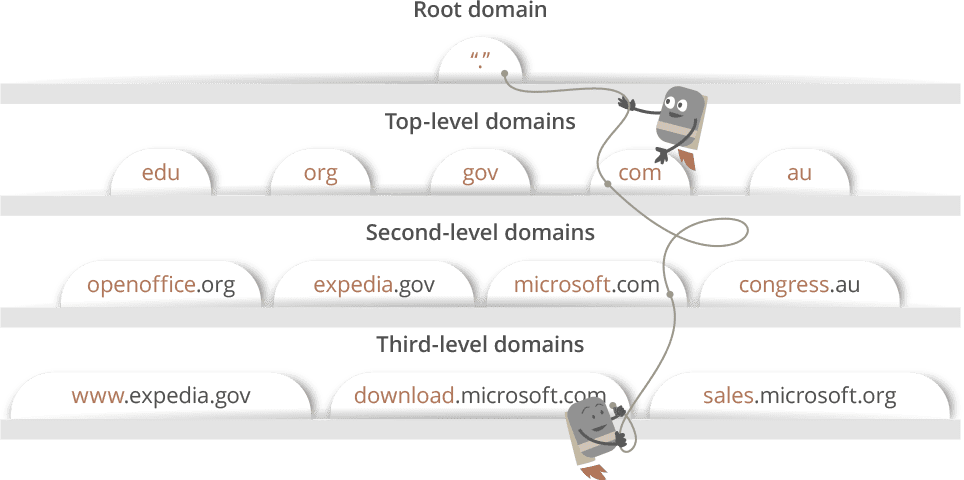
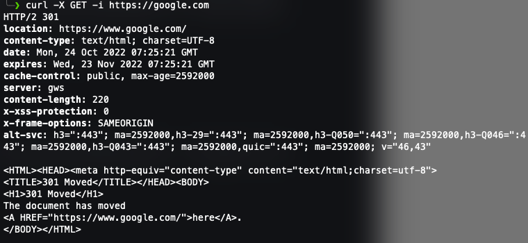

## 브라우저 주소창에 google.com을 입력하면 어떤 일이 일어날까?

---

### **1. 브라우저는 캐싱된 DNS 기록들을 통해 google.com과 대응되는 IP 주소가 있는지 확인합니다.**

**DNS(Domain Name System)** 는 URL들의 이름과 IP 주소를 저장하고 있는 데이터베이스입니다.

인터넷에 있는 모든 URL들에는 고유의 IP 주소가 지정되어 있습니다. 이 IP 주소를 통해서 해당 웹 사이트를 호스팅하고 있는 서버 컴퓨터에 접근할 수 있습니다.

예를 들어 [google.com](https://google.com)의 IP 주소를 알아보기 위해서는 아래의 커맨드를 터미널에 작성하면 해당 사이트의 IP 주소를 알려줍니다.

```bash
nslookup google.com
```

<br>

현재 제가 있는 지역에서 해당 명령어를 작성했을 때 142.251.42.206가 나왔고 IP 주소를 브라우저에서 검색했을 때 google.com의 결과와 같았습니다.


<br >

> 여기서 <br > **non-authoritative answer**이란, name 서버가 도메인에서 만든 원본 소스 파일을 갖고 있지 않다는 뜻입니다. <br >
> 이 서버에는 다른 DNS들에서 얻어진 도메인의 파일을 캐싱 형태로 갖고 있는 것입니다.

<br >

#### **DNS의 가장 큰 목적은 사람들에게 편리함을 주기 위함입니다.**

숫자로 된 IP 주소를 작성해도 원하는 웹 사이트에 접속할 수 있지만, 매번 랜덤 해 보이는 숫자들을 검색하는 것은 매우 복잡한 일입니다.

사람은 네이버, 다음, 구글처럼 이름을 외우는 것에 더 친숙하기 때문입니다.

DNS는 이처럼 사람들이 웹 사이트 주소에 접속할 수 있게 매핑해주는 역할을 합니다.

<br >

웹 사이트 이름을 브라우저에 검색하면 브라우저는 DNS 기록을 4가지의 캐시에서 확인합니다.

1. 가장 먼저 브라우저 캐시를 확인합니다. <br > 브라우저는 일정 기간 동안의 DNS 기록들을 저장하고 있습니다. DNS Query는 이곳에서 가장 먼저 실행이 됩니다.

2. 그다음에 브라우저는 OS 캐시를 확인합니다. <br > 브라우저 캐시에 웹 사이트 이름의 IP 주소가 발견되지 않았다면, 브라우저는 systemcall을 통해서 OS가 저장하고 있는 DNS 기록들의 캐시에 접근합니다.

3. 그다음에는 router 캐시를 확인합니다. <br > 컴퓨터에서 DNS 기록을 찾지 못하면 브라우저는 DNS 기록을 캐싱하고 있는 router와 통신을 해서 찾으려고 합니다.

4. 그래도 못 찾는다면 마지막으로, ISP 캐시를 확인합니다. <br > ISP는 DNS 서버를 구축하고 있고 브라우저는 마지막으로 DNS 기록이 있기를 바라며 접근하게 됩니다.

<br >

#### **왜 이렇게 많은 곳에서 캐시들을 저장할까요?**

개인 정보를 생각했을 때, 정보가 여기저기에 캐싱된 것이 조금 불편할 수 있겠지만, 캐시는 네트워크 트래픽을 조절하고 데이터 전송 시간을 줄이기 위해 매우 중요합니다.

---

### **2. 요청한 URL이 캐시에 없으면, ISP의 DNS 서버가 google.com을 호스팅하고 있는 서버의 IP 주소를 찾기 위해 DNS query를 날립니다.**

위에서 언급했던 것처럼 google.com에 접속하고 싶으면 IP 주소를 반드시 알아야 합니다.

DNS Query의 목적은 여러 다른 DNS 서버들을 검색해서 해당 사이트의 IP 주소를 찾는 것입니다.

이러한 검색을 **`recursive search`** 라고 부릅니다. IP 주소를 찾을 때까지 DNS 서버에서 다른 DNS 서버를 오가면서 반복적으로 검색을 하던지 못 찾아서 에러가 발생할 때까지 검색을 진행합니다.

<br >

이 상황에서, ISP의 DNS 서버를 **`DNS recursor`** 라고 부르고 인터넷을 통해 다른 DNS 서버들에게 물어 물어 도메인 이름의 올바른 IP 주소를 찾는데 책임을 가지고 있습니다.

다른 DNS 서버들은 **`name server`** 라고 불립니다. 이들은 웹 사이트 도메인 이름의 구조에 기반해서 검색을 하기 때문입니다.

<br >

도메인 이름 구조에 기반해서 검색한다고 하면 이해하기 어려워 보이지만 원리는 매우 간단합니다.

일단 도메인 이름들의 구조를 보면 다음과 같습니다.



우리가 마주하는 웹 사이트 URL들은 `third-level domain`, `second-level-domain`, `top-level domain`을 가지고 있습니다.

각 레벨별로 자신들만의 name server가 있고 여기서 DNS lookup 프로세스 중에 쿼리가 진행됩니다.

<br >

google.com에 대해서

1. 처음에 `DNS recursor`가 `root name server`에 연락을 합니다.

2. `root name server`는 .com 도메인 `name server`로 리다이렉트 합니다.

3. `.com name server`는 `google.com name server`로 리다이렉트 합니다.

4. `google.com name server`는 DNS 기록에서 google.com에 매칭 되는 IP 주소를 찾고 `DNS recursor`로 보내게 됩니다.

<br >

이 모든 요청들은 작은 데이터 패킷들을 통해서 보내집니다.

패킷 안에는 보내는 요청의 내용과 DNS recursor의 IP 주소가 포함되어 있습니다.

이 패킷들은 원하는 DNS 기록을 가진 DNS 서버에 도달할 때까지 클라이언트와 서버를 여러 번 오갑니다.

패킷들이 움직이는 것도 Routing table에 기반합니다.

Routing table을 통해서 어떤 길로 가야 가장 빠른지 확인할 수 있습니다.

만약 패킷이 도중에 loss 되면 request fail error가 발생하게 됩니다.

---

### **3. 브라우저가 서버와 TCP connection을 합니다.**

브라우저가 올바른 IP 주소를 받게 되면 서버와 connection을 빌드하게 됩니다.

브라우저는 인터넷 프로토콜을 사용해서 서버와 연결이 됩니다.

인터넷 프로토콜의 종류는 여러 가지 있지만, **웹 사이트의 HTTP의 경우에는 일반적으로 TCP를 사용**합니다.

<br>

클라이언트와 서버 간 데이터 패킷들이 오가려면 **TCP connection**이 되어야 합니다.

**`TCP/IP three-way handshake`** 라는 프로세스를 통해서 클라이언트와 서버 간 connection이 이뤄지게 됩니다.

단어 그대로 클라이언트와 서버가 SYN과 ACK 메시지들을 가지고 3번의 프로세스를 거친 후에 연결이 되는 것입니다.

1. 클라이언트가 SYN 패킷을 서버에 보내고 connection을 열어달라고 물어봅니다.

2. 서버가 새로운 connection을 시작할 수 있는 포트가 있다면 SYN/ACK 패킷으로 대답을 합니다.

3. 클라이언트는 SYN/ACK 패킷을 서버로부터 받으면 서버에게 ACK 패킷을 보냅니다.

<br >

**이 과정이 끝나면 TCP connection이 완성되는 것입니다.**

---

### **4. 브라우저가 웹 서버에 HTTP 요청을 합니다.**

TCP로 연결이 되었다면 데이터를 전송하면 됩니다.

클라이언트의 브라우저는 GET 요청을 통해 서버에게 google.com 웹 페이지를 요구합니다.

요청을 할 때 비밀 자료들을 포함하던지, form을 제출하는 상황에서는 POST 요청을 사용할 수도 있습니다.

이 요청을 할 때 다른 부가적인 정보들도 함께 전달이 됩니다.

- browser identification (User-Agent header)

- 받아들일 요청의 종류 (Accept header)

- 추가적인 요청을 위해 TCP connection을 유지를 요청하는 (connection header)

- cookie

- etc...

---

### **5. 서버가 요청을 처리하고 response를 생성합니다.**

서버는 웹 서버를 가지고 있습니다.(NginX, NodeJs, Apache, IIS...) 이들은 브라우저로부터 요청을 받고 Request handler한테 요청을 전달해서 요청을 읽고 response를 생성하게 됩니다.

Requset handler란 Python, Go, JS, JAVA 등으로 작성된 프로그램을 의미합니다.

이 Request handler는 요청과 요청의 헤더, 쿠키를 읽어서 요청이 무엇인지 파악하고 필요하다면 서버에 정보를 업데이트합니다.

그다음에 response를 특정한 포맷으로 작성합니다. (ex: JSON, XML, HTML)

---

### **6. 서버가 HTTP response를 보냅니다.**

서버의 response에는 `요청한 웹 페이지`, `status code`, `compress type(Content-Encoding)`, `Cache-Control`, 설정할 쿠키가 있다면 `쿠키`, `개인 정보` 등이 포함됩니다.

아래는 샘플 HTTP response headers는 다음과 같습니다.



---

### **7. 브라우저가 HTML content를 보여줍니다.**

브라우저는 HTML content를 단계적으로 보여줍니다.

처음에는 HTML의 스켈레톤을 렌더링 합니다.

그다음에는 HTML tag들을 체크하고 나서 추가적으로 필요한 웹 페이지 요소들을 GET으로 요청합니다.

이 정적인 파일들은 브라우저에 의해 캐싱이 되서 나중에 해당 페이지를 방문할 때 다시 서버로부터 불러와지지 않도록 합니다.

그 다음에는 그토록 원했던 google.com의 모습이 보이게 됩니다.

---

## 결론

**google.com을 검색하고 웹 페이지가 뜰 때까지 엄청 많은 일들이 일어나지만, 이 모든 일들은 1초도 되지 않아서 완료가 된다.**

```toc

```
