## 배치(Batch) 작업 어디까지 해봤니?

서비스를 구축하다 보면 많은 양의 데이터를 일괄적으로 변경하거나 삭제 등의 처리를 해야 할 순간이 옵니다.
이런 작업을 트래픽이 몰리는 시간 때에 하게 되면 서비스에 치명적일 수도 있고 잘못된다면 서비스 전체가 셧다운 되는 악몽을 꾸게 될 수도 있습니다.

이때 해야 하는 것이 **배치(Batch)** 작업입니다.

배치 작업은 데이터를 실시간으로 처리하는 게 아니라, 일괄적으로 모아서 한 번에 처리하는 작업을 의미합니다.
가령, 은행의 정산 작업의 경우 배치 작업을 통해 일괄처리를 수행하게 되며 사용자에게 빠른 응답이 필요하지 않은 서비스에 적용할 수 있습니다.

이번 글에선 MongoDB + NodeJs를 활용한 배치 작업 테스트 결과를 공유하고자 합니다.

## 테스트 환경

### DB Spec

- Tencent Cloud CVM
- 2core / 2GB
- mongodb WT 4.2.19

### DB Schema

#### TestA

- name: string

#### TestB

- name: string;
- aId: string

### Runtime

- NodeJs v14.19.0 / NestJs

<br >

## Take1 🎥

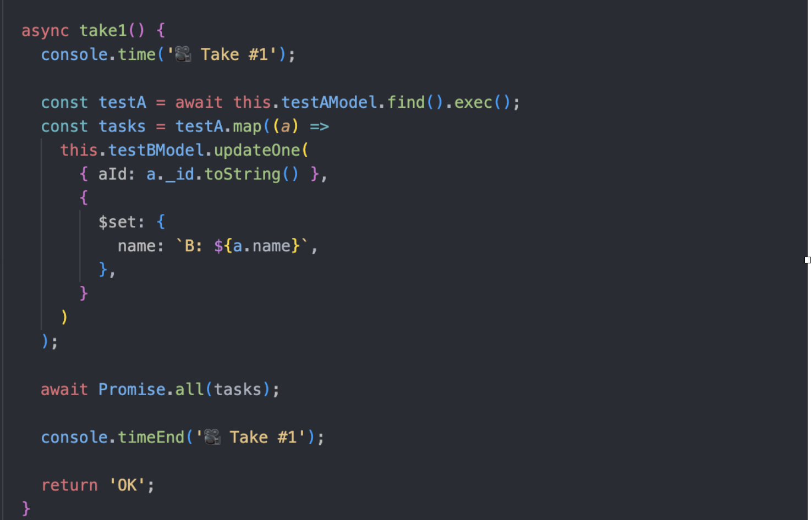

간단한 코드입니다.
TestA 컬렉션에서 데이터를 가져와 TestB 컬렉션의 document 하나씩 update 하는 코드입니다.

실제 운영 중인 서비스에선 여러 비지니스 로직이 들어가겠지만 큰 틀에서 보면 이것과 비슷한 게 많으실 겁니다.

문제가 크게 없어 보이는 코드이지만 실제로 이 코드를 실행해 보면 어쩔까요?

<br >

### 결과

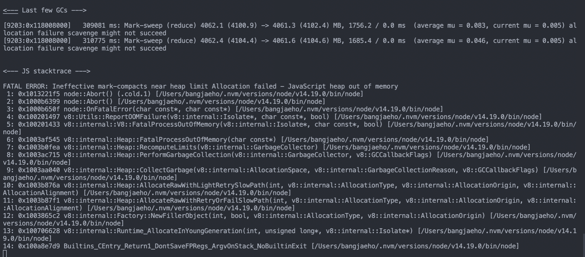

Heap 메모리 부족으로 프로세스가 죽었습니다. 😱

<br >

NodeJs는 버전별로 아래와 같이 사용할 수 있는 기본 메모리 제한이 있습니다.

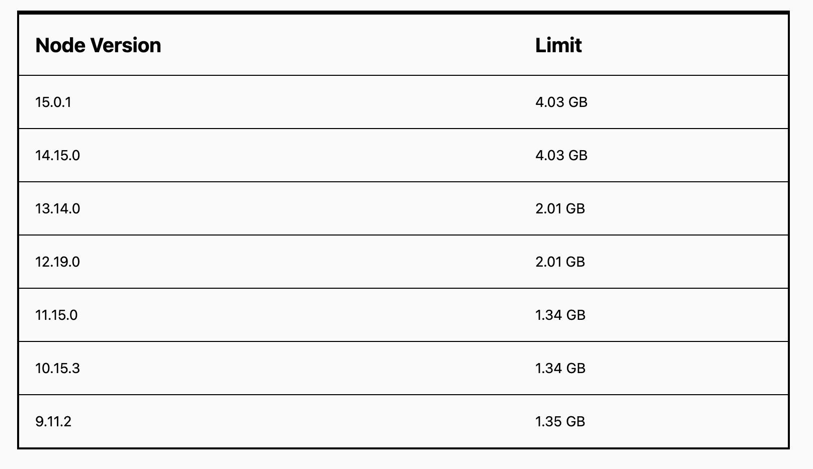

<br >

```bash
node --max-old-space-size=<memory>
```

위와 같은 커맨드로 Heap 메모리 제한을 늘릴 수도 있겠지만 근본적인 해결책은 아닙니다.
코드 상에서 메모리 누수가 발생하는 부분을 찾거나 메모리를 많이 잡아먹는 로직이 있는지 먼저 살펴봐야 합니다.

<br >

살펴보니 TestA, TestB 컬렉션에 document가 각각 50만개가 존재했습니다.

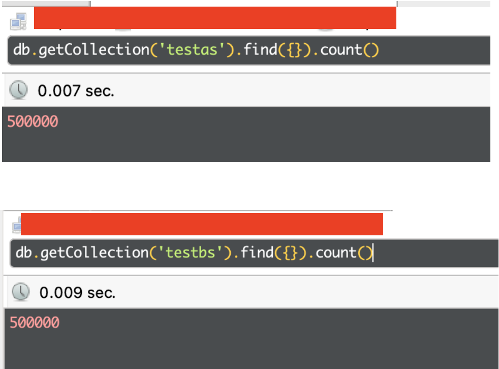

<br >

데이터양을 확인한 후 Take1의 테스트 코드를 보면 문제가 있어 보입니다.

50만 개의 데이터를 가져오는 건 둘째 치더라도 50만 번의 updateOne은 문제가 있어 보입니다.

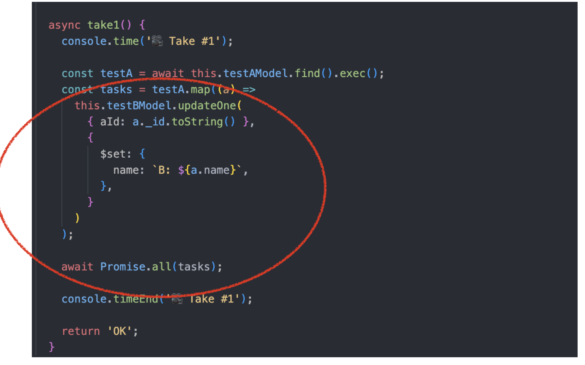

<br >

이럴 때 사용하면 좋은 MongoDB의 메서드가 [bulkWrite](https://j-ho.dev/feature-3/) 입니다.

이름이 아주 명확하죠? 😎

간단하게 말씀드리면 BulkWrite는 이름 그대로 DB에 쓰기 작업을 대량으로 해주는 메서드입니다.

기본적으로 배열로 들어온 쓰기 작업을 순차적으로 처리하고 옵션을 주면 병렬 처리도 가능합니다.

그렇다면 바로 BulkWrite를 적용한 후 테스트 코드를 실행해 보겠습니다.

<br >

## Take2 🎥

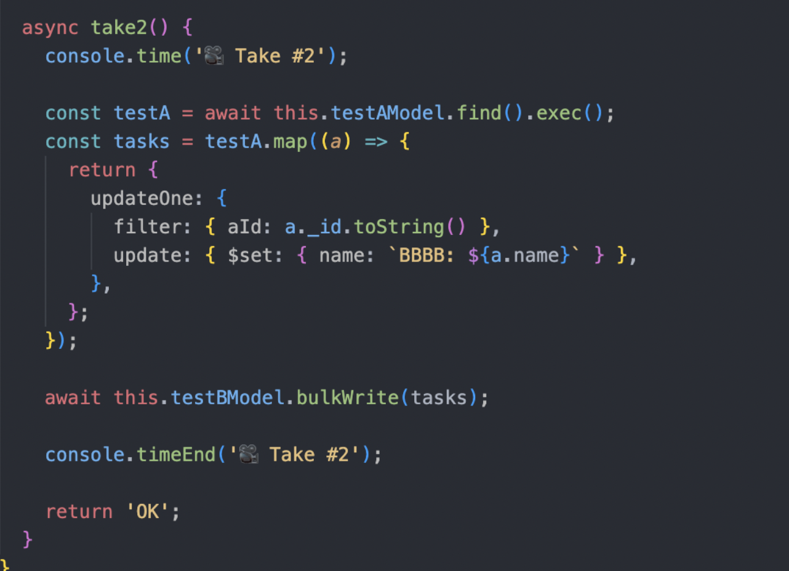

`Take1` 코드에서 BulkWrite만 추가된 코드입니다.

updateOne이 50만 번 실행되던 코드에서 bulkWrite를 한 번 실행하는 것으로 변경되었습니다.

그럼 바로 실행 결과를 보겠습니다.

<br >

### 결과

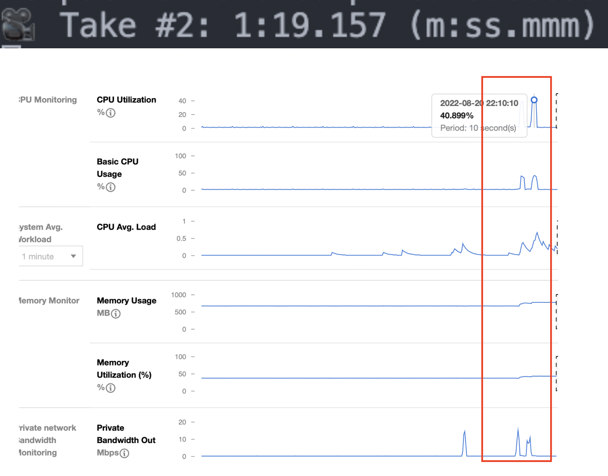

이번에는 문제없이 50만 개의 document가 update 되었습니다.

50만 개의 데이터의 처리가 완료되는 시간은 1분 19초 정도로 나쁘지 않은 속도지만, 로직이 실행되는 동안
DB의 CPU가 40%가량 치솟는 것을 보실 수 있습니다.

40% 면 아직 여유가 있다고 생각하실 수 있지만 update를 하는 로직이 조금만 더 복잡해지거나 데이터가 더 많아진다면 문제가 생길 여지가 있습니다.

DB의 사양을 늘리면 되지 않느냐고 하실 수도 있지만... (`give me the money 💰`)

<br >

역시 문제는 많은 양의 데이터를 한번에 처리하려고 하니까 생기는 문제인 듯 합니다.

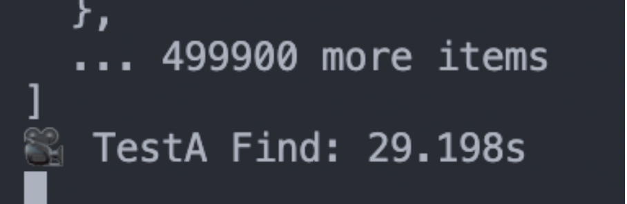

50만 개의 데이터를 읽기만 하는 것으로도 많은 시간이 걸리는 것을 볼 수 있습니다.

그렇다면 몇 개씩 나눠서 처리를 한다면 어떨까요?

다음 테스트 코드 보시겠습니다.

<br >

## Take3 🎥

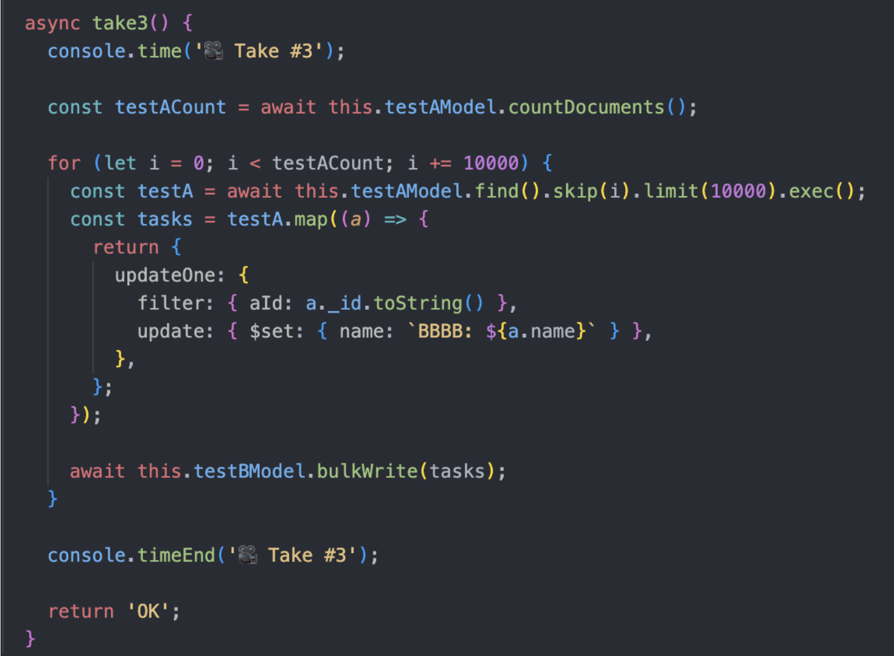

반복문이 추가됐습니다. 데이터를 10000개씩 가져와 쓰기 작업을 하는 코드로 변경했습니다.

50만 개의 데이터를 한 번의 검색으로 가져오는 것보다는 많은 검색을 하겠지만, 만 개씩 데이터를 나눠서 처리하니 안정적일 것 같습니다.

결과를 한번 보시겠습니다.

<br >

### 결과

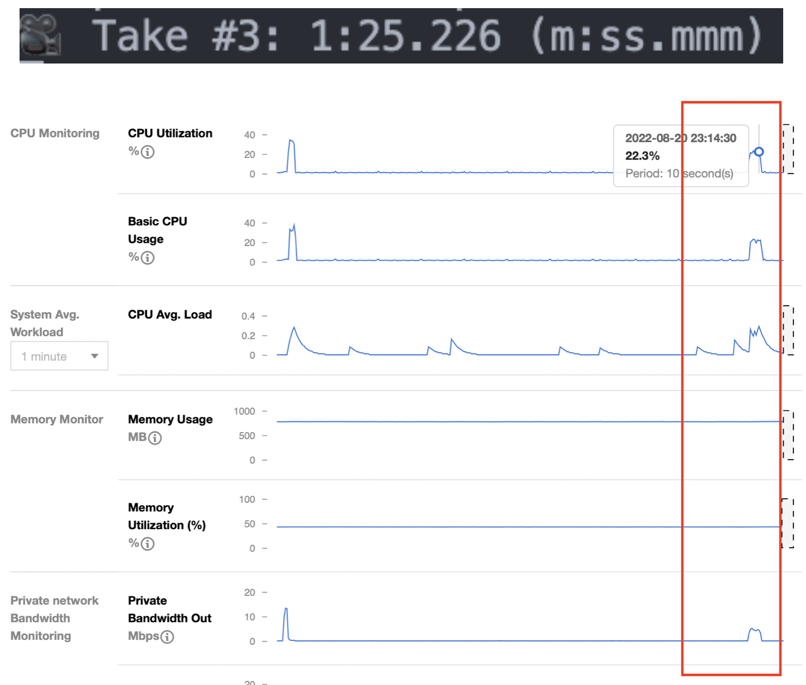

실행 시간은 1분 25초로 50만 개의 데이터를 한 번에 처리하는 것과 비슷한 처리 시간이 나타났습니다.

한 번에 데이터를 처리하는 것과 나눠서 처리하는 것에서 속도의 차이는 거의 없어 보입니다만...

<br >

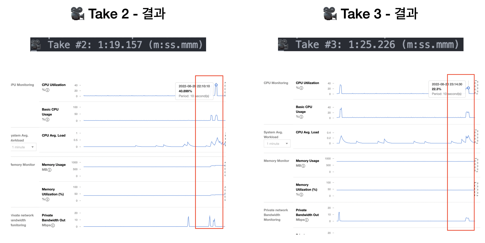

CPU 사용률을 보면 22% 정도로 Take2의 반절 정도의 사용률을 보여줍니다.

훨씬 안정적인 것이죠.

<br >

### 문제점

확실히 좋아 보이는 처리 방법이지만 단점은 존재합니다.

나눠서 처리할 데이터양을 정하는 것이 어렵다는 단점이 있습니다.

지금은 테스트 데이터들이라 데이터 용량이 작아 만 개라는 임의의 수를 지정해서 처리할 수 있었습니다.

하지만 실제 운영되는 데이터의 메모리는 저것들보다 훨씬 많을 것입니다.

예를 들어 지금 테스트에 사용하고 있는 MongoDB는 쿼리에 응답하는 데이터의 **최대 메모리는 40MB**입니다.

따라서 만 개의 데이터가 40MB를 넘어버린다면 MongoDB는 쿼리에 응답하지 못할 것입니다.

그렇다면 해결 방법은 무엇이 있을까요?

저는 해결 방법을 Stream으로 생각했습니다.

DB에서 SELECT를 해올 때 Stream으로 데이터를 가져와서 하나씩 처리한다면 처리 시간은 훨씬 오래 걸리겠지만 안정적일 것입니다.

그렇다면 Take4 보시죠

<br >

## Take4 🎥

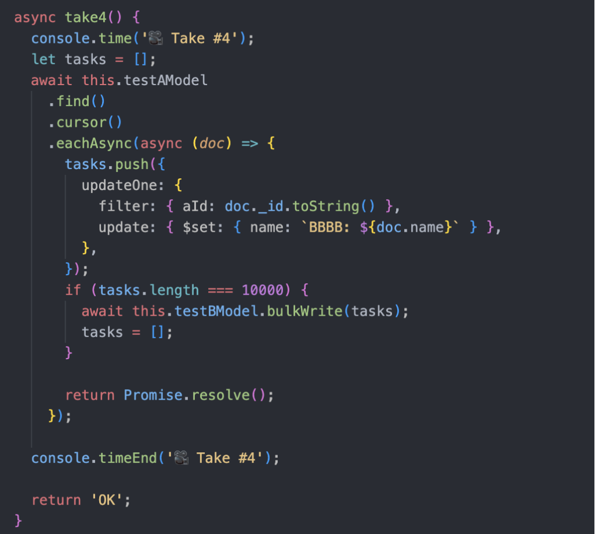

`cursor` 명령어가 추가됐습니다.

cursor는 쿼리에 대한 결과를 document로 반환하지 않고 cursor로 반환하는 명령어입니다.

cursor에 대한 자세한 내용은 아래 첨부해둔 링크에서 참고해 주세요.

간단하게 말씀드리자면 cursor는 find 해온 결과를 Stream으로 가져올 수 있게 하는 메서드입니다.

위의 코드와 같이 BulkWrite와 Stream을 동시에 써서 실행을 한다면 아래와 같은 결과가 나타나게 됩니다.

<br >

### 결과

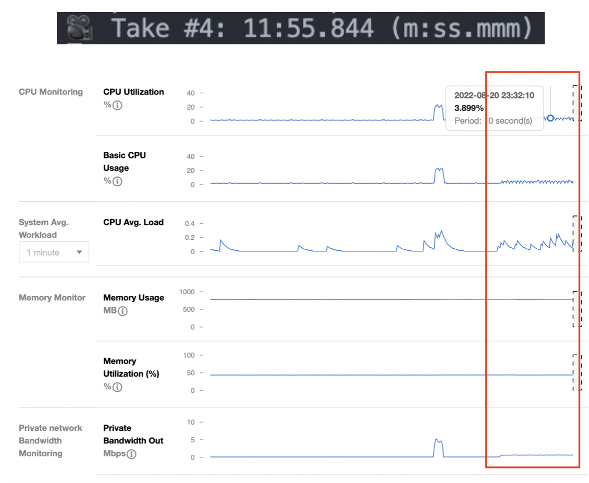

시간은 어마무시하게 많이 걸렸습니다 11분 55초... 😂

하지만 CPU 사용률은 엄청나게 줄어든 것을 확인할 수 있습니다.

---

## 결론

지금까지 여러 코드를 테스트해보았습니다.

Take3과 Take4가 괜찮은 결과를 보였지만 어느 방법으로 선택할 것인지는 서비스마다 다를 것입니다.

리소스를 더 쓰더라도 빠른 실행 시간을 원한다면 Take3를

실행 시간이 오래 걸리더라도 리소스를 절약하길 원한다면 Take4가 좋을 듯합니다.

---

[Heap of memory](https://blog.openreplay.com/javascript-heap-out-of-memory-error/)

[MongoDB 공식문서](https://www.mongodb.com/docs/manual/reference/method/js-cursor/)

[Cursor](https://thecodebarbarian.com/cursors-in-mongoose-45)

```toc

```
