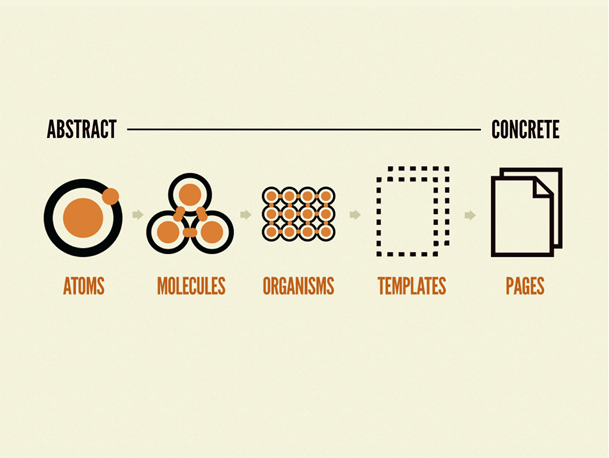

현대의 프론트엔드 개발은 단순히 화면을 그리는 것을 넘어 **복잡한 상태 관리, 다양한 API 연동, 글로벌 디자인 시스템 통합** 등 다층적인 요구사항을 다룬다. 
간단한 MVP 수준에서 수십, 수백 개의 컴포넌트와 로직으로 확장되는 상황은 흔하다. 
이때 단순히 ‘동작하는 코드’ 이상으로, **유지보수 가능한(Clean), 확장성 있는(Extensible), 일관성 있는(Consistent) 아키텍처**를 갖추는 것은 필수가 된다.

본 포스팅에서는 프론트엔드 아키텍처 패턴과 클린 코드의 중요성과 이를 실무에 적용하는 방법을 사례와 함께 다룬다.

## 프론트엔드 아키텍처 패턴이란?

**프론트엔드 아키텍처 패턴**은 코드베이스를 모듈화하고, 명확한 책임 분리를 통해 애플리케이션 복잡성을 제어하는 설계 원칙이다. 이를 적용하면 다음과 같은 효과를 기대할 수 있다.
- **유지보수성 향상**: 특정 모듈 수정 시 다른 부분에 최소한의 영향만 미치므로, 에러 추적과 버그 수정이 용이하다.
- **협업 효율 극대화**: 명확한 디렉토리 구조와 일관된 패턴 덕분에, 신규 합류 팀원도 손쉽게 코드베이스를 이해할 수 있다.
- **확장성 보장**: 프로젝트 규모가 커져도 아키텍처적 일관성을 유지해 성능과 품질 관리가 수월해진다.

### 1. Atomic Design (아토믹 디자인)



**개념**: UI를 가장 작은 단위(원자, Atom)에서 시작해 점진적으로 컴포넌트를 확장하는 계층적 설계 방식이다.

**장점**: 재사용성과 일관성 향상, 디자인 시스템과의 매끄러운 연계, 팀 내 합의된 디자인 언어 정착. 

**에시 디렉터리 구조**:

```plaintext
src/
  components/
    atoms/
      Button.tsx
      Input.tsx
    molecules/
      SearchBar.tsx
    organisms/
      Header.tsx
      Footer.tsx
    templates/
      MainLayout.tsx
    pages/
      HomePage.tsx
```

Button, Input과 같은 원자 단위 컴포넌트를 모아서 SearchBar(molecule)를 만들고, 이를 Header, Footer(organism)와 결합해 MainLayout(template)을 형성, 최종적으로 HomePage를 구성하는 식이다.

### 2. Container-Presentational

**개념**: Container는 상태 관리와 비즈니스 로직 담당, Presenter는 순수 UI 렌더링 담당.

**장점**: UI와 로직의 명확한 분리로 테스트 및 코드 재사용성 극대화.

**예시 코드 스니펫**:

```tsx
// ProductContainer.tsx
import { useEffect, useState } from 'react';
import ProductPresenter from './ProductPresenter';
import { fetchProduct } from '@/services/productService';

export default function ProductContainer({ productId }: { productId: number }) {
  const [product, setProduct] = useState(null);

  useEffect(() => {
    fetchProduct(productId).then(setProduct);
  }, [productId]);

  return <ProductPresenter product={product} />;
}

// ProductPresenter.tsx
interface ProductProps {
  product: { id: number; name: string; price: number } | null;
}

export default function ProductPresenter({ product }: ProductProps) {
  if (!product) return <div>Loading...</div>;
  return (
    <div>
      <h2>{product.name}</h2>
      <p>Price: ${product.price}</p>
    </div>
  );
}
```

ProductContainer에서는 데이터 페칭과 상태 관리를 전담하고, ProductPresenter는 받은 데이터를 렌더링만 한다. 향후 ProductPresenter를 다른 컨테이너에서도 재활용하기 쉽다.

### 3. Clean Architecture 및 Layered Architecture

**개념**: 도메인 로직, 애플리케이션 로직, 프레젠테이션 로직을 명확히 분리해 변경 사항이 특정 레이어 내에서만 일어나도록 한다.

**장점**: UI 개편 시 비즈니스 로직에 영향이 거의 없고, 비즈니스 로직 변경 시 UI는 그대로 유지 가능.

**예시 아키텍처 다이어그램**:

```plaintext
┌───────────────────┐
│   Components(UI)  │  ← UI 계층 (Presentational Layer)
└───────┬───────────┘
        │
┌───────▼───────────┐
│ Services/UseCases │  ← 도메인/애플리케이션 로직 계층
└───────┬───────────┘
        │
┌───────▼───────────┐
│   Repositories    │  ← 데이터 접근 계층 (API, DB)
└───────────────────┘
```

예를 들어 services/productService.ts에서 제품 데이터를 가져오는 로직을 정의하고, components/ 내 컴포넌트는 해당 서비스를 호출할 뿐 비즈니스 로직을 직접 다루지 않는다. 
데이터 소스가 REST API에서 GraphQL로 바뀌어도 repositories 계층만 수정하면 UI나 상위 레이어 로직에는 큰 영향이 없다.

<br />

## 클린 코드를 위한 필수 요소

### 1. 일관된 디렉터리 구조
   
구조적 합의를 통해 팀원 모두가 코드베이스 탐색에 드는 비용을 최소화한다.

```plaintext
src/
  components/
  pages/
  services/
  hooks/
  styles/
  tests/
```

### 2. 코딩 컨벤션과 린팅(Linting)을 정립

ESLint, Prettier를 사용해 팀 내 컨벤션을 자동화하고, 네이밍 규칙과 코드 스타일을 일관되게 유지한다.

### 3. 타입 안전성 확보 (TypeScript)

- 도메인 모델, API 응답 구조, 컴포넌트 props를 타입으로 정의해 사전에 오류를 방지.
- IDE 자동완성과 타입 추론을 통해 개발 생산성 향상.

### 4. 테스트 전략 확립

- 유닛 테스트(Jest)로 서비스 로직 검증. 
- 컴포넌트 테스트(React Testing Library)로 UI 동작 점검. 
- E2E 테스트(Cypress, Playwright)로 실제 사용자 플로우 시나리오 확인.

<br />

## 앞으로 고려할 점

### 1. 마이크로 프론트엔드(Micro Frontend):
매우 대규모 프로젝트나 다수 팀이 병렬로 개발하는 경우, 독립적인 프론트엔드 모듈을 통합하는 전략을 고려할 수 있다.

### 2. 기술 스택 변화 대응:
React → Next.js 전환, Redux → Zustand 변경 등 새로운 기술 도입 시에도 기존 아키텍처 원칙을 유지하면 전환 비용을 최소화할 수 있다.


## 결론
프론트엔드 아키텍처 패턴과 클린 코드는 "**단지 코드가 돌아가는지**"가 아닌 "**코드가 앞으로 어떻게 성장하고 유지될 수 있는지**"에 대한 해답을 제시한다. **명확한 레이어링, 일관된 구조, 엄격한 컨벤션과 테스트 전략**을 통해 팀 전체의 생산성을 극대화하고, 장기적으로 안정적이며 확장 가능한 제품 개발 환경을 구축할 수 있다. 
실제 프로젝트 경험상, 아키텍처적 접근과 클린 코드 문화는 프로젝트 규모가 커질수록 그 진가를 발휘한다.

지금 바로 디렉토리 구조를 재정리하고, 테스트 커버리지를 높이고, Atomic Design 혹은 Container-Presenter 패턴 적용을 고려해보자. 작은 변화의 시작이, 훗날 큰 유지보수 비용을 절감하고 팀 생산성을 비약적으로 끌어올리는 초석이 될 것이다.

```toc

```
