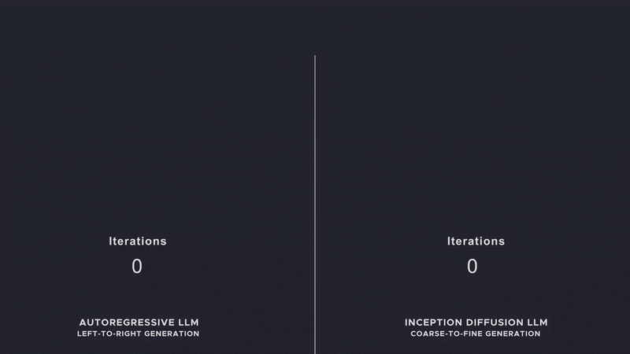

안녕하세요, 최근 자연어 처리(NLP) 분야에서 최근 주목 받고 있는 **DLLM (Diffusion Language Model)** 에 대해 이야해보고자 합니다. DLLM은 확산 언어 모델로, 기존의 대규모 언어 모델(LLM)과는 다른 독창적인 접근 방식을 취합니다.

이 글에서는 DLLM의 개념과 작동 원리를 소개하고, 기존 LLM과의 주요 차이점을 비교하며, 이 새로운 모델이 가져올 가능성을 탐구해보겠습니다.

---

## 1. DLLM이란?

**DLLM**은 확산 언어 모델의 줄임말로, 이미지 생성에서 성공을 거둔 **확산 모델(Diffusion Model)** 의 원리를 텍스트 데이터에 적용한 신개념 언어 모델입니다. 확산 모델은 데이터에 점진적으로 노이즈를 추가하고 이를 제거하는 과정을 통해 데이터의 분포를 학습하는 방식으로 작동합니다.
DLLM은 이 아이디어를 텍스트에 맞게 변형하여, 텍스트를 왜곡한 후 원래 상태로 복원하면서 언어의 구조와 의미를 학습합니다.

쉽게 말해, DLLM은 텍스트에 노이즈를 더하고 이를 복원하는 과정을 반복하며 언어를 이해하고 생성하는 모델입니다.

이 과정에서 **텍스트 전체의 문맥을 동시에 고려할 수 있다는 점이 큰 특징**입니다.



<br />

## 2. 기존 LLM의 작동 방식

기본의 대규모 언어 모델(LLM)은 주로 두 가지 학습 방식으로 작동합니다.

- **자기회귀 방식 (Autoregressive)** <br />
  GPT와 같은 모델이 대표적입니다. 이 방식은 이전 단어들을 기반으로 다음 단어를 순차적으로 예측합니다. 예를 들어, "나는 학교에" 다음에 "갔다"를 예측하는 식입니다.
- **마스크 언어 모델링 (Masked Language Modeling)** <br />
  BERT와 같은 모델이 사용하며, 문장 내 일부 단어를 가리고 이를 예측합니다. 에를 들어, "나는 [MASK]에 갔다" 에서 [MASK]를 "학교"로 예측합니다.

이 모델들은 **트랜스포머 (Transformer)** 아키텍처를 기반으로 하며, 방대한 데이터와 강력한 컴퓨팅 자원을 활용해 뛰어난 성능을 보여줍니다.
하지만 순차적인 예측이나 특정 단어에 초점을 맞춘 학습 방식으로 인해, 긴 문맥을 전체적으로 파악하는 데 한계가 있을 수 있습니다.

<br />

## 3. DLLM의 작동 방식

DLLM은 확산 모델의 원리를 텍스트에 적용하며, 두 가지 핵심 과정으로 작동합니다.

- 전진 과정 (Forward Process) <br />
  원본 텍스트에 점진적으로 노이즈를 추가해 왜곡합니다. 예를 들어, 문장에서 단어를 무작위로 바꾸거나 마스킹하여 원본과 점점 더 멀어지게 만듭니다. 여러 단계를 거치면 텍스트는 결국 알아보기 어려운 상태가 됩니다.
- 역과정 (Reverse Process) <br />
  왜곡된 텍스트에서 시작해 학습된 신경망으로 노이즈를 제거하며 원본 텍스트를 복원합니다. 이 과정에서 모델은 문맥과 구조를 분석해 올바른 단어를 예측합니다.

기존 자기회귀 모델과 달리, **DLLM은 텍스트 전체를 병렬적으로 처리할 수 있어 효율적이며, 전체 문맥을 동시에 학습할 수 있다는 장점**이 있습니다.

<br />

## 4. 기존 LLM과 DLLM의 차이점

DLLM과 기존 LLM은 학습 방식, 문맥 처리, 생성 방식, 유연성 등 여러 측면에서 차이가 있습니다. 아래에서 주요 차이점을 자세히 비교해보겠습니다.

### 4.1. 학습 방식

- **기존 LLM**: 단어 단위로 예측하며 학습합니다. 자기회귀 모델은 순차적으로 단어를 생성하고, 마스크 모델은 특정 단어를 예측합니다.
- **DLLM**: 텍스트 전체에 노이즈를 추가하고 제거하는 과정을 통해 학습합니다. 병렬 처리로 텍스트의 전체 구조를 동시에 고려합니다.

### 4.2. 문맥 처리

- **기존 LLM**: 자기회귀 모델은 이전 단어에 의존하기 때문에 긴 문장에서 문맥을 유지하기 어려울 수 있습니다(장기 의존성 문제).
- **DLLM**: 텍스트 전체에 노이즈를 추가하고 제거하며 문맥을 동시에 파악하므로, 장기 의존성을 더 효과적으로 다룰 가능성이 있습니다.

### 4.3. 생성 방식

- **기존 LLM**: 단어를 순차적으로 생성하며, top-k나 nucleus sampling 같은 샘플링 기법을 사용합니다.
- **DLLM**: 노이즈 제거 과정을 통해 텍스트를 생성하며, 병렬 처리로 속도가 빠르고 다양한 샘플링 방식을 활용해 창의적이고 유연한 결과를 낼 수 있습니다.

### 4.4. 모델의 유연성

- **기존 LLM**: 트랜스포머 기반으로 대규모 데이터와 자원이 필수적이며, 구조적 한계가 존재할 수 있습니다.
- **DLLM**: 확산 모델의 특성을 활용해 복잡한 텍스트 패턴을 학습하며, 새로운 아키텍처로 기존 LLM의 한계를 극복할 가능성을 보여줍니다. 다만, 아직 연구 초기 단계입니다.

<br />

## 5. 결론

**DLLM(확산 언어 모델)** 은 기존 LLM과 달리 확산 모델의 원리를 텍스트에 적용해 학습 방식, 문맥 처리, 생성 방식에서 차별화된 접근을 제공합니다.
특히 텍스트 전체를 병렬적으로 처리하고 장기 의존성을 더 잘 다룰 수 있는 잠재력으로, 자연어 처리 분야에서 새로운 가능성을 열어줄 수 있는 모델로 주목받고 있습니다.
아직 초기 단계에 있지만, 앞으로의 발전이 기대되는 기술입니다.

<br />

## 6. 참교자료

- [Inception](https://www.inceptionlabs.ai/?ref=news.aikoreacommunity.com)
- [Diffusion Models: A Comprehensive Survey of Methods and Applications](https://arxiv.org/abs/2209.00796)
- [Language Models are Few-Shot Learners](https://arxiv.org/abs/2005.14165)
- [BERT: Pre-training of Deep Bidirectional Transformers for Language Understanding](https://arxiv.org/abs/1810.04805)

```toc

```
