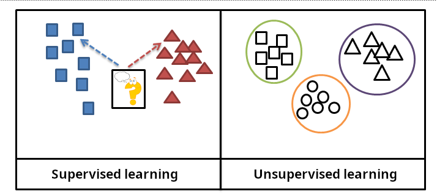

**“기계가 스스로 학습한다”** 라는 말은 이제 흔히 들리지만, 정작 **‘어떤 방식으로 학습하는 걸까?’** 라는 질문을 던지면 막막해하는 분들도 많습니다.
머신러닝에는 여러 학습 방식이 있지만, 그중에서도 가장 기본이 되는 두 축은 **지도 학습(Supervised Learning)** 과 **비지도 학습(Unsupervised Learning)** 입니다.

이 글에서는 두 가지 방법을 쉽게 이해되도록 소개하려고 합니다.

<br >

## 지도 학습(Supervised Learning)

### 주요 개념

지도 학습이란, **입력 데이터와 그에 대응하는 정답(레이블)** 을 함께 제시해 모델을 학습시키는 방식입니다.
예컨대 강아지 사진에 “강아지”라는 레이블을, 고양이 사진에 “고양이”라는 레이블을 붙여 주면, 모델이 둘 각각의 특징을 학습한 뒤 새로운 사진이 들어왔을 때 해당 이미지가 강아지인지 고양이인지 예측할 수 있게 됩니다.

또한 스팸 메일 필터링, 음성 인식, 이미지 분류, 금융 시장에서의 시계열 예측(회귀 문제) 등에서 폭넓게 활용됩니다. 핵심은 **“어떤 입력이 주어졌을 때 어떤 결과를 기대하는지”** 가 이미 명확히 주어져 있다는 점입니다.

<br >

### 장점과 주의점

- **장점**

  - **명확한 평가 척도**: 레이블과 비교해 정확도(Accuracy), 정밀도(Precision), 재현율(Recall) 같은 지표로 모델 성능을 객관적으로 확인할 수 있습니다.
  - **오류 수정의 용이성**: 정답이 주어지므로, 예측이 틀린 경우 어느 부분에서 문제가 생겼는지를 파악하고 개선하기가 상대적으로 쉽습니다.

- **주의점**

  - **레이블링 비용**: 대규모 데이터에 레이블을 달려면 인력과 시간이 많이 들고, 레이블링 자체가 어려운 분야도 있습니다.
  - **데이터 품질 의존도**: 레이블이 잘못된 경우, 모델이 잘못된 방향으로 학습될 위험이 큽니다.
  - **변동성 높은 문제에서의 한계**: 특히 금융 시장 예측처럼 시간에 따른 변동 폭이 큰 문제는 불확실성이 커서, 지도 학습만으로 항상 높은 정확도를 보장하기가 어렵습니다.

<br >

### 고민해볼 질문

- 많은 시간과 비용이 드는 레이블링 작업을 감수할 만큼, 지도 학습을 사용하는 이점이 충분할까요?
- 환경이 바뀌어 기존에 제공한 정답과 실제 답이 달라질 때, 모델은 어떻게 대응해야 할까요?

<br >

## 비지도 학습(Unsupervised Learning)

### 주요 개념

**비지도 학습**은 **정답(레이블) 없이** 모델이 스스로 데이터의 구조나 패턴을 탐색하는 방식입니다.
예를 들어, 다양한 과일 이미지를 전혀 구분하지 않은 채 “비슷한 것끼리 묶어 보라”고 모델에 요구하면, 색상이나 모양 등의 유사도를 바탕으로 데이터를 자동으로 군집화(Clustering)합니다.

이처럼 **어떤 레이블도 제공되지 않았음에도**, 모델이 데이터 내부에 존재하는 특징을 스스로 찾아낸다는 점이 특징입니다.
고객 데이터에서 유사 구매 패턴을 가진 그룹을 찾아내거나, 텍스트 코퍼스에서 토픽을 스스로 분류해 보는 작업 등이 비지도 학습의 대표적인 예입니다.

<br >

### 장점과 활용 사례

- **장점**:

  - **새로운 통찰**: 미리 정해진 레이블이 없어도, 전혀 예상치 못한 패턴이나 구조를 찾아낼 수 있습니다.
  - **레이블링 비용 절감**: 별도의 레이블을 준비할 필요가 없으므로, 방대한 데이터에 대해 빠르게 시도해볼 수 있습니다.

- **주의점**:

  - **결과 해석**: 군집화나 차원 축소 등으로 얻어낸 결과에 의미를 부여하는 단계는 사람이 직접 맡아야 합니다. 모델이 자동으로 “이 그룹은 VIP 고객”처럼 이름을 붙여 주지는 않습니다.
  - **여러 기법 존재**: K-means나 DBSCAN 같은 군집화뿐 아니라, 차원 축소(PCA, t-SNE), 이상 탐지(Anomaly Detection), 생성 모델(GAN) 등 다양한 비지도 학습 기법이 있으며, 각 기법의 목적과 해석 방법이 다릅니다.

<br >

### 고민해볼 질문

- 모델이 발견한 그룹이나 패턴에 의미를 부여하는 것은 누가 맡아야 할까요?
- 구조가 너무 복잡해 해석이 어려울 때, 어떤 방법으로 이 문제를 풀 수 있을까요?

<br >

## 비교

| 비교 항목         | 지도 학습                                                | 비지도 학습                                                                  |
| ----------------- | -------------------------------------------------------- | ---------------------------------------------------------------------------- |
| **레이블 유무**   | 정답 레이블 필요                                         | 정답 레이블 필요 없음                                                        |
| **목표 차이**     | 정확한 예측(분류, 회귀 등)을 목표                        | 데이터의 숨은 구조나 관계를 찾는 데 집중                                     |
| **평가 방법**     | 정답과 비교해 정확도, 정밀도, 재현율 등 측정             | "발견된 패턴이 실제로 의미가 있는지"를 주관적으로 해석.검증                  |
| **비용과 효율성** | 레이블 작업의 비용이 크지만, 결과 해석은 상대적으로 명확 | 레이블이 필요 없어 대량 데이터를 다루기 쉽지만, 해석과 평가가 어려울 수 있음 |

<br >

**지도 학습 예시**

사과와 바나나 사진 각각에 "사과", "바나나"라는 레이블을 달아놓고 모델을 학습시키면, 새로운 사진이 들어왔을 때 해당 과일을 정확히 예측할 수 있습니다.

**비지도 학습 예시**

레이블 없이 다양한 과일 사진을 제공하면, 모델은 유사도를 분석해 빨갛고 둥근 과일과 길쭉하고 노란 과일을 분류합니다. 다만 "사과", "바나나"라는 이름을 붙이는 일은 사람이 후처리 단계에서 해야 합니다.



<br >

## 추가적인 학습 방식

### 준지도 학습(Semi-Supervised Learning)

방대한 데이터 중 극히 일부에만 레이블이 달려 있고, 나머지 데이터는 비레이블 상태로 모델을 학습시키는 방식입니다.
레이블링 비용을 대폭 줄이면서도 어느 정도 성능을 확보할 수 있어, 실무에서 각광받고 있습니다.

### 자기지도 학습(Self-Supervised Learning)

최근 주목받는 방식으로, 모델이 데이터 내에서 스스로 ‘가상의 정답’을 만들어 학습하는 기법입니다. 예컨대 텍스트 문장에서 일부 단어를 가리고, 모델이 해당 위치에 올 단어를 예측하게 하는 구조를 생각해 볼 수 있습니다.

### 강화 학습(Reinforcement Learning)

환경과 상호 작용하며 **보상(Reward)** 을 최대화하도록 학습하는 방법입니다. 게임 AI, 로봇 제어, 자율주행 같은 분야에서 모델이 시행착오를 거치며 스스로 최적의 전략을 찾아가도록 설계합니다.

<br >

## 생각해봐야할 질문들

- 라벨 작업에 드는 시간과 예측 정확도 중, 무엇을 더 우선시해야 할까요?
- 비지도 학습 결과가 실제로 가치 있는지 판단하는 기준은 어떻게 설정할 수 있을까요?
- 적은 수의 라벨만 사용해도 충분한 성능을 낼 수 있는 준지도 학습은 언제 적용해야 할까요?
- 강화 학습은 왜 시행착오와 보상을 통한 학습이 필요한 문제에서 강력한가요?
- 데이터 편향(bias)이나 모델 오류를 어떻게 점검하고 개선해 나갈 수 있을까요?

<br >

## 결론

지도 학습과 비지도 학습은 머신러닝의 기초이자 핵심입니다. 데이터의 특성, 레이블 유무, 그리고 우리가 얻고자 하는 목표에 따라 적절한 방식을 고르면, 현실 세계의 복잡한 문제를 보다 체계적이고 효율적으로 해결할 수 있습니다.

기계가 스스로 똑똑해지려면, 결국 사람이 **어떤 데이터를 어떤 방식으로 학습시킬지** 결정해야 합니다.
이러한 선택과 판단은 기계학습에서 인간이 맡아야 할 중요한 역할입니다. 데이터를 잘 준비하고, 목적과 상황에 맞게 지도 또는 비지도 학습을 적용하면, 기계는 한 단계 더 진화한 인사이트와 예측 능력을 갖추게 될 것입니다.

---

### 참고 자료

- [AWS 지도 학습과 비지도 학습의 차이점은 무엇일까요?](https://aws.amazon.com/ko/compare/the-difference-between-machine-learning-supervised-and-unsupervised/#:~:text=What%20is%20it%3F)

```toc

```
