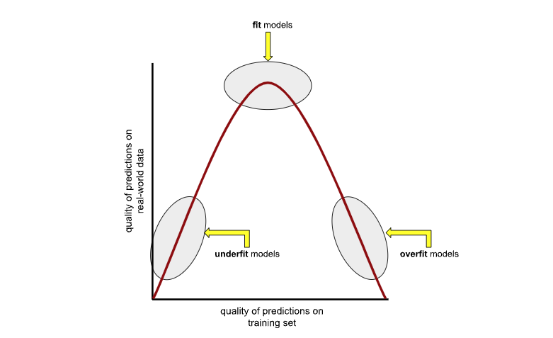
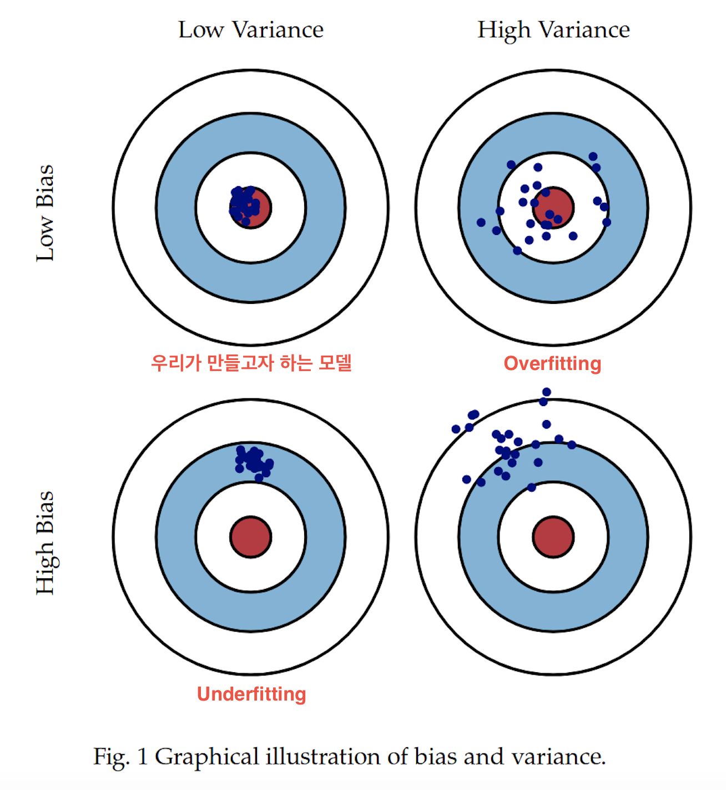
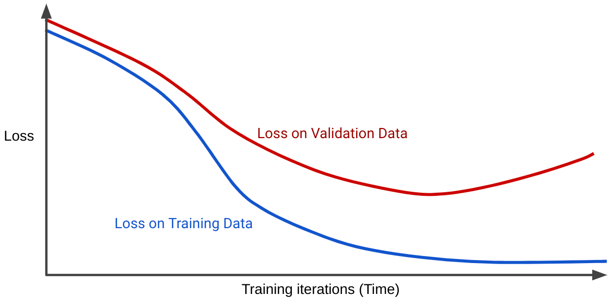

머신러닝 모델의 성능은 학습 데이터로부터 일반화하여 새로운 데이터에 얼마나 잘 적용되는가에 따라 결정됩니다.
그러나 학습 데이터의 세부적인 특성이나 노이즈까지 과도하게 학습하면, 새로운 데이터에서 성능이 급격히 떨어지는 현상이 발생합니다. 이를 **과적합(Overfitting)** 이라고 합니다.

이 글에서는 과적합의 정의, 주요 원인, 정확한 진단 방법, 효과적인 방지 전략 및 실제 사례를 통해 이해를 돕겠습니다.

<br >

## 과적합이란?

과적합이란 머신러닝 모델이 학습 데이터를 너무 세밀하게 학습하여, 실제로는 중요하지 않은 노이즈나 특이사항까지 반영함으로써 일반화 성능이 떨어지는 현상입니다.
예를 들어, 학생이 문제의 원리를 이해하지 않고 단지 특정 문제의 답만 외우는 경우와 유사합니다. 결과적으로 새로운 문제에는 제대로 대응할 수 없습니다.



<br >

## 과적합의 주요 특징

- 학습 데이터에서는 뛰어난 성능을 보이지만, 검증 또는 테스트 데이터에서는 성능이 크게 떨어집니다.
- 특히 모델의 구조가 복잡하거나 파라미터가 많은 경우 흔히 발생합니다.
- 데이터의 노이즈나 이상치(outliers)를 과도하게 반영하여 일반화 능력이 저하됩니다.

<br >

## 발생 원인

과적합은 다음과 같은 이유로 주로 발생합니다.

- **모델 복잡성**: 파라미터가 지나치게 많거나 모델 구조가 복잡하면 일반적인 패턴보다는 노이즈를 학습할 가능성이 높습니다.
- **불충분한 데이터**: 데이터가 부족하면 모델은 제한된 데이터의 세부적인 특성을 과도하게 학습할 수 있습니다.
- **노이즈 데이터**: 데이터 내 오류나 불필요한 정보가 많으면 모델이 잘못된 패턴을 학습할 수 있습니다.
- **과도한 학습**: 모델을 지나치게 오래 훈련시키면 세부사항과 노이즈를 과도하게 학습하게 됩니다.

추가적으로 과적합은 바이어스와 분산의 트레이드오프 개념과 밀접한 연관이 있습니다.
**높은 바이어스는 과소적합(Underfitting)**을 일으키며, **높은 분산은 과적합**을 유발합니다. 따라서 모델의 복잡도를 적절히 조정하여 바이어스와 분산 사이에서 균형을 유지하는 것이 중요합니다.



<br >

## 진단 및 평가 방법

과적합 여부를 효과적으로 탐지하기 위해 다음 방법들이 사용됩니다.

- **학습 및 검증 데이터 성능 비교**: 학습 데이터와 비교해 검증 데이터의 성능이 현저히 낮다면 과적합 가능성이 큽니다.
- **학습 곡선 분석**: 학습 손실(training loss)과 검증 손실(validation loss)을 그래프로 그려 과적합이 발생하는 지점을 시각적으로 확인합니다.
- **교차 검증(Cross-validation)**: 데이터를 여러 부분으로 나누어 반복적으로 성능을 평가해 모델의 일반화 능력을 측정합니다.



<br >

## 방지 전략

과적합을 방지하거나 최소화하기 위해 다음 전략을 활용할 수 있습니다.

- **정규화(Regularization)**: L1, L2 정규화 및 드롭아웃(Dropout)을 통해 모델의 복잡성을 제한합니다.
- **조기 종료(Early Stopping)**: 검증 데이터의 손실이 증가하는 시점에 학습을 중단하여 과적합을 방지합니다.
- **데이터 증강(Data Augmentation)**: 데이터를 다양하게 변형하거나 추가하여 데이터 다양성을 높이고 일반화 성능을 향상시킵니다.
- **모델 단순화**: 파라미터 수를 줄이거나 덜 복잡한 구조의 모델을 사용하여 과적합 가능성을 낮춥니다.
- **앙상블 기법(Ensemble Methods)**: 여러 모델의 예측 결과를 결합하여 개별 모델의 약점을 보완하고 과적합을 방지합니다.
- **충분한 데이터 확보**: 더 많은 데이터를 수집하면 모델이 일반적인 패턴을 보다 잘 학습할 수 있어 과적합 가능성을 줄일 수 있습니다.

<br >

## 결론

과적합은 머신러닝 모델의 실제 활용성을 저하시키는 주요 문제입니다.
이를 방지하기 위해 모델의 복잡도를 관리하고, 정규화, 데이터 증강, 앙상블 등 다양한 전략을 체계적으로 적용해야 합니다.
또한 지속적인 모니터링과 평가를 통해 모델의 신뢰성과 성능을 높여가는 것이 중요합니다.

<br >

## 추가적으로 고민해볼 고민들

- 모델의 복잡도와 성능 사이에서 최적의 균형을 찾기 위한 실질적인 기준은 무엇일까요?
- 프로젝트의 특성에 따라 과적합 방지 전략을 선택할 때 주요 고려 요소는 무엇이 되어야 할까요?
- 데이터 증강 기법이 역효과를 낼 수 있는 구체적인 상황과 그 이유는 무엇일까요?
- 여러 전략을 동시에 적용할 때 발생할 수 있는 부정적 상호작용을 최소화하는 방안은 무엇일까요?

---

## 참고 자료

- [Google Developers - 과적합](https://developers.google.com/machine-learning/crash-course/overfitting/overfitting?hl=ko)
- [AWS - 과적합](https://aws.amazon.com/what-is/overfitting/)

```toc

```
