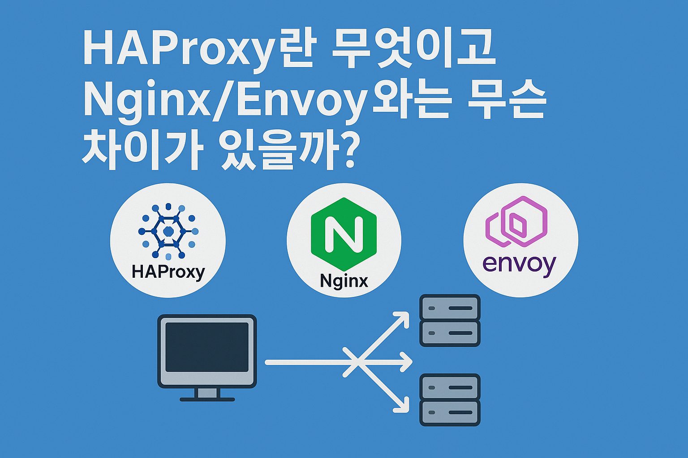

현대의 웹 어플리케이션 환경에서 성능, 안정성, 그리고 확장성은 더 이상 선택이 아닌 필수입니다. 트래픽이 폭증하고 서비스 아키텍처가 복잡해짐에 따라,
유입되는 요청을 다수의 백엔드 서버로 분산하고, 예기치 않은 서버 장애 상황에서도 서비스 중단을 최소화하는 기술의 중요성은 아무리 강조해도 지나치지 않습니다.
이러한 과제를 해결하기 위한 오픈 소스 솔루션 중 하나가 바로 HAProxy입니다.

HAProxy(High Availability Proxy)는 고성능 TCP/HTTP 로드 밸런서 및 프록시 서버로서, 수많은 글로벌 고트래픽 웹사이트에서 그 성능과 안정성을 입증하며 핵심 인프라 구성 요소로 자리 잡았습니다.
이 글에서는 HAProxy의 개념과 주요 기능을 소개하고, Nginx와 Envoy와 같은 다른 솔루션과의 비교를 통해 각각의 특징과 적합한 사용 사례를 알려드리겠습니다.

## HAProxy의 핵심 기능

HAProxy는 트래픽 관리와 서비스 가용성 극대화를 위한 풍부하고 강력한 기능셋을 제공합니다.

### 1. 로드 밸런싱(Load Balancing)

- **다양한 알고리즘**: Round Robin, Least Connections, Source IP Hashing, URI Hashing 등 다양한 알고리즘을 지원하여 워크로드 특성에 맞게 트래픽을 백엔드 서버 풀에 최적으로 분산시킵니다.
- **가중치 기반 분산**: 서버 스펙이나 현재 부하 상태에 따라 가중치를 동적으로 조절하여 트래픽을 보다 지능적으로 분배할 수 있습니다.

### 2. 고가용성(High Availability)

- **정교한 Health Checks**: TCP 레벨부터 어플리케이션 레벨(HTTP 상태 코드, 응답 내용 확인 등)까지 다층적인 헬스 체크를 구성하여 백엔드 서버의 장애를 신속하고 정확하게 감지합니다. 장애 서버는 자동으로 풀에서 제외되어 사용자 요청이 실패한 서버로 라우팅되는 것을 방지합니다.
- **Active/Passive 및 Active/Active 이중화**: VRRP 등의 프로토콜과 연동하여 HAProxy 인스턴스 자체의 이중화를 구현함으로써 단일 실패 지점(SPOF)을 제거하고 서비스 연속성을 보장합니다.

### 3. 세션 지속성(Session Persistence)

- 클라이언트가 세션 동안 동일한 백엔드 서버와 통신하도록 보장하는 기능입니다. 쿠키 삽입/재작성, 소스 IP 해싱 등 다양한 방식을 지원하여 장바구니나 로그인 상태 유지와 같은 스테이트풀(Stateful) 어플리케이션 요구사항을 충족합니다.

### 4. SSL/TLS Termination 및 Offloading

- 클라이언트와의 SSL/TLS 핸드셰이크 및 암호화/복호화 처리를 HAProxy에서 수행합니다. 이를 통해 백엔드 서버의 CPU 부담을 경감시키고 성능을 향상시킬 수 있으며, SSL 인증서 관리를 중앙 집중화하여 운영 효율성을 높입니다.

### 5. 보안 강화

- 강력한 ACL(Access Control List)을 통해 IP 주소, URL 경로, HTTP 헤더, 쿼리 파라미터 등 다양한 조건을 조합하여 정교한 접근 제어 및 트래픽 필터링 규칙을 적용할 수 있습니다.
- Slowloris와 같은 특정 유형의 DoS 공격 완화, HTTP 헤더 조작을 통한 보안 취약점 방어 등 기본적인 보안 기능을 제공합니다.

<br >

## HAProxy의 작동 방식

HAProxy는 매우 효율적인 아키텍처를 자랑합니다. 단일 프로세스, 이벤트 기반(event-driven), 논블로킹 I/O 모델을 채택하여 컨텍스트 스위칭 오버헤드를 최소화하고 적은 메모리 사용량으로도 수많은 동시 연결을 처리할 수 있습니다.
특히 커널 레벨에서의 최적화(예: splice() 시스템 콜 사용)를 통해 데이터 전송 효율을 극대화하여 낮은 지연 시간과 높은 처리량을 동시에 달성합니다.

<br >

## HAProxy의 주요 이점

- **압도적인 성능**: 순수 로드 밸런싱 작업에서 업계 최고 수준의 성능과 낮은 지연 시간을 제공합니다.
- **검증된 안정성**: 오랜 역사와 수많은 운영 사례를 통해 입증된 뛰어난 안정성과 견고함.
- **높은 유연성 및 제어**: 다양한 로드 밸런싱 옵션, 세션 지속성 방법, 강력한 ACL은 복잡한 트래픽 관리 시나리오 구현을 가능하게 합니다.
- **리소스 효율성**: 낮은 CPU 및 메모리 점유율로 운영 비용 절감에 기여합니다.
- **활발한 오픈 소스 커뮤니티**: 지속적인 기능 개선과 보안 업데이트, 풍부한 문서 및 커뮤니티 지원.

<br >

## HAProxy 활용 사례

- **대규모 웹 어플리케이션**: 최전방에서 HTTP/HTTPS 트래픽을 분산하는 L7 로드 밸런서.
- **마이크로서비스 아키텍처**: API 게이트웨이 또는 내부 서비스 간 통신을 위한 L4/L7 로드 밸런서.
- **데이터베이스 클러스터**: TCP 모드를 사용하여 읽기 전용 복제본 등으로 데이터베이스 연결 분산 (단, DB 특성 고려 필요).
- 고가용성이 중요한 모든 TCP/UDP 기반 서비스.

<br >

## Nginx 및 Envoy와의 비교

HAProxy가 강력한 솔루션임은 분명하지만, 모든 상황에 최적인 것은 아닙니다. Nginx와 Envoy 역시 널리 사용되는 대안으로, 각각의 강점과 특징을 이해하는 것이 중요합니다.

| 솔루션      | 강점                                                                                                                                                                      | 약점 (상대적)                                                                                                                      | 주요 용도                                                                                                  |
| ----------- | ------------------------------------------------------------------------------------------------------------------------------------------------------------------------- | ---------------------------------------------------------------------------------------------------------------------------------- | ---------------------------------------------------------------------------------------------------------- |
| **HAProxy** | • 최고의 로드 밸런싱 성능/효율성<br>• 정교한 헬스 체크<br>• 검증된 안정성<br>• 낮은 리소스 사용량                                                                         | • 웹 서버 기능 제한적<br>• 고급 기능 구성 복잡성<br>• 제한적인 동적 구성 API                                                       | • 고성능 L4/L7 로드 밸런싱<br>• TCP 프록시<br>• 안정성이 최우선인 환경                                     |
| **Nginx**   | • 뛰어난 웹 서버 기능(정적 파일 서빙, 캐싱)<br>• 로드 밸런서/리버스 프록시 기능 통합<br>• 비교적 쉬운 구성<br>• 방대한 생태계                                             | • 극한의 로드 밸런싱 성능에서 HAProxy 대비 열세 가능성<br>• 덜 정교한 헬스 체크(과거 기준)<br>• 제한적인 동적 구성(오픈 소스 기준) | • 웹 서버 + 로드 밸런서 통합<br>• 리버스 프록시<br>• 캐싱<br>• API 게이트웨이                              |
| **Envoy**   | • 마이크로서비스/클라우드 네이티브 최적화<br>• 서비스 메시 연동<br>• 고급 트래픽 관리(Canary, Circuit Breaking 등)<br>• 강력한 Observability<br>• API 기반 동적 구성(xDS) | • 구성 및 운영 복잡성<br>• 상대적으로 높은 리소스 사용량<br>• HAProxy/Nginx 대비 짧은 역사                                         | • 마이크로서비스 통신 제어<br>• 서비스 메시 데이터 플레인<br>• 동적 환경<br>• 고급 Observability 요구 환경 |

## 적절한 선택 가이드

최적의 솔루션은 프로젝트의 구체적인 요구사항과 제약 조건에 따라 달라집니다. 다음 질문들을 통해 선택의 방향을 잡을 수 있습니다.

1. **핵심 요구사항은 무엇인가?** 순수한 로드 밸런싱 성능인가 (HAProxy)? 웹 서빙 통합인가 (Nginx)? 마이크로서비스 제어인가 (Envoy)?
2. **성능 목표와 자원 제약은?** 극한의 성능과 낮은 리소스가 필요한가 (HAProxy)? 일반적인 웹 트래픽이며 리소스에 여유가 있는가 (Nginx, Envoy)?
3. **운영 복잡성 감수 수준과 팀의 경험은?** 안정적이고 익숙한 기술을 선호하는가 (HAProxy, Nginx)? 새로운 기술 학습과 복잡한 구성 관리가 가능한가 (Envoy)?
4. **Observability 요구 수준은?** 기본적인 로그/메트릭으로 충분한가 (HAProxy, Nginx)? 분산 추적 등 심층적인 가시성이 필요한가 (Envoy)?
5. **동적 구성의 필요성은?** 정적인 구성 변경으로 충분한가 (HAProxy, Nginx)? API를 통한 실시간 구성 업데이트가 필수적인가 (Envoy)?

요약하자면, **HAProxy**는 로드 밸런싱 `장인`, **Nginx**는 다재다능한 `맥가이버 만능칼`, **Envoy**는 클라우드 네이티브 시대의 `네트워크 허브`로 비유할 수 있습니다. 각 도구의 철학과 강점을 이해하고 프로젝트의 맥락에 맞춰 신중하게 선택하는 것이 중요합니다.

<br >

## 결론

HAProxy는 고성능, 고가용성, 그리고 뛰어난 안정성을 바탕으로 오랜 기간 동안 로드 밸런싱 및 프록시 시장에서 강력한 입지를 구축해왔습니다. 특히 순수한 로드 밸런싱 성능과 효율성이 중요한 환경에서 여전히 최고의 선택지 중 하나입니다.

그러나 기술 환경이 클라우드 네이티브와 마이크로서비스 중심으로 변화함에 따라 Nginx의 다재다능함과 Envoy의 고급 기능 및 동적 구성 능력 또한 매우 중요해졌습니다. 따라서 특정 솔루션이 절대적으로 우월하다기보다는, 당면한 문제와 목표, 운영 환경, 팀의 역량 등을 종합적으로 고려하여 가장 적합한 도구를 선택하는 엔지니어링적 판단이 요구됩니다. HAProxy, Nginx, Envoy의 특징을 명확히 이해하는 것은 성공적인 웹 어플리케이션 아키텍처 설계의 중요한 첫걸음이 될 것입니다.

---

## 생각해 볼 점

- 여러분이 현재 참여하고 계신 프로젝트나 경험했던 시스템에서 로드 밸런싱 솔루션은 어떤 것을 사용하고 있으며, 그 이유는 무엇이었습니까? 만약 다른 솔루션(HAProxy, Nginx, Envoy 중)을 사용했다면 어떤 점이 달라졌을지 예측해 보십시오.
- 로드 밸런서의 Health Check 실패 시, 단순히 트래픽을 차단하는 것 외에 시스템의 전반적인 안정성을 높이기 위해 추가적으로 고려할 수 있는 전략(예: 점진적 트래픽 전환, 자동 복구 메커니즘 연동 등)은 무엇이 있을까요?
- Observability 관점에서 HAProxy, Nginx, Envoy가 제공하는 메트릭, 로그, 추적 데이터는 어떻게 다르며, 이를 효과적으로 수집하고 분석하기 위한 모니터링 시스템 구축 전략은 어떻게 달라질 수 있을까요?

```toc

```
