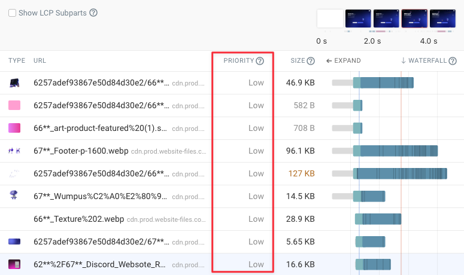

> 원문: [How Does Chrome Prioritize Image Requests?](https://www.debugbear.com/blog/chrome-image-request-prioritization)

이 글에서는 Chrome 브라우저가 이미지 리소스에 대한 요청 우선순위를 어떻게 결정하는지 자세히 살펴보겠습니다.
우선순위 결정 방식의 원리를 이해하고, 중요한 이미지를 더 빠르게 로드하기 위해 사용할 수 있는 최적화 기법들을 소개합니다.

<br >

## 이미지 요청은 기본적으로 '낮음(Low)' 우선순위를 가집니다.

기본적으로 이미지 요청은 **낮음(Low)** 우선순위를 갖습니다. 브라우저는 이미지를 로드하기 전에 **렌더링 차단(render-blocking)** 리소스나 **핵심 요청 체인(critical request chain)** 에 포함된 리소스들의 로드를 먼저 처리합니다.

아래 요청 워터폴(waterfall) 예시를 보면 여러 이미지 요청이 '낮음(Low)' 우선순위로 처리되는 것을 확인할 수 있습니다.



회색 막대는 대기 시간을 나타내며, 이 예시에서는 700ms가 넘는 경우가 많습니다. Chrome은 페이지 렌더링이 시작될 때까지 이러한 낮은 우선순위 리소스의 요청을 시작조차 하지 않습니다.

가장 중요한 페이지 리소스(HTML, CSS, 렌더링 차단 JavaScript 등)가 로드된 후에야 Chrome은 **낮음(Low)** 우선순위의 이미지를 로드하기 시작합니다.


> Chrome은 리소스를 두 단계로 로드합니다. 초기 단계인 '엄격 모드(tight mode)'에서는 브라우저가 낮은 우선순위 요청에 자원을 사용하지 않으려고 합니다.

<br >

## Chrome 117 버전부터 처음 5개의 '큰 이미지' 우선순위가 향상되었습니다.

Chrome 117 버전부터 Google은 처음 로드되는 5개의 **큰 이미지**의 우선순위를 **낮음(Low)** 에서 **중간(Medium)** 으로 상향 조정했습니다. 이는 주요 이미지가 더 빠르게 로드되도록 돕기 위한 변경입니다.

이전 버전에서는 이 이미지들도 기본적으로 **낮음(Low)** 우선순위를 가졌습니다. 아래 워터폴 예시에서는 이 변경 사항으로 인해 5개의 이미지가 **중간(Medium)** 우선순위를 할당받은 것을 보여줍니다. 그 이후의 두 이미지는 여전히 **낮음(Low)** 우선순위를 유지합니다. 이 접근 방식은 효율적인 리소스 로딩을 유지하면서도 주요 이미지의 우선순위를 높여 최대 콘텐츠풀 페인트(Largest Contentful Paint, LCP) 점수를 개선하는 데 도움을 줍니다.


<br >

## '큰 이미지'란 무엇일까요?

면적이 10,000 픽셀² 이상인 이미지는 **큰 이미지**로 간주되어 **중간(Medium)** 우선순위로 상향 조정될 수 있습니다.
예를 들어, `` 태그에 width와 height 속성을 지정하지 않거나, 지정된 크기의 곱이 10,000 이상이면 큰 이미지로 취급됩니다.


만약 이미지 태그의 width와 height 속성을 사용하여 크기를 10x10 픽셀로 설정하면, Chrome은 이 이미지를 더 이상 '큰 이미지'로 간주하지 않으므로 기본 우선순위인 '낮음(Low)'을 유지하게 됩니다.


> `width와` `height` 속성이 지정되지 않은 경우, Chrome은 해당 이미지를 기본적으로 '큰 이미지'로 간주합니다.

<br >

## 이미지가 뷰포트(Viewport)에 진입하면 **높음(High)** 우선순위로 변경됩니다.

모든 이미지는 기본적으로 **낮음(Low)** 우선순위를 갖지만, 이미지가 화면에 보이는 영역, 즉 뷰포트(viewport)에 들어오면 그 우선순위는 **높음(High)** 으로 변경됩니다. 이 변경은 일반적으로 최초 콘텐츠풀 페인트(First Contentful Paint, FCP) 이후에 발생합니다.

이는 LCP 이미지에 문제를 일으킬 수 있습니다. 대부분의 경우 LCP 이미지는 페이지 로드 중에 우선순위가 **낮음(Low)** 에서 **높음(High)** 으로 변경되는 것을 관찰하게 됩니다. 이 변경은 브라우저가 문서 파싱을 시작하고 해당 이미지가 뷰포트에 있음을 인지한 후에 발생하며, 이는 이미지가 초기에 계획된 것보다 더 빨리 렌더링되도록 우선순위를 높이는 효과를 줍니다. 하지만 이 시점은 이미 LCP 측정에 영향을 줄 수 있을 만큼 늦을 수 있습니다.


<br >

## `fetchpriority` 속성으로 우선순위를 직접 제어할 수 있습니다.

개발자는 fetchpriority 속성을 사용하여 이미지 로딩 우선순위를 직접 제어할 수 있습니다. 이 속성에 "high" 또는 "low" 값을 설정하면 브라우저의 기본 로직을 재정의(override)합니다.

- **fetchpriority="high"**: LCP 이미지에 이 속성을 설정하면 브라우저가 가능한 한 빨리 해당 이미지를 로드하도록 우선순위를 부여합니다. 이는 LCP 렌더 지연(LCP Render Delay)과 같은 근본적인 문제가 없다면 LCP 점수를 크게 향상시킬 수 있습니다.
  

- **fetchpriority="low"**: 뷰포트 밖에 있는 큰 이미지(기본적으로 '중간(Medium)' 우선순위를 받을 수 있는)에 이 속성을 설정하여 의도적으로 '낮음(Low)' 우선순위를 유지시킬 수 있습니다. 이는 중요도가 낮은 이미지 때문에 중요한 리소스 로딩이 지연되는 것을 방지하는 데 도움이 됩니다.

아래 예시에서는 5개의 큰 이미지 중 하나에 fetchpriority="low" 속성을 적용했습니다. 비교 워터폴을 보면 이제 '중간(Medium)' 우선순위 이미지가 4개만 있는 것을 확인할 수 있습니다.


<br >

## 이미지 프리로딩(Preloading) 요청의 우선순위

이미지 로딩을 관리하는 또 다른 방법은 프리로딩(`<link rel="preload">`)을 사용하는 것입니다. 이는 브라우저에게 특정 리소스를 평소보다 일찍 가져오도록 지시하는 방법입니다.

프리로딩은 페이지에 중요하지만 일반적으로는 늦게 로드될 수 있는 이미지(예: CSS 배경 이미지, JavaScript로 로드되는 이미지 등 HTML에서 직접 참조되지 않는 경우)에 특히 유용합니다. HTML `<head>`에 preload 링크를 추가하면 해당 이미지가 조기에 로딩되기 시작합니다.

하지만 프리로드된 리소스의 우선순위는 해당 리소스 유형의 기본 우선순위와 동일합니다. 따라서 이미지를 프리로드해도 기본적으로는 '낮음(Low)' 우선순위를 유지합니다.


---

```toc

```
