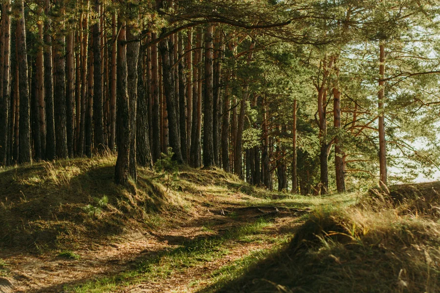
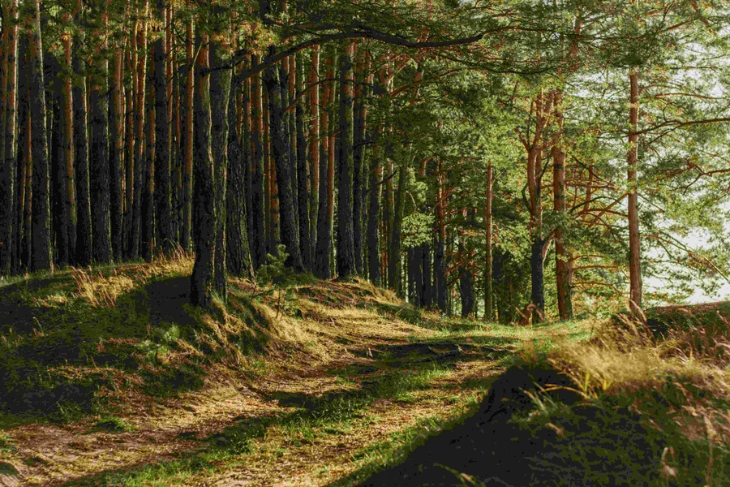

약 30년 동안 JPEG는 월드 와이드 웹의 주요 이미지 포맷이었습니다.
하지만 웹이 처음 시작할 때 사용된 포맷은 아니었습니다.
사실 최초의 대중적인 그래픽 브라우저인 NCSA Mosaic은 처음에는 인라인 JPEG 파일을 지원하지 않았고, [인라인 GIF](https://ftp.jurassic.nl/pub/irix/mosaic/Mac/FAQ/FAQ.HTML)와 지금은 [잊힌 몇 가지 다른 포맷](https://spectrum.ieee.org/carnegie-mellon-is-saving-old-software-from-oblivion)만 지원했습니다.
그러나 JPEG는 곧 대체한 포맷에 비해 많은 장점이 있었습니다.

JPEG와 웹 브라우저는 처음부터 함께 등장하지는 않았지만(이미지 표준이 공식적으로 발표된 지 3년 후인 1995년에 Netscape에서 처음 등장), 둘은 자연스럽게 어울렸습니다.
JPEG 파일은 GIF보다 더 우아하게 품질이 저하되어, 이미지의 원래 형태를 더 잘 유지할 수 있었고, 덕분에 더 큰 성공을 거둘 수 있었습니다.
애니메이션은 지원하지 않았지만, 모뎀이 느리게 렌더링하던 시절부터 고급 전문 사진에도 사용할 수 있을 만큼 발전했습니다.

인터넷에서 중요한 점은 바로 이 품질 저하 방식이었습니다.
하지만 JPEG가 디지털 세계에서 엄청난 가치를 갖게 된 것은 이것만이 아니었습니다.
중요한 점은 여러 이해관계자들이 함께 만든 문서화된 표준이었다는 점입니다.

<br >

## GIF는 사실상의 표준, JPEG는 진짜 표준

JPEG가 표준이었다는 점이 얼마나 중요할까요? 이야기를 하나 해드릴게요.

2013년, GIF의 창시자인 스티브 윌하이트가 자신의 업적을 기리는 상을 받기 직전 [뉴욕타임스와의 인터뷰](https://archive.nytimes.com/bits.blogs.nytimes.com/2013/05/21/an-honor-for-the-creator-of-the-gif/?smid=tw-nytimes)에서, 그는 자신이 의도치 않게 만든 논쟁에 대해 언급했습니다.
즉, 자신이 만든 이미지 포맷(Graphics Interchange Format)의 약어를 어떻게 발음해야 하는지 아무도 몰랐던 것입니다. 그는 이 기회를 빌려 “부드러운 G, 즉 ‘지프(jif)’로 발음한다. 끝.”이라고 말했습니다.

저는 그 당시 인기 있던 Tumblr에 [윌하이트의 말을 인용](https://shortformblog.com/post/51026114908/steve-wilhite-gif-award)해 올렸고, 곧 수천 건의 리블로그가 달렸습니다.
대부분은 윌하이트의 발음에 동의하지 않았죠. 곧 [그의 발언은 밈이 되었습니다](https://knowyourmeme.com/memes/gif-vs-jif-pronunciation-debate/).

이 일화는 윌하이트가 자신의 포맷을 위원회가 아닌 혼자 개발했다는 점을 보여줍니다.
그는 1987년 CompuServe 직원으로서 이 프로젝트를 맡아 직접 만들었고, 그게 전부였습니다.
작동 방식을 설명하는 최초의 문서도 매우 간단했습니다. 38년이 지난 지금도 GIF는 여전히 사용되고 있지만, JPEG만큼 널리 퍼지지는 못했습니다.

JPEG는 약 5년 후에 공식적으로 등장했는데, 상황이 완전히 달랐습니다. 사실상의 표준과 진짜 표준의 차이였고, 이것이 JPEG가 널리 퍼지는 데 결정적이었습니다.


> 이 기사 전체에서 이 이미지의 품질을 점점 낮춰볼 것입니다. 원래 전체 크기는 13.7메가바이트입니다.

<br >

## JPEG 포맷의 탄생

수십 명의 이해관계자들이 참여해 만든 JPEG(Joint Photographic Experts Group)는 모두의 요구를 충족하는 포맷을 만들고자 했습니다. (위원회가 만든 만큼, 이름에 혼동이 없도록 조직의 약어를 그대로 사용했습니다.) 포맷이 세상에 공개되었을 때는 600페이지가 넘는 책으로 소개될 정도였습니다.

IBM 직원이자 JPEG 조직의 일원이었던 윌리엄 B. 페네베이커와 조안 L. 미첼이 쓴 『JPEG: 정지 영상 데이터 압축 표준』은 포토리얼리즘 이미지와 즉시성의 균형을 맞출 방법이 없던 멀티미디어 이미지의 세계를 [설명](https://www.google.com/books/edition/JPEG/AepB_PZ_WMkC?hl=en&gbpv=0)합니다. 표준화가 이 문제를 해결할 수 있다고 믿었습니다.

“문제는 이미지 압축 알고리즘의 부족이 아니라, 다양한 응용 프로그램 간에 이미지를 교환할 수 있는 표준 알고리즘의 부재였다”고 저자들은 썼습니다.

이 말은 맞았습니다. 30년 넘게 JPEG는 고품질, 고해상도 사진을 다양한 운영체제에서 사용할 수 있게 했습니다. 이제는 JPEG를 극한까지 압축할 필요는 없지만, 그 기능 덕분에 현대 인터넷이 가능해졌습니다.

IBM의 지원을 받아 미첼과 페네베이커는 JPEG 위원회와 함께 연구를 진행했고, 이 과정에서 JPEG 포맷의 핵심 특허를 개발했습니다. 1988년에 미첼과 페네베이커가 출원한 특허에서 IBM과 JPEG 위원회의 다른 멤버(AT&T, 캐논 등)는 고품질 이미지를 제한된 환경에서 쉽게 전달할 수 있도록 압축 기술을 개발했습니다.

각 회사는 각자의 필요에 따라 참여했습니다. 캐논은 프린터와 사진에, AT&T는 데이터 전송에 더 관심이 있었습니다. 이들이 남긴 표준은 지금까지도 유효합니다.

재미있게도, JPEG 압축을 사용할 수 있는 프로그램이 처음 등장한 곳은 MacOS나 Windows가 아니라 IBM이 만든 실패한 운영체제 OS/2였습니다. 1990년경, OS/2는 OS/2 이미지 지원 애플리케이션을 통해 JPEG를 지원했습니다.



> 초기 품질의 50퍼센트로 낮추면, 이미지 용량이 약 2.6MB로 줄어듭니다. 이미지 품질을 절반으로 낮췄더니, 파일 크기가 원래의 5분의 1이 되었습니다.

<br >

## JPEG를 강하게 압축하면 어떻게 될까

JPEG가 PNG나 GIF와 다른 점은 데이터를 압축할 때 어떻게 품질이 저하되는지입니다. JPEG의 목표는 압축이 필요하더라도 사진처럼 보이게 하는 것입니다. 즉, 원본과 비슷한 이미지를 더 적은 용량으로 보여줄 수 있습니다.

[페네베이커와 미첼의 말](https://www.google.com/books/edition/JPEG/AepB_PZ_WMkC?hl=en&gbpv=1&pg=PA4&printsec=frontcover)처럼, “가장 효과적인 압축은 원본 이미지를 정확히 재현하는 것이 아니라 근사치로 만드는 것이다.”

여기서 핵심은 이산 코사인 변환(DCT)이라는 압축 과정입니다. DCT는 손실 압축 방식으로, 디지털 오디오와 신호 처리 등 다양한 분야에서 사용됩니다. 데이터를 줄이면서도 원본의 핵심을 근사치로 유지합니다. 변환 강도가 높을수록 더 많이 압축됩니다.

이 알고리즘은 1970년대에 개발되었으며, 데이터를 마치 수도꼭지처럼 조절할 수 있게 해줍니다. 더 많은 데이터를 원하면 더 많이, 적게 원하면 적게 흘러나오게 할 수 있습니다. DCT 덕분에 데이터가 적어도 원본의 핵심을 유지할 수 있습니다.

JPEG 표준은 하나의 압축 방식만 제공하는 것이 아니라, 다양한 압축 기술의 “도구 상자”를 제공합니다. 응용 프로그램이 필요에 따라 적합한 요소를 선택할 수 있습니다.

도구 상자는 네 가지 모드가 있습니다.

- **순차 DCT**: 압축된 이미지를 위에서 아래로 순서대로 표시(블라인드처럼)
- **점진적 DCT**: 전체 이미지를 낮은 해상도로 먼저 보여주고, 점차 디테일을 추가
- **순차 무손실**: 블라인드 방식이지만 압축하지 않음
- **계층적 모드**: 앞의 세 가지를 조합(예: 점진적으로 시작해 무손실로 마무리)

JPEG가 만들어질 당시에는 모뎀이 흔했기 때문에, 이미지를 천천히 로딩하는 점진적 DCT가 인터넷에 가장 적합했습니다. 시간이 지나면서 컴퓨터 성능이 좋아져 순차 DCT가 더 많이 쓰이게 되었습니다.



> 같은 숲 사진을 품질 5퍼센트로 저장하면, 이제 약 419킬로바이트로 줄어듭니다.

이미지를 DCT로 압축하면, 머리카락이나 나뭇잎처럼 복잡한 부분에서는 변화가 덜 눈에 띄고, 단색이나 색이 급격히 변하는 부분(예: 텍스트)에서는 더 잘 보입니다. 그래서 소셜 미디어 게시물을 스크린샷하면 노이즈가 생기는 것입니다.

PNG 같은 다른 포맷은 텍스트에 더 적합합니다. PNG의 압축 방식(DEFLATE)은 ZIP 포맷을 만든 필 카츠가 개발했으며, 라이선스가 필요 없는 압축 방식이기 때문에 사용되었습니다.

JPEG는 이미지 제작 도구 중 하나일 뿐입니다. 오래되고 성숙한 포맷이지만, 인터넷에서 사진을 공유할 때 여전히 최고의 선택지 중 하나입니다. 하지만 모든 상황에 적합한 도구는 아닙니다.

<br >

## 포전트 네트웍스(Forgent Networks)는 JPEG의 핵심 알고리즘을 소유했다고 주장했다 

JPEG가 90년대에 인기를 끈 이유는 포맷의 품질뿐만 아니라 특허 때문이기도 했습니다. 1994년, 유니시스(Unisys)는 자신들이 소유한 특허를 사용한 GIF 파일 사용자들에게 요금을 청구하려 했습니다. 이로 인해 무료로 사용할 수 있는 JPEG가 더 인기를 끌었습니다. (이 일로 특허가 없는 PNG 포맷도 탄생했습니다.)

JPEG도 특허 문제에서 자유로울 수는 없었습니다. 포맷이 등장하기 몇 년 전, 컴프레션 랩스(Compression Labs) 직원 두 명이 모션 그래픽 압축에 관한 특허를 출원했습니다. 나중에 이 특허가 JPEG 압축과 유사하다는 사실이 알려졌을 때는 이미 JPEG가 널리 퍼진 뒤였습니다.

1997년, 포전트 네트웍스가 컴프레션 랩스를 인수했습니다. 이후 이 특허를 발견하고 소송을 제기하기 시작했습니다.

포전트 CEO 제이 피터슨은 2005년 CNET과의 인터뷰에서 “이 특허는 어떤 면에서 복권과 같다. 5년 전에 ‘네가 JPEG 특허를 갖고 있다’고 했다면 믿지 않았을 것”이라고 말했습니다.

포전트의 JPEG 압축 알고리즘 소유 주장은 미약했지만, 결국 유니시스보다 더 많은 성공을 거두었습니다. 디지털 카메라 제조사들로부터 1억 달러 이상을 벌었고, PC 업계에도 라이선스 비용을 요구했습니다. 결국 800만 달러의 합의금으로 마무리되었습니다.

공격적인 특허 소송이 이어지자, 법원과 여론 모두에서 점점 불리해졌습니다. 결국 2007년 특허가 만료되었고, 포전트는 소프트웨어 회사(Asure Software)로 전환했습니다.

<br >

## JPEG가 사라지지 않는 이유

JPEG 파일 포맷은 오랫동안 우리 곁에 있었습니다. 쉽게 대체되지 않았죠. JPEG 2000 같은 포맷이 더 나은 성능과 무손실 옵션을 제공하며 대체를 시도했지만, 일반 사용자에게는 인기가 없었습니다.

구글이 지원하는 WebP는 웹사이트 개발자들 사이에서 인기가 있지만, 사용자들 사이에서는 논란이 있습니다. AVIF와 HEIC 같은 포맷은 JPEG와 JPEG 2000을 능가하는 성능을 보이기도 합니다.

그럼에도 불구하고 JPEG는 여전히 살아남고 있습니다. MP3나 ZIP 파일처럼 너무 널리 퍼져서 사라지기 힘든 포맷입니다. 더 효율적인 포맷이 있지만, 30년의 역사를 가진 포맷을 대체하는 것은 쉽지 않습니다.

JPEG를 완전히 없애는 것은 말처럼 쉽지 않습니다. 대부분의 사람들은 그냥 계속 사용할 것입니다.

---

```toc

```
