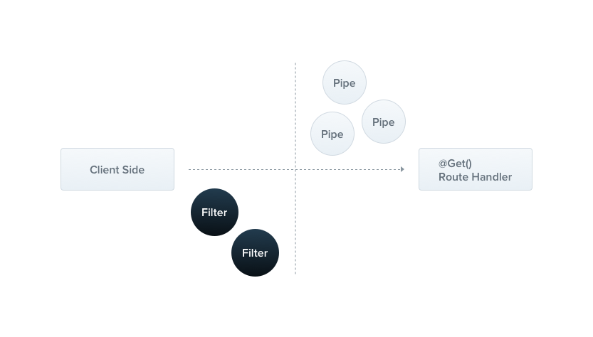

[NestJs](https://docs.nestjs.com/exception-filters)에는 애플리케이션 전체의 모든 예외 처리를 하는 **Exceptions Layer**가 내장되어 있습니다.

애플리케이션 코드에서 예외 처리를 하지 않으면 이 레이어에서 예외를 처리합니다.



커스텀으로 예외 레이어를 만들지 않는다면 아래와 같이 기본 JSON 응답을 합니다.

```js
{
  "statusCode": 500,
  "message": "Internal server error"
}
```

---

## Exception Filters

기본 예외 필터가 자동으로 많은 경우의 예외 처리를 해주지만 **custom**으로 제어를 하고 싶은 경우가 있습니다.

예를 들어 다른 형태의 JSON 스키마로 반환하고 싶은 경우입니다.

```ts
import { ExceptionFilter, Catch, ArgumentsHost, HttpException } from '@nestjs/common';
import { Request, Response } from 'express';

/*
  @Catch(HttpException)은
  http 통신의 예외를 캐치하겠다는 뜻입니다. 
  만약 모든 예외를 캐치하고 싶다면
  
  @Catch()로 적용하시면 됩니다.
*/
@Catch(HttpException)
export class AllExceptionFilter implements ExceptionFilter {
  async catch(exception: HttpException, host: ArgumentsHost) {
    const ctx = host.switchToHttp();
    const response = ctx.getResponse();
    const request = ctx.getRequest();

    const status = exception ? exception.getStatus() : HttpStatus.INTERNAL_SERVER_ERROR;

    response.status(status).json({
      statusCode: status,
      timestamp: new Date().toISOString(),
      path: request.url,
      message: exception.message,
    });
  }
}
```

<br >

## Usage

이제 위에서 만든 **Exception Filter**를 적용해보겠습니다.

```ts
@UseFilters(AllExceptionFilter)
@Controller('user')
export class UserController {
  constructor(private userService: UsersService) {}
  // ...
}
```

<br >

**Exception Filter**를 적용하고 싶다면 **@UseFilters()** 를 import해야 합니다. (이름이 아주 직관적이죠?🤣)

User 컨트롤러의 라우팅 핸들러 전체에 **Exception Filter**를 적용하고 싶다면 **@Controller()** 에 위와 같이 적용하시면 됩니다.

그리고 특정 라우팅 핸들러에만 적용하고 싶다면

```ts
@Controller('user')
export class UserController {
  constructor(private userService: UsersService) {}

  @UseFilters(AllExceptionFilter)
  @Get()
  // ...
  async find() {
    // ...
  }
  // ...
}
```

**Controller**에 적용한 것과 비슷하게 해당 라우팅 핸들러에 위와 같이 적용하시면 됩니다.

<br >

위의 코드를 적용한 뒤의 에러 메시지입니다.

```js
{
  "statusCode": 401,
  "timestamp": "2022-10-21T08:04:19.635Z",
  "path": "/api/v1/test",
  "message": "여기에 에러 메시지가 들어옵니다."
}
```

---

이것으로 기본적인 NestJs Error handling에 대해 작성해보았습니다.

```toc

```
