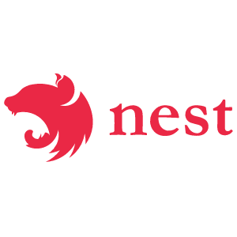
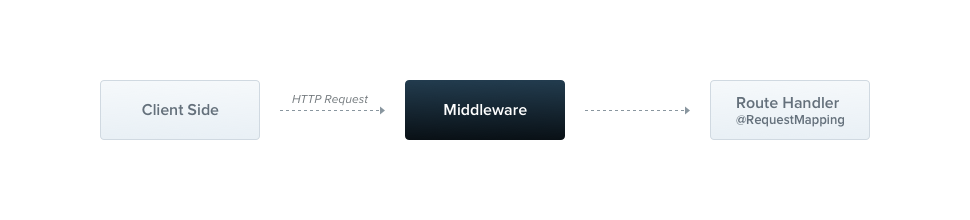
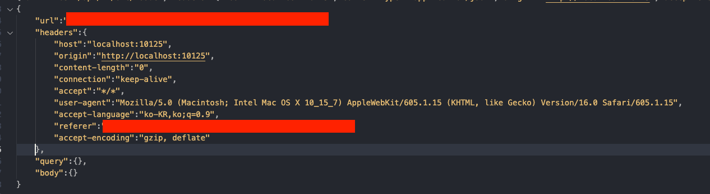

웹 API 서버를 운영할 때 중요한 것 중 하나가 바로 로그를 쌓는 것입니다.

NestJS에 NodeJs의 대표적인 로그 모듈 중 하나인 [winston](https://www.npmjs.com/package/winston)을 도입해 로그를 남기는 방법을 알려드리고자 합니다.

---

## Middleware

미들웨어는 라우터 핸들러(컨트롤러) 전에 호출되는 함수입니다.

Request - Response 사이클 중에 reqeust, response 객체에 접근할 수 있고, next 미들웨어 기능에 접근할 수 있습니다.



NestJs의 Middleware는 기본적으로 **[express](https://expressjs.com/en/guide/using-middleware.html)** 의 Middleware와 동일합니다.

- 어떠한 코드도 실행할 수 있음.
- Request, Response 객체를 변경할 수 있음
- Request - Response 주기를 종료시킬 수 있음
- next 미들웨어 함수를 호출할 수 있음
- 현재 미들웨어 함수가 Request - Response 주기를 종료시키지 않는다면, 반드시 next 미들웨어 함수를 실행해야 합니다. 그렇지 않는다면 Request는 계속 응답 대기 상태가 됩니다.

<br >
기본적인 미들웨어 개념 설명이 끝났습니다. 이제 Winston을 도입해보도록 하겠습니다.

## winston 도입하기

### Installation

```bash
  npm i winston
  npm i nest-winston
```

### Logger Service

```ts
// core
import { LoggerService as LS } from '@nestjs/common';

// lib
import * as winston from 'winston';
import * as moment from 'moment';
import { utilities as nestWinstonModuleUtilities } from 'nest-winston';

const { errors, combine, timestamp, printf } = winston.format;

export class LoggerService implements LS {
  private logger: winston.Logger;

  constructor(service: string) {
    this.logger = winston.createLogger({
      transports: [
        new winston.transports.File({
          level: 'error',
          filename: `error-${moment(new Date()).format('YYYY-MM-DD')}.log`,
          dirname: 'logs',
          maxsize: 5000000,
          format: combine(
            errors({ stack: true }),
            timestamp({ format: 'isoDateTime' }),
            printf((info) => {
              return `${info.message}`;
            }),
          ),
        }),
        new winston.transports.Console({
          level: 'debug',
          format: combine(
            timestamp({ format: 'isoDateTime' }),
            nestWinstonModuleUtilities.format.nestLike(service, {
              prettyPrint: true,
            }),
          ),
        }),

        new winston.transports.File({
          filename: `application-${moment(new Date()).format('YYYY-MM-DD')}.log`,
          dirname: 'logs',
          maxsize: 5000000,
          format: combine(
            timestamp({ format: 'isoDateTime' }),
            printf((info) => {
              return `${info.message}`;
            }),
          ),
        }),
      ],
    });
  }

  log(message: string) {
    this.logger.log({ level: 'info', message });
  }
  info(message: string) {
    this.logger.info(message);
  }
  error(message: string, trace: string) {
    this.logger.error(message, trace);
  }
  warn(message: string) {
    this.logger.warning(message);
  }
  debug(message: string) {
    this.logger.debug(message);
  }
  verbose(message: string) {
    this.logger.verbose(message);
  }
}
```

**transports**를 보시면 level을 여러 개로 나누어놨는데 이건 log 레벨에 따라 log 파일을 다르게 생성하기 위함입니다.

### Logger Middleware

커스텀 미들웨어를 생성하기 위해선 **@Injectable() decorator**를 적용해야 하고

class는 **NestMiddleware를 implements** 해야 합니다.

```ts
// core
import { Injectable, NestMiddleware } from '@nestjs/common';

// logger
import { LoggerService } from './logger.service';

// lib
import { Request, Response } from 'express';

@Injectable()
export class LoggerMiddleware implements NestMiddleware {
  constructor() {}
  use(req: Request, res: Response, next: Function) {
    const loggerService = new LoggerService(
      req.url.slice(1).split('/')[req.url.slice(1).split('/').length - 1],
    );
    const tempUrl = req.method + ' ' + req.url.split('?')[0];
    const _headers = req.headers ? req.headers : {};
    const _query = req.query ? req.query : {};
    const _body = req.body ? req.body : {};
    const _url = tempUrl ? tempUrl : {};

    loggerService.info(
      JSON.stringify({
        url: _url,
        headers: _headers,
        query: _query,
        body: _body,
      }),
    );

    next();
  }
}
```

당신이 뭘 원할지 몰라서 다 준비했어 컨셉의 미들웨어입니다. 🤣

header, query, body 등등을 log 파일로 남깁니다.

### AppModule

```ts
export class AppModule implements NestModule {
  configure(consumer: MiddlewareConsumer) {
    consumer.apply(LoggerMiddleware).forRoutes(YourController);
  }
}
```

마지막으로 AppModule에 NestModule을 implements 합니다.

NestModule에는 configure method가 있습니다.

그리고 LoggerMiddleware를 원하는 라우트 핸들러 (Controller)에 연결하면 끝입니다.

<br >

최종적으로 로그 파일은 아래의 포맷으로 생성됩니다.



---

이것으로 NestJs에 winston 모듈을 도입해보았습니다.

```toc

```
