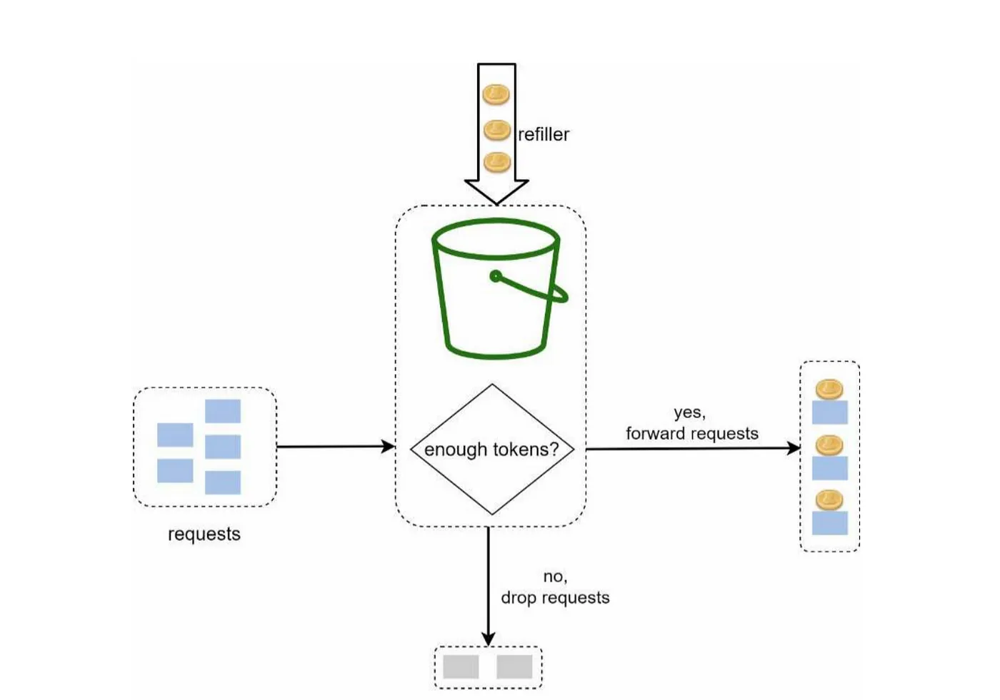

## 처리율 제한 장치란?

네트워크 시스템에서 **처리율 제한 장치(rate limiter)** 는 클라이언트 또는 서비스가 보내는 **트래픽의 처리율(rate)을 제어**하기 위한 장치입니다.

HTTP를 예로 들면 이 장치는 특정 기간 내에 전송되는 클라이언트의 요청 횟수를 제한합니다.

API 요청 횟수가 제한 장치에 정의된 임계치(threshold)를 넘어서면 추가로 도달한 모든 호출은 처리가 중단됩니다.

예를 들어

- 사용자는 초당 2회 이상 새 글을 올릴 수 없다.
- 같은 IP 주소로는 하루에 10개 이상의 계정을 생성할 수 없다.
- 같은 디바이스로는 주당 5회 이상 리워드를 요청할 수 없다.

### 장점

- Dos(Denial of Service) 공격에 의한 자원 고갈을 방지할 수 있습니다. 대부분의 API는 어떤 형태로든 처리율 제한 장치를 갖고 있습니다.
  <br > 예를 들어 트위터는 3시간 동안 300개의 트윗만 올릴 수 있도록 제한합니다.
- 비용을 절감합니다. 추가 요청에 대한 처리를 제한하면 서버를 많이 두지 않아도 되고, 우선순위가 높은 API에 더 많은 자원을 할당할 수 있습니다. <br >
  아울러 처리율 제한은 제 3자 API에 사용료를 지불하고 있는 회사들에게는 중요합니다.
- 서버 과부하를 막습니다. 봇(bot)에서 오는 트래픽이나 사용자의 잘못된 이용 패턴으로 유발된 트래픽을 걸러내는데 활용할 수 있습니다.

---

## 처리율 제한 알고리즘

- 토큰 버킷(token bucket)
- 누출 버킷(leaky bucket)
- 고정 윈도 카운터(fixed window counter)
- 이동 윈도 로그(sliding window log)
- 이동 윈도 카운터(sliding window counter)

<br >

### 토큰 버킷

토큰 버킷 알고리즘은 처리율 제한에 폭넓게 이용되고 있습니다. <br>
간단하고, 알고리즘에 대한 세간의 이해도도 높은 편이며 인터넷 기업들이 보편적으로 사용하고 있습니다.<br>
아마존과 스트라이프가 API 요청을 통제(throttle)하기 위해 이 알고리즘을 사용합니다.

- 토큰 버킷은 지정된 용량을 갖는 컨테이너입니다. 이 버킷에는 사전 설정된 양의 토큰이 주기적으로 채워집니다. <br >
  토큰이 꽉 찬 버킷에는 더 이상의 토큰은 추가되지 않습니다. <br >
  토큰 공급기(refiller)는 이 버킷에 매초 2개의 토큰을 추가합니다. 버킷이 가득 차면 추가로 공급된 토큰은 버려집니다(overflow)

- 각 요청은 처리될 때마다 하나의 토큰을 사용합니다. <br >
  요청이 도착하면 버킷에 충분한 토큰이 있는지 검사하게 됩니다.
  - 충분한 토큰이 있는 경우, 버킷에서 토큰 하나를 꺼낸 후 요청을 시스템에 전달합니다.
  - 충분한 토큰이 없는 경우, 해당 요청은 버려집니다.



<br >

토큰 버킷 알고리즘은 2개 인자를 받습니다.

- 버킷 크기: 버킷에 담을 수 있는 토큰의 최대 개수
- 토큰 공급률: 초당 몇 개의 토큰이 버킷에 공급되는가

<br >

### 사례

- 통상적으로, API 엔드포인트마다 별도의 버킷을 둡니다. <br>
  예를 들어, 사용자마다 하루에 한 번만 포스팅을 할 수 있고, 친구는 150명까지 추가할 수 있고, 좋아요 버튼은 다섯 번까지만 누를 수 있다면, 사용자마다 3개의 버킷을 두어야 할 것입니다.

- IP 주소별로 처리율 제한을 적용해야 한다면 IP 주소마다 버킷을 하나씩 할당해야 합니다.
- 시스템의 처리율을 초당 10,000개 요청으로 제한하고 싶다면, 모든 요청이 하나의 버킷을 공유하도록 해야 할 것입니다.

<br >

### 예시 코드 (javascript)

그럼 토큰 버킷 알고리즘을 코드로 구현해보겠습니다.

#### Initial Bucket

```javascript
class TokenBucket {
  constructor(capacity, fillPerSecond) {
    this.capacity = capacity;
    this.tokens = capacity;
    setInterval(() => this.addToken(), 1000 / fillPerSecond);
  }

  addToken() {
    if (this.tokens < this.capacity) {
      this.tokens += 1;
    }
  }

  take() {
    if (this.tokens > 0) {
      this.tokens -= 1;
      return true;
    }

    return false;
  }
}
```

<br >

#### Rate Limiting with Bucket

코드를 보시면 초기에 10개의 토큰을 충전하고, 토큰 공급기에서 0.2초마다 토큰을 하나씩 채웁니다.

```javascript
const express = require('express');
const app = express();

function limitRequests(perSecond, maxBurst) {
  const bucket = new TokenBucket(maxBurst, perSecond);

  return function limitRequestsMiddleware(req, res, next) {
    if (bucket.take()) {
      next();
    } else {
      res.status(429).send('Rate limit exceeded');
    }
  };
}

app.get('/', limitRequests(5, 10), (req, res) => {
  res.send('Hello from the rate limited API');
});

app.listen(3000, () => console.log('Server is running'));
```

<br >

#### Rate Limiting by IP

다른 방법으론 IP 주소별로 요청을 제한할 수도 있습니다.

```javascript
function limitRequests(perSecond, maxBurst) {
  const buckets = new Map();

  return function limitRequestsMiddleware(req, res, next) {
    if (!buckets.has(req.ip)) {
      buckets.set(req.ip, new TokenBucket(maxBurst, perSecond));
    }

    const bucketForIP = buckets.get(req.ip);
    if (bucketForIP.take()) {
      next();
    } else {
      res.status(429).send('Client rate limit exceeded');
    }
  };
}
```

<br >

---

## 결론

처리율 제한 장치를 구축하는데 많이 쓰이는 토큰 버킷 알고리즘을 알아봤습니다.

### 장점

- 구현이 쉽습니다.
- 메모리 사용 측면에서도 효율적입니다.
- 짧은 시간에 집중되는 트래픽도 처리 가능합니다. <br >
  버킷에 남은 토큰이 있기만 한다면 요청은 시스템에 전달될 것입니다.

### 단점

- 이 알고리즘은 버킷 크키와 공급률이라는 두 개의 인자를 가지고 있는데, 이 값을 적절하게 튜닝하는 것은 까다로운 일입니다.

---

```toc

```
