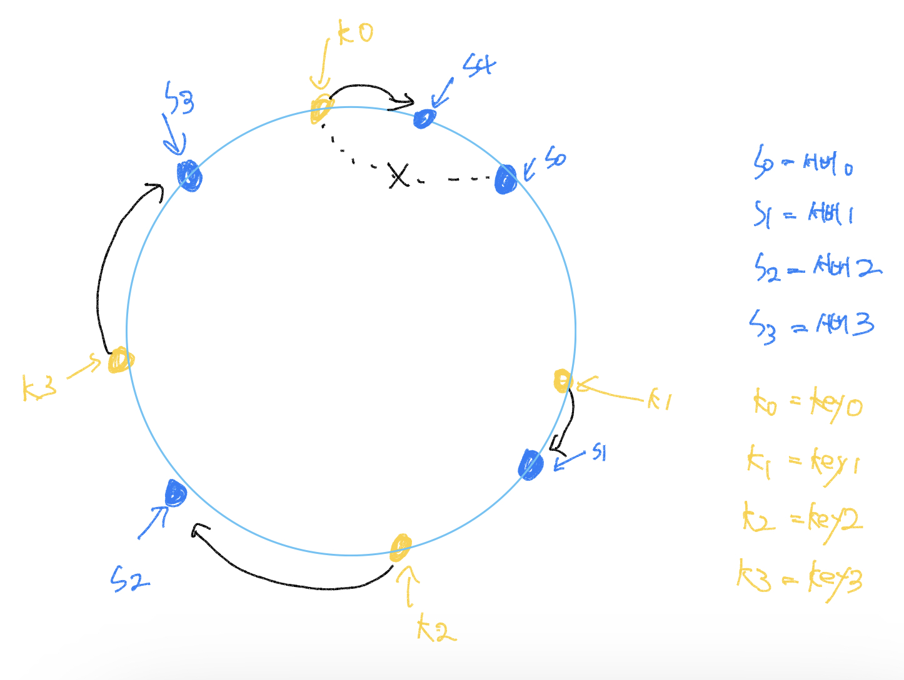
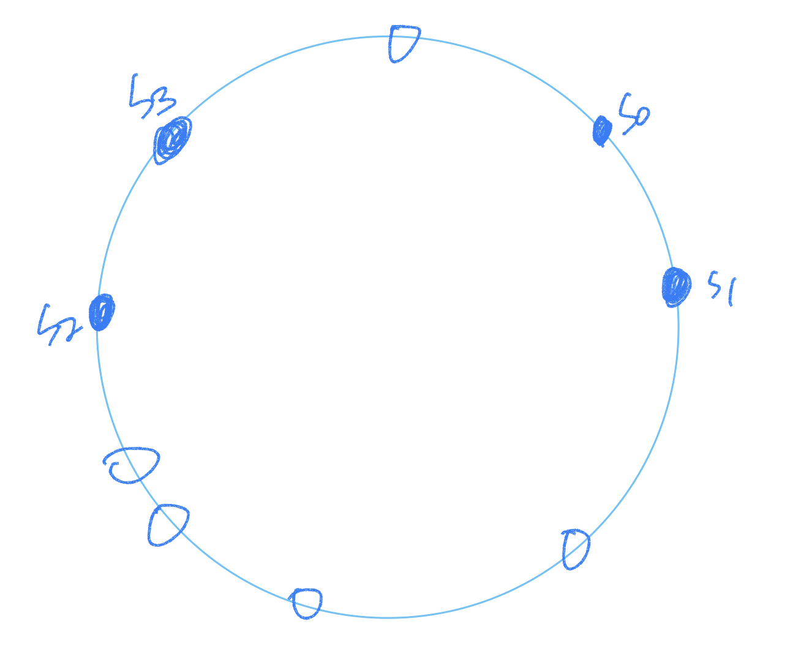
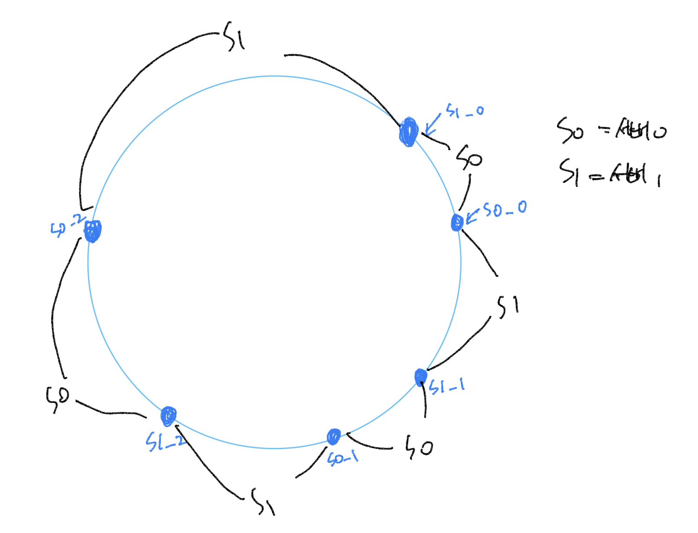
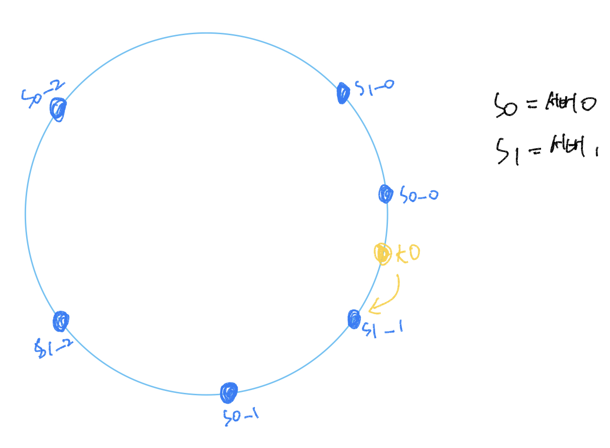

수평적 규모 확장성을 달성하기 위해서는 요청 또는 데이터를 서버에 균등하게 나누는 것이 중요합니다. <br >
안정 해시는 이 목표를 달성하기 위해 보편적으로 사용하는 기술입니다.

하지만 우선 이 해시 기술이 풀려고 하는 문제부터 좀 더 알아보겠습니다.

<br >

## 해시 키 재배치(rehash) 문제

N개의 캐시 서버가 있다고 가정해 봅시다. <br >
이 서버들에 부하를 균등하게 나누는 보편적 방법은 아래의 해시 함수를 사용하는 것입니다.

> serverIndex = hash(key) % N (N은 서버의 개수입니다)

<br >

예제를 더 보겠습니다. <br>
총 4대의 서버를 사용한다고 가정해 봅시다. <br >
다음 아래의 표는 주어진 각각의 키에 대해서 해시 값과 서버 인덱스를 계산한 예제입니다.

|  키  |   해시   | 해시 % 4(서버 인덱스) |
| :--: | :------: | :-------------------: |
| key0 | 18358617 |           1           |
| key1 | 26143584 |           0           |
| key2 | 18131146 |           2           |
| key3 | 35863496 |           0           |
| key4 | 34085809 |           1           |
| key5 | 27581703 |           3           |
| key6 | 38164978 |           2           |
| key7 | 22530351 |           3           |

<br >

특정한 키가 보관된 서버를 알아내기 위해, 나머지(modular) 연산을 f(key) % 4와 같이 적용하였습니다.<br >
예를 들어 hash(key0) % 4 = 1이면, 클라이언트는 캐시에 보관된 데이터를 가져오기 위해 서버 1에 접속하여야 합니다.


<br >

이 방법은 서버 풀(server pool)의 크기가 고정되어 있을 때, 그리고 데이터 분포가 균등할 때는 잘 동작합니다.<br>
하지만 서버가 추가되거나 기존 버서가 삭제되면 문제가 생깁니다. <br >
예를 들어 1번 서버가 장애를 일으켜 동작을 중단했다고 가정해 봅시다. 그러면 서버 풀의 크기는 3으로 변합니다. <br >
그 결과로, 키에 대한 해시 값은 변하지 않지만 나머지(%) 연산을 적용하여 계산한 서버 인덱스 값은 달라질 것입니다. <br> 서버의 수가 1만큼 줄어들어서입니다. 따라서 아래의 표와 같은 결과를 얻습니다. 해시 % 3의 결과 값입니다.

|  키  |   해시   | 해시 % 4(서버 인덱스) |
| :--: | :------: | :-------------------: |
| key0 | 18358617 |           0           |
| key1 | 26143584 |           0           |
| key2 | 18131146 |           1           |
| key3 | 35863496 |           2           |
| key4 | 34085809 |           1           |
| key5 | 27581703 |           0           |
| key6 | 38164978 |           1           |
| key7 | 22530351 |           0           |

<br >

그리고 키의 분포도 달라집니다.


<br >

장애가 발생한 1번 서버에 보관되어 있는 키 뿐만 아닌 대부분의 키가 재분배되었습니다. <br >
1번 서버가 죽으면 대부분 캐시 클라이언트가 데이터가 없는 엉뚱한 서버에 접속하게 된다는 뜻입니다. <br>
그 결과로 대규모 `캐시미스(cache miss)`가 발생하게 될 것입니다. <br >
**안정 해시는 이 문제를 효과적으로 해결하는 기술입니다.**

<br >

## 안정 해시

안정 해시(consistent hash)는 해시 테이블 크기가 조정될 때 평균적으로 오직 **k/n개의 키만 재배치**하는 해시 기술입니다. <br >
**여기서 k는 키의 개수이고, n은 슬롯(slot)의 개수입니다.** <br >
이와는 달리 대부분의 전통적 해시 테이블은 슬롯의 수가 바뀌면 거의 대부분 키를 재배치합니다.

### 해시 공간과 해시 링

안정 해시의 정의는 알았으니, 그 동작 원리를 살펴보겠습니다. <br >
해시 함수로 f로는 SHA-1을 사용한다고 하고, 그 함수의 출력 값 범위는 x0, x1, x2, x3, ... xn과 같다고 가정해 봅시다. <br >
SHA-1의 해시 공간 범위는 0부터 2의 160승의 -1까지라고 알려져 있습니다. <br >
따라서 x0는 0, xn은 2의 160승의 -1이며, 나머지 x1부터 xn-1까지는 그 사이의 값을 갖게 될 것입니다.

아래 그림은 이 해시 공간을 그림으로 표현한 것입니다.


<br >

이 해시 공간을 양쪽으로 구부려 접으면 아래와 같은 해시 링(hash ring)이 만들어집니다.


<br >

### 해시 서버

해시 함수 f를 사용하면 서버 IP나 이름을 이 링 위의 어떤 위치에 대응시킬 수 있습니다. <br >
아래 그림은 4개의 서버를 이 해시 링 위에 배치한 결과입니다.


<br >

### 해시 키

여기 사용된 해시 함수는 `"해시 키 재배치 문제"`에 언급된 함수와는 다르며, 나머지 연산 %는 사용하지 않고 있음에 유의해야 합니다. <br > 아래와 같이, 캐시할 키 key0, key1, key2, key3 또한 해시 링 위의 어느 지점에 배치할 수 있습니다.


<br >

### 서버 조회

어떤 키가 저장되는 서버는, 해당 키의 위치로부터 시계 방향으로 링을 탐색해가면서 만나는 첫 번째 서버입니다. <br >
아래 그림이 이 과정을 보여줍니다. 따라서 key0은 서버 0에 저장되고 key1은 서버 1에 저장되며, key2는 서버 2, key3은 서버3에 저장됩니다.


<br >

### 서버 추가

위에서 설명한 내용에 따르면, 서버를 추가하더라도 키 가운데 일부만 재배치하면 됩니다. <br >
아래 그림을 보면 새로운 서버 4가 추가된 뒤에 key0만 재배치됨을 알 수 있습니다. k1, k2, k3은 같은 서버에 남습니다. <br >
자세히 살펴보겠습니다. 서버 4가 추가되기 전 key0은 서버 0에 저장되어 있었습니다. 하지만 서버 4가 추가된 뒤에 key0은 서버 4에 저장될 것인데 그 이유는 key0의 위치에서 시계 방향으로 순회했을 때 처음으로 만나게 되는 서버가 서버 4이기 때문입니다. 다른 키들은 재배치되지 않습니다.



<br >

### 서버 제거

하나의 서버가 제거되면 키 가운데 일부만 재배치됩니다. <br >
아래 그림을 보면 서버 1이 삭제되었을 때 key1만이 서버 2로 재배치됨을 알 수 있습니다.


<br >

## 기본 구현법의 두 가지 문제

안정 해시 알고리즘은 MIT에서 처음 제안되었습니다. 그 기본 절차는 다음과 같습니다.

- 서버와 키를 균등 분포 해시 함수(uniform distribution)를 사용해 해시 링에 배치합니다.
- 키의 위치에서 링을 시계 방향으로 탐색하다 만나는 최초의 서버가 키가 저장될 서버입니다.

이 접근법에는 두 가지 문제가 있습니다. <br >
**첫 번째 문제는 서버가 추가되거나 삭제되는 상황을 감안하면 파티션의 크기를 균등하게 유지하는 게 불가능하다는 것입니다.**<br > 여기서 파티션은 인접한 서버 사이의 해시 공간입니다. 어떤 서버는 굉장히 작은 해시 공간을 할당 받고, 어떤 서버는 굉장히 큰 해시 공간을 할당 받는 상황이 가능하다는 것입니다.

<br >

두 번째 문제는 키의 균등 분포를 달성하기가 어렵다는 것입니다. <br >
서버가 아래 그림과 같이 배치되어 있다고 가정했을 때, 서버 1과 서버 3은 아무 데이터도 갖지 않는 반면, 대부분의 키는 서버 2에 보관될 것입니다.



<br >

이러한 문제를 해결하기 위해 제안된 기법이 `가상 노드(virtual node)` 또는 `복제(replica)`라 불리는 기법입니다.

<br >

## 가상 노드

가상 노드는 실제 노드 또는 서버를 가리키는 노드로서, 하나의 서버는 링 위에 여러 개의 가상 노드를 가질 수 있습니다. <br >
아래 그림을 보면 서버 0과 서버 1은 3개의 가상 노드를 갖습니다. 여기서 숫자 3은 임의로 정한 것이며, 실제 시스템에서는 그보다 훨씬 큰 값이 사용됩니다. <br >
서버 0을 링에 배치하기 위해 s0하나만 쓰는 대신, s0_0, s0_1, s0_2의 세 개 가상 노드를 사용하였습니다. <br >
마찬가지로 서버 1을 링에 배치할 때는 s1_0, s1_1, s1_2의 세 개 가상 노드를 사용하였습니다. <br >
따라서 각 서버는 하나가 아닌 여러 개 파티션을 관리해야 합니다. 아래 그림에서 s0으로 표시된 파티션은 서버 0이 관리하는 파티션이고, s1로 표시된 파티션은 서버 1이 관리하는 파티션입니다.



<br >

키의 위치로부터 시계방향으로 링을 탐색하다 만나는 최초의 가상 노드가 해당 키가 저장될 서버가 됩니다. <br >
아래 그림은 그에 해당하는 사례입니다. k0가 저장되는 서버는 k0의 위치로부터 링을 시계방향으로 탐색하다 만나는 최초의 가상 노드 s1_1가 나타내는 서버, 즉 서버 1입니다.



<br >

가상 노드의 개수를 늘리면 키의 분포는 점점 더 균등해집니다. 표준 편차가 작아져서 데이터가 고르게 분포되기 때문입니다. <br >
**표준 편차는 데이터가 어떻게 퍼져 나갔는지를 보이는 척도입니다.** 통계에 따르면 100~200개의 가상 노드를 사용했을 경우 표준 편차 값은 평균 5%에서 10% 사이입니다. <br >
**가상 노드의 개수를 더 늘리면 표준 편차의 값은 더 떨어집니다.** 그러나 가상 노드 데이터를 저장할 공간은 더 많이 필요하게 될 것입니다. `타협적 결정(trade off)`가 필요하다는 뜻입니다. 그러니 시스템 요구사항에 맞도록 가상 노드 개수를 적절히 조정해야 할 것입니다.

---

## 결론

안정 해시가 왜 필요하며 어떻게 동작하는 지를 살펴보았습니다. 안정 해시의 이점은 다음과 같습니다.

- 서버가 추가되거나 삭제될 때 재배치되는 키의 수가 취소화됩니다.
- 데이터가 보다 균등하게 분포하게 되므로 수평적 규모 확장성을 달성하기 쉽습니다.
- **핫스팟(hotspot) 키** 문제를 줄입니다. 특정한 샤드에 대한 접근이 지나치게 빈번하면 서버 과부하 문제가 생길 수 있습니다. <br > bts, 뉴진스와 같은 유명인의 데이터가 전부 같은 샤드에 몰리는 상황을 생각해보면 이해하기 쉬울 것입니다. <br > 안정 해시는 데이터를 좀 더 균등하게 분배하게 되므로 이런 문제가 생길 가능성을 줄여줍니다.

안정 해시는 실제로 널리 쓰이는 기술입니다. 그중 유명한 예로,

- AWS DynamoDB의 파티셔닝 관런 컴포넌트
- Apache Cassandra 클러스터에서의 데이터 파니셔닝
- Discord 채팅 어플리케이션
- Akamai CDN
- Meglev 네트워크 부하 분산기

---

```toc

```
