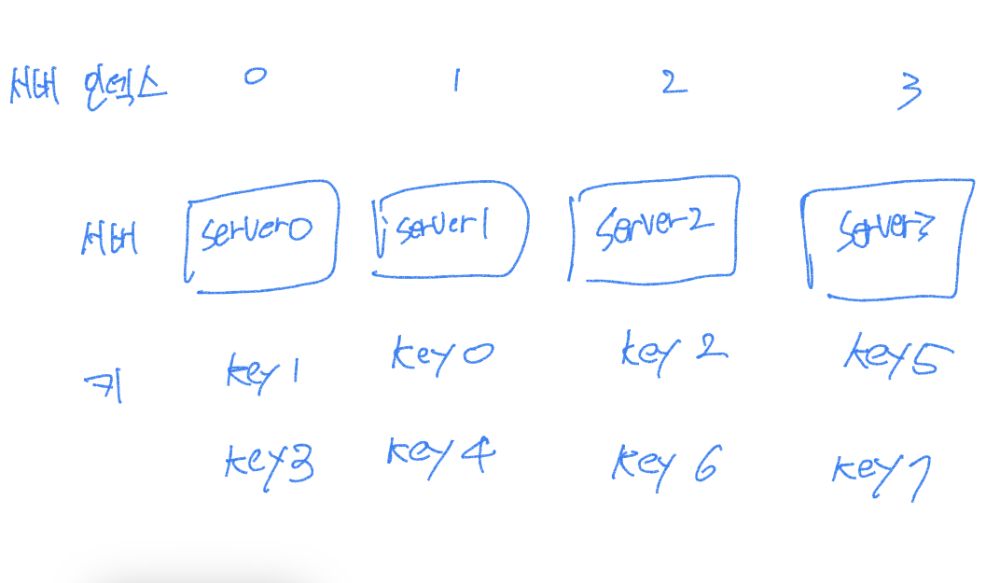
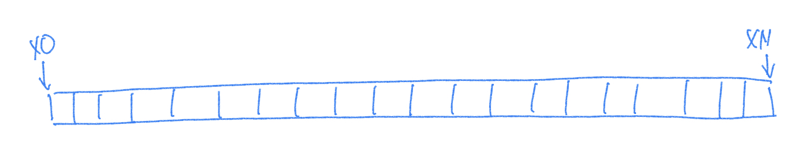
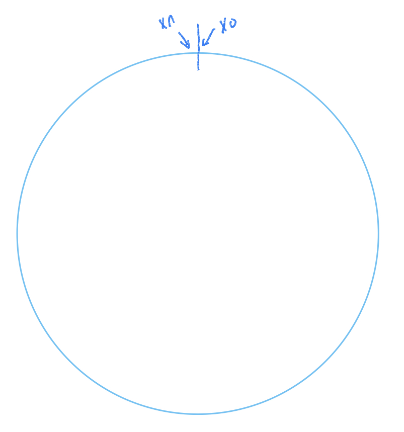
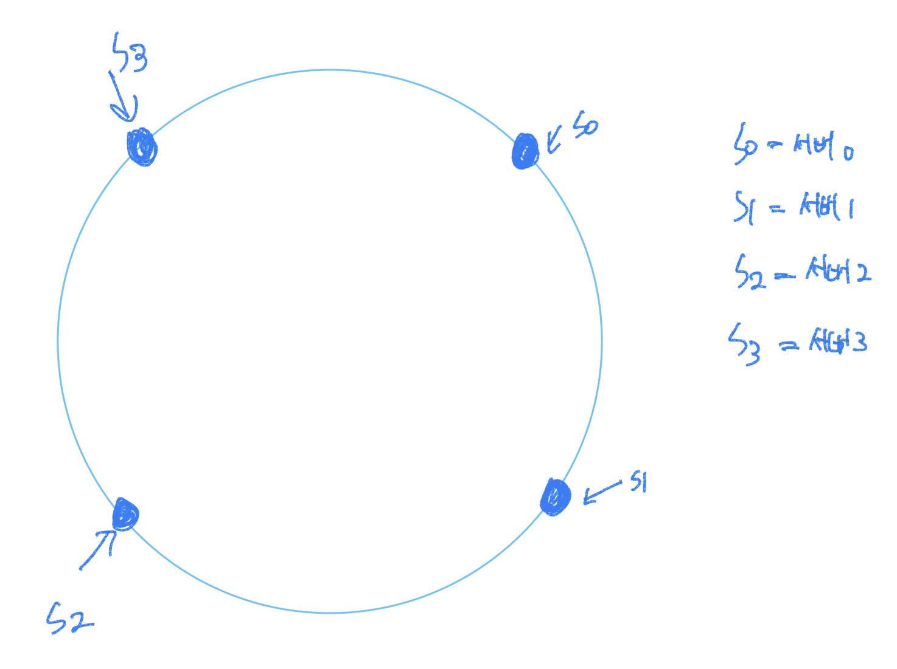
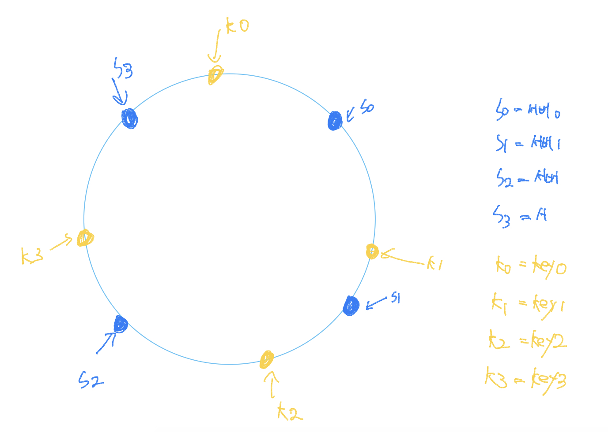
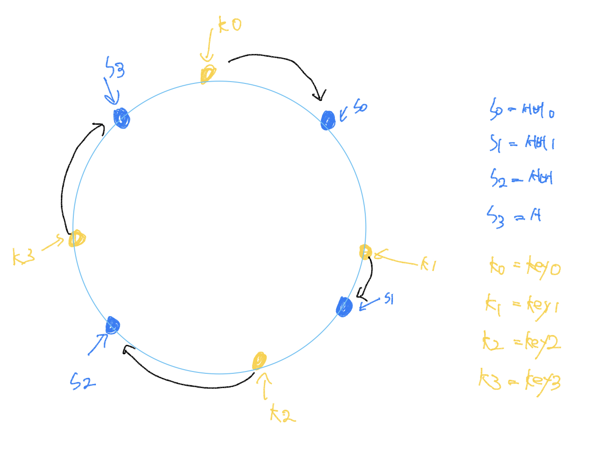

수평적 규모 확장성을 달성하기 위해서는 요청 또는 데이터를 서버에 균등하게 나누는 것이 중요합니다. <br >
안정 해시는 이 목표를 달성하기 위해 보편적으로 사용하는 기술입니다.

하지만 우선 이 해시 기술이 풀려고 하는 문제부터 좀 더 알아보겠습니다.

<br >

## 해시 키 재배치(rehash) 문제

N개의 캐시 서버가 있다고 가정해 봅시다. <br >
이 서버들에 부하를 균등하게 나누는 보편적 방법은 아래의 해시 함수를 사용하는 것입니다.

> serverIndex = hash(key) % N (N은 서버의 개수입니다)

<br >

예제를 더 보겠습니다. <br>
총 4대의 서버를 사용한다고 가정해 봅시다. <br >
다음 아래의 표는 주어진 각각의 키에 대해서 해시 값과 서버 인덱스를 계산한 예제입니다.

|  키  |   해시   | 해시 % 4(서버 인덱스) |
| :--: | :------: | :-------------------: |
| key0 | 18358617 |           1           |
| key1 | 26143584 |           0           |
| key2 | 18131146 |           2           |
| key3 | 35863496 |           0           |
| key4 | 34085809 |           1           |
| key5 | 27581703 |           3           |
| key6 | 38164978 |           2           |
| key7 | 22530351 |           3           |

<br >

특정한 키가 보관된 서버를 알아내기 위해, 나머지(modular) 연산을 f(key) % 4와 같이 적용하였습니다.<br >
예를 들어 hash(key0) % 4 = 1이면, 클라이언트는 캐시에 보관된 데이터를 가져오기 위해 서버 1에 접속하여야 합니다.



<br >

이 방법은 서버 풀(server pool)의 크기가 고정되어 있을 때, 그리고 데이터 분포가 균등할 때는 잘 동작합니다.<br>
하지만 서버가 추가되거나 기존 버서가 삭제되면 문제가 생깁니다. <br >
예를 들어 1번 서버가 장애를 일으켜 동작을 중단했다고 가정해 봅시다. 그러면 서버 풀의 크기는 3으로 변합니다. <br >
그 결과로, 키에 대한 해시 값은 변하지 않지만 나머지(%) 연산을 적용하여 계산한 서버 인덱스 값은 달라질 것입니다. <br> 서버의 수가 1만큼 줄어들어서입니다. 따라서 아래의 표와 같은 결과를 얻습니다. 해시 % 3의 결과 값입니다.

|  키  |   해시   | 해시 % 4(서버 인덱스) |
| :--: | :------: | :-------------------: |
| key0 | 18358617 |           0           |
| key1 | 26143584 |           0           |
| key2 | 18131146 |           1           |
| key3 | 35863496 |           2           |
| key4 | 34085809 |           1           |
| key5 | 27581703 |           0           |
| key6 | 38164978 |           1           |
| key7 | 22530351 |           0           |

<br >

그리고 키의 분포도 달라집니다.


<br >

장애가 발생한 1번 서버에 보관되어 있는 키 뿐만 아닌 대부분의 키가 재분배되었습니다. <br >
1번 서버가 죽으면 대부분 캐시 클라이언트가 데이터가 없는 엉뚱한 서버에 접속하게 된다는 뜻입니다. <br>
그 결과로 대규모 `캐시미스(cache miss)`가 발생하게 될 것입니다. <br >
**안정 해시는 이 문제를 효과적으로 해결하는 기술입니다.**

<br >

## 안정 해시

안정 해시(consistent hash)는 해시 테이블 크기가 조정될 때 평균적으로 오직 **k/n개의 키만 재배치**하는 해시 기술입니다. <br >
**여기서 k는 키의 개수이고, n은 슬롯(slot)의 개수입니다.** <br >
이와는 달리 대부분의 전통적 해시 테이블은 슬롯의 수가 바뀌면 거의 대부분 키를 재배치합니다.

### 해시 공간과 해시 링

안정 해시의 정의는 알았으니, 그 동작 원리를 살펴보겠습니다. <br >
해시 함수로 f로는 SHA-1을 사용한다고 하고, 그 함수의 출력 값 범위는 x0, x1, x2, x3, ... xn과 같다고 가정해 봅시다. <br >
SHA-1의 해시 공간 범위는 0부터 2의 160승의 -1까지라고 알려져 있습니다. <br >
따라서 x0는 0, xn은 2의 160승의 -1이며, 나머지 x1부터 xn-1까지는 그 사이의 값을 갖게 될 것입니다.

아래 그림은 이 해시 공간을 그림으로 표현한 것입니다.



<br >

이 해시 공간을 양쪽으로 구부려 접으면 아래와 같은 해시 링(hash ring)이 만들어집니다.



<br >

### 해시 서버

해시 함수 f를 사용하면 서버 IP나 이름을 이 링 위의 어떤 위치에 대응시킬 수 있습니다. <br >
아래 그림은 4개의 서버를 이 해시 링 위에 배치한 결과입니다.



<br >

### 해시 키

여기 사용된 해시 함수는 `"해시 키 재배치 문제"`에 언급된 함수와는 다르며, 나머지 연산 %는 사용하지 않고 있음에 유의해야 합니다. <br > 아래와 같이, 캐시할 키 key0, key1, key2, key3 또한 해시 링 위의 어느 지점에 배치할 수 있습니다.



<br >

### 서버 조회

어떤 키가 저장되는 서버는, 해당 키의 위치로부터 시계 방향으로 링을 탐색해가면서 만나는 첫 번째 서버입니다. <br >
아래 그림이 이 과정을 보여줍니다. 따라서 key0은 서버 0에 저장되고 key1은 서버 1에 저장되며, key2는 서버 2, key3은 서버3에 저장됩니다.



---

## 결론

---

```toc

```
