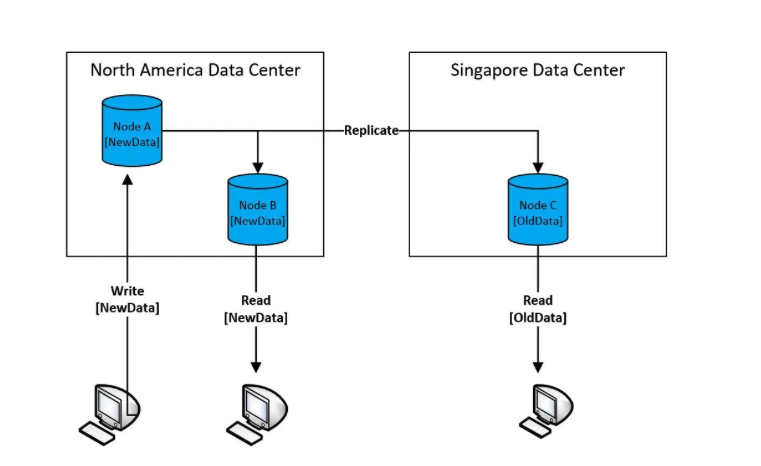
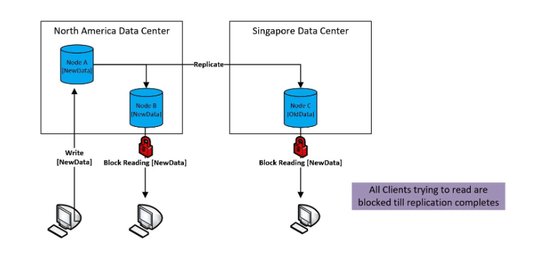
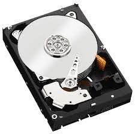
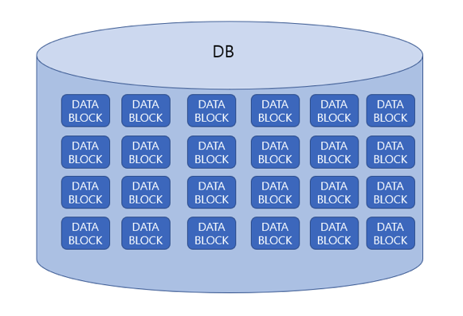
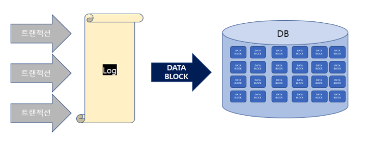

Durability는 시스템이 오류를 겪거나 충돌되더라도 데이터의 내구성을 보장한다. <br >
시스템 장애를 대비해 다음과 같은 3가지 테크닉을 사용할 수 있다.

- 레플리케이션
- 백업
- Write-Ahead Logging (WAL)

<br >

## 레플리케이션

---

분산 시스템에서 레플리케이션이란 여러 노드에 데이터가 복제된 것을 말한다. <br >
높은 가용성과 시스템 확장성의 높은 퍼포먼스를 확보하기 위해 레플리케이션을 사용한다.

- 시스템에 장애가 생기더라도 데이터가 잘 보존되어 있도록 한다. <br />카피한 데이터 중 데이터가 손실 (data loss) 되거나 손상(data corruption)되더라도 다른 카피를 사용해서 데이터 복원이 가능하다
- 복제를 통해 성능을 높이기도 한다 (ex: 네트워크 Latency 감소) <br > 카피를 여러 노드에 저장한 다음 가장 가까운 노드에 있는 데이터를 Read/Write 한다.

추가로 복제에서 중요한 또 다른 개념은 데이터간 동기화입니다.

### Eventual Consistency (결과적 일관성)

서버가 여러 대인 분산 시스템에서 데이터를 조회했을 때, 특정 서버는 변경된 데이터가 조회되고 일부는 변경되지 않은 상태로 조회될 수 있다.

그 때 데이터의 일관성을 위해서는 모든 서버에 결과값을 질의하고 N개 이상이 같은 값을 반환할 때 사용자에게 해당 값을 보여주는 형태의 일관성입니다.

이 때 사용되는 개념이 쿼럼(Quorum)과 구성임계값(Configurable Threshold)입니다.

- 쿼럼: 완료되었다고 여겨지는 읽기나 쓰기 작업에 반드시 응답해야 하는 서버의 수
- 구성임계값: 응답여부를 결정짓는 기준



<br >

### Strong Consistency

Eventual Consistency와 반대되는 개념으로, 관계형 데이터베이스가 대표적인 모델입니다. <br >

> 한문장으로 요약을 한다면 모든 노드에 새 데이터 복제가 완료될 때까지 대아토 앍기를 차단합니다.



<br >

## 백업

---

분산 시스템에서 백업은 데이터 안정성의 기본입니다.

- **중복성(Redundancy)**: 중복성은 다양한 요인으로 데이터 복사본이 손실되는 경우에도 데이터 복사본으로 복원해서 중요한 정보에 문제 없이 액세스할 수 있도록 보장합니다.
- **자동 백업**: 특정 주기로 데이터가 백업되는 기능입니다.
- **증분 백업**: 마지막 백업이 발생한 후 발생한 데이터의 변경 사항만 백업하는 테크닉입니다. <br > 백업해야 할 데이터양은 줄어들어서 백업 속도가 빠릅니다.

백업의 어려운 점 중 하나는 완전성(completeness)이 아닐까 싶습니다. <br>
특히 라지 스케일의 시스템과 방대한 양의 데이터 업데이트가 일어나는 시스템의 경우, 모든 최신 데이터를 일정 시간 (SLA) 내에 백업하는 게 어려울 수 있습니다. <br>
따라서 완전성(completeness)과 성능(performance)의 적절한 절충점이 필요할 수 있습니다.

<br>

## WAL (Write-Ahead Logging)

---

데이터를 먼저 로그에 기록한 후 데이터 스토어에 저장되는 방식입니다.
데이터 스토어에 커밋하는 중 데이터 손상이나 손실이 일어나는 경우, 로그에서 데이터를 복원할 수 있습니다.

WAL을 자세하기 설명하기 전에 디스크의 읽는 방식에 대해 알아야합니다.

DB에 저장되는 데이터는 어디에 저장될까요? 바로 **하드디스크**에 저장됩니다.



이 하드디스크에서 저장된 데이터를 읽어오려면 위의 사진에 있는 침 같이 생긴 헤더가 디스크에서 데이터를 읽어 우리가 볼 수 있도록 데이터를 가져다줍니다.

디스크를 읽는 방식은 두 가지가 있는데 바로 **Sequential Access**와 **Random Access**입니다.

<br >

### Sequential Access vs Random Access

먼저 두 가지 액세스 방식 중에 어떤 것이 더 빠를까요?

정답을 알기 전에 제가 생각했던 것은 Random Access가 더 빠를 것이라고 생각했습니다. <br >
`읽고자 하는 데이터가 디스크의 맨 마지막에 있다면` **Sequential하게 읽을 때 처음부터 끝까지 읽어야만 맨 마지막 데이터를 가져올 수 있으니까 Random하게 읽으면 확률적으로 더 빨리 가져올 수 있지 않을까?** 하는 생각 떄문이였습니다.

이론만 생각했을 때는 Random Access가 더 빠를 수도 있을 것 같지만 여기에는 하드디스크의 한계가 존재합니다. 바로 **디스크 헤드가 움직이는 속도**입니다.

헤드가 디스크의 달느 부분으로 읽으러 가는 것이 일단 시간을 많이 소모하기 때문에, <br >
Sequential Access는 Random Access보다 무려 **100배 정도 빠르다**고 합니다.

<br >

### DBMS는 데이터를 어떤 형태로 저장할까?



<br >

데이터베이스는 디스크에 데이터를 저장할 때 `블록 형태로 쪼개어 디스크에 쓰게 됩니다.` <br >
과연 데이터베이스는 우리가 아는 듯이 소위 commit을 하면 바로 데이터베이스 서버에 있는 디스크 데이터를 쓸까요? 예전의 DB는 그랬을 수도 있습니다만,

**최근 대부분의 DB는 메모리나 Sequential한 log에 적어 이를 보관하고 어느 정도 데이터가 차게 되면 BLOCK으로 만들어 하드 디스크에 쓰게 됩니다.** 바로 바로 DATA BLOCK을 만들지 않는 것이 키 포인트입니다.

<br >

그렇다면 왜 바로 DATA BLOCK을 만들지 않는 것일까요?

**바로 DB의 성능 때문입니다.** 디스크 IO가 너무 자주 발생하게 되면 DB의 성능이 굉장히 떨어지게 됩니다.

그렇다면 DBMS는 어떤 아키텍처로 이런 디스크 IO에서 오는 성능 저하를 방지하고 있을까요?

DBMS에 트랜잭션이 발생하게 되면 DBMS는 **이를 모두 Sequential한 Log 형태**로 보관하게 됩니다. <br >
왜 Sequential한 Log일까요? 바로 성능때문입니다. <br > Sequential Log 형태로 데이터를 나열하게 되면 특별한 연산이나 리소스 소모가 적고 디스크 헤더 움직임도 적기 때문에 빠르게 데이터를 적을 수 있습니다. <br >
그러다가 `Log가 적정 사이즈가 되면 이 데이터를 DATA BLOCK으로 만들어 DB에 Disk Write하게 됩니다.`



<br >

위 그림의 DB 앞에 Log가 바로 WAL입니다. 트랜잭션을 로그에 일단 기입해 기록을 남기고 특정 데이터가 쌓이면 이를 Flush해 DB의 Disk에 DATA BLOCK형태로 write하게 되는 것입니다. <br >
일단 Log에 적히게 되면 누가 조회를 해도 같은 데이터를 보여주는 **일관성(Consistency)**을 보장하게 되고 서버가 다운되어도 이미 Log에 기입되었기 때문에 **원자성(Atomicity)**도 보장할 수가 있는 것입니다.

---

참조

- [https://careerly.co.kr/@kimcoder](https://careerly.co.kr/@kimcoder)
- [https://velog.io/@soongjamm/Eventual-Consistency-란](https://velog.io/@soongjamm/Eventual-Consistency-란)
- [https://bourbonkk.tistory.com/86](https://bourbonkk.tistory.com/86)

```toc

```
