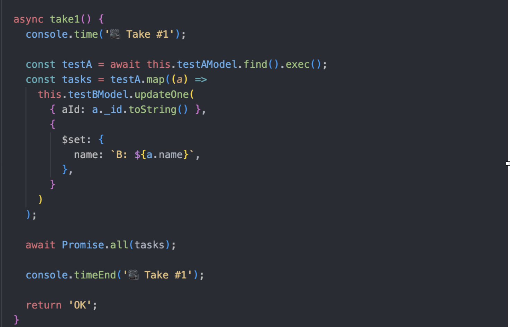

## 배치(Batch) 작업 어디까지 해봤니?

서비스를 구축하다보면 많은 양의 데이터를 일괄적으로 변경하거나 삭제 등의 처리를 해야할 순간이 옵니다.
이런 작업을 트래픽이 몰리는 시간 때에 하게 되면 서비스에 치명적일 수도 있고 잘못된다면 서비스 전체가 셧다운되는 악몽을 꾸게 될 수도 있습니다.

이때 해야하는 것이 **배치(Batch)** 작업입니다.

배치 작업은 데이터를 실시간으로 처리하는게 아니라, 일괄적으로 모아서 한번에 처리하는 작업을 의미합니다.
가령, 은행의 정산작업의 경우 배치 작업을 통해 일괄처리를 수행하게 되며 사용자에게 빠른 응답이 필요하지 않은 서비스에 적용할 수 있습니다.

이번 글에선 MongoDB + NodeJs를 활용한 배치 작업 테스트 결과를 공유하고자 합니다.

## 테스트 환경

### DB Spec

- 2core / 2GB
- mongodb WT 4.2.19

### DB Schema

#### TestA

- name: string

#### TestB

- name: string;
- aId: string

### Runtime

- NodeJs v14.19.0 / NestJs

## Take1 🎥



간단한 코드입니다.
TestA컬렉션에서 데이터를 가져와 TestB 컬렉션의 document 하나씩 update하는 코드입니다.

---

이것으로 MongoDB의 ReplicaSet에 대해서 알아보았습니다.

```toc

```
