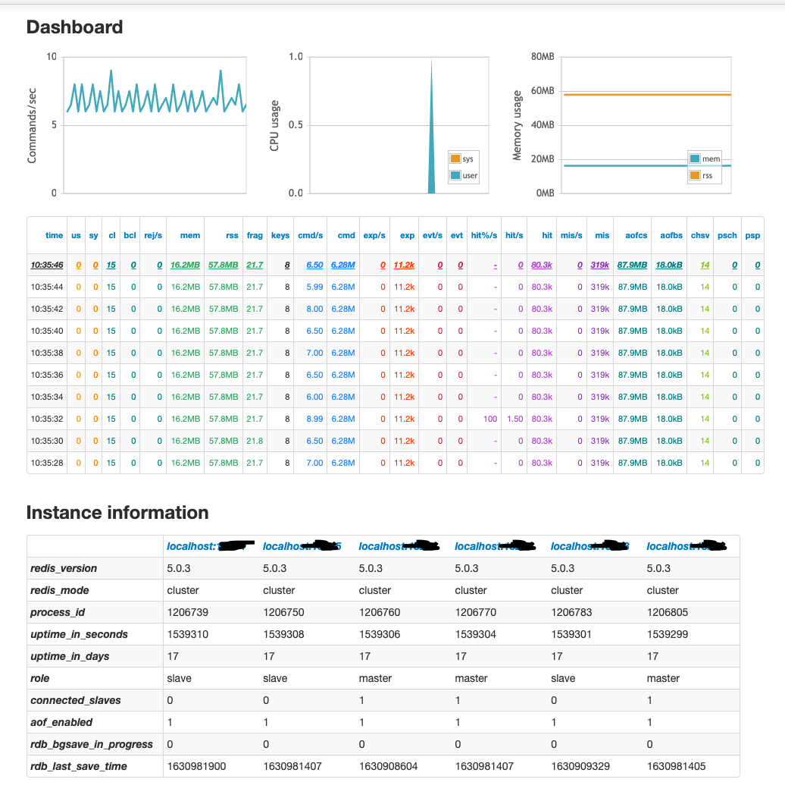
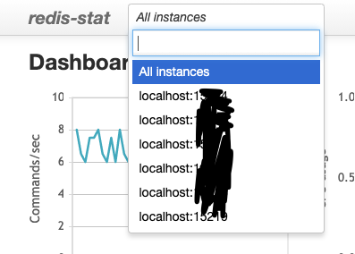
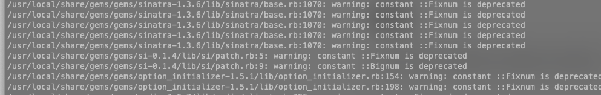

<br >

레디스를 쓰다 보면 각 서버가 CPU, MEM 등 서버 자원을 얼마나 쓰고 있는지 모니터링할 필요가 있습니다. <br>
그럴 때 간단하게 쓸 오픈 소스 라이브러리를 소가해드리겠습니다.

<br >

## Redis-Stat



Redis-stat로 띄운 대시보드입니다.

<br >



포트별로 정보를 나눠서 볼 수도 있습니다. 맘에 드신다면 아래 설치를 따라가주세요.

<br >

### Install

redis-stat은 ruby로 만들어져 있습니다. 따라서 관련 라이브러리들을 먼저 설치하셔야 합니다.

```bash
 yum install ruby-devel gcc make rpm-build rubygems
```

<br >

그런 뒤 gem을 이용하여 redis-stat을 설치합니다

```bash
 gem install redis-stat
```

<br >

### Usage

아래는 웹 서버를 띄우는 명령어 입니다.

```bash
 redis-stat 127.0.0.1:7000 127.0.0.1:7001 127.0.0.1:7002 --verbose --daemon --server=[웹 서버 포트번호]
```

위의 로컬 주소와 포트는 여러분의 것에 맞게 설정하시면 됩니다.

<br >

### 주의

위의 명렁어를 실행하면 아래와 같은 경고 로그가 찍힐 것입니다.



<br >

하지만 걱정하지 마세요.
https://stackoverflow.com/questions/41463999/warning-constant-fixnum-is-deprecated-when-generating-new-model

ruby 버전 때문에 경고가 뜨는 거지 명령어는 문제 없이 실행됩니다.

<br >

다른 명령어도 확인하고 싶으신 분들은 아래 주소를 확인해주세요.

https://github.com/junegunn/redis-stat

```toc

```
