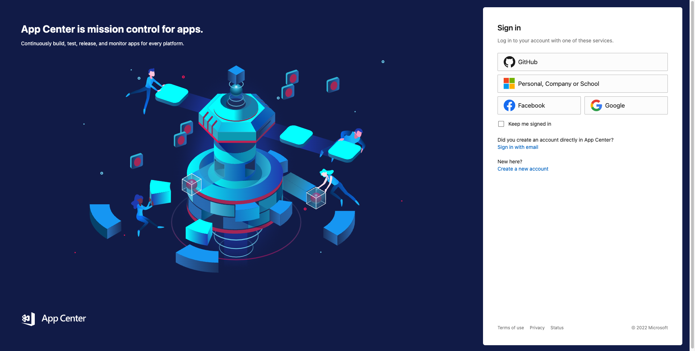
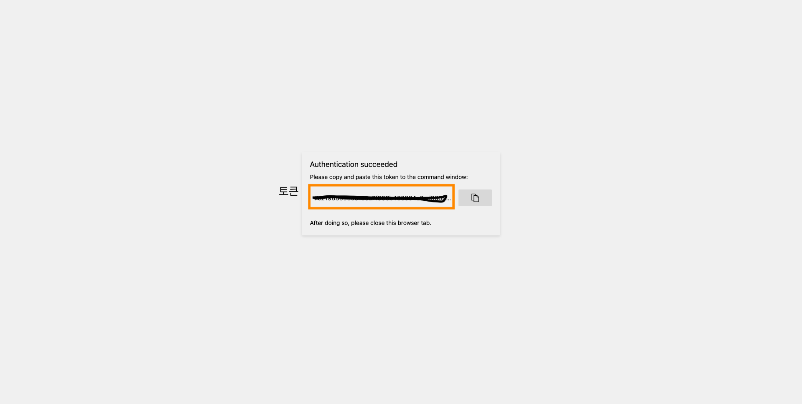
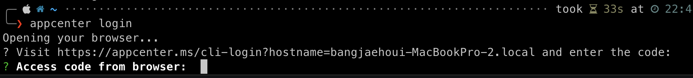

<br >

리액트 네이티브로 모바일 앱을 개발하다보면 항상 고민되는 것이 하나 있을 것입니다.

> **바로 테스트도 마치고 심사까지 통과했는데 오타가 있으면 어쩌지?**

그럴 때마다 오타를 수정해서 플레이스토어와 앱스토어에 재배포를 해야한다면 정말 이것만한 불편함은 없을 것입니다.

더 큰 문제는 이런 오류 코드가 있는 앱을 최대 2주 이상 방치할 수 밖에 없다는 것입니다.

오류가 발견됐을 때 그 오류를 수정하고 즉각적으로 수정 내용을 사용자들이 설치한 앱에 반영하게 하는 방법은 없을까요?

<br >

## CodePush?

CodePush는 마이크로소프트의 [Visual Studio App Center](https://appcenter.ms)에서 제공하는 서비스 중 하나로, 클라우드 기반의 앱 원격 업데이트 서비스입니다.

원리는 git과 유사합니다.

코드를 수정하고 우리가 터미널을 통해 수정한 코드를 commit하고 우리의 git 서버에 push하면 다른 개발자가 pull을 통해 내가 수정한 코드를 내려받을 수 있는 구조입니다.

CodePush도 우리가 터미널에서 배포 명령을 실행하면 앱을 bundle 파일로 변환하고 이를 CodePush 클라우드 서버에 저장합니다.

그럼 사용자가 기존에 설치한 앱을 실행하면 CodePush 서버에 업데이트 여부를 확인하고 수정된 내용을 병합하는 것입니다.

## CodePush 설정하기

### 1. AppCenter cli 설치

```bash
npm i -g appcenter-cli
```

<br >

### 2. appcenter cli login

```bash
appcenter login
```

<br >

명령어를 실행하면 아래와 같은 appcenter 홈페이지가 열립니다.



<br >

이후 로그인을 완료하면 아래 화면과 같이 로그인 토근값이 표기됩니다. (**잘 복사해두시길 바랍니다**)



<br >

이 토큰을 복사하고 커맨트 창에 나타나는 토큰 입력 부분에 복사한 토큰을 붙여넣습니다.



<br >

### 3. AppCenter 콘솔에 앱 등록

아래 명령어를 입력해 appcenter 콘솔에 앱을 등록합니다.

(**같은 프로젝트라도 IOS, AOS용 앱을 따로 등록해줘야 합니다!**)

```bash
appcenter apps create -d {AppName} -o {OS} -p {플랫폼 타입}

# ex)
# appcenter apps create -d test_app_ios -o iOS -p React-Native
# appcenter apps create -d test_app_aos -o Android -p React-Native

# 주의
# os와 플랫폼 선언 시 대소문자까지 위의 예시와 같아야 합니다
```

<br >

### 4. 등록된 앱의 키 등록

Staging 키와 Production 키를 등록할 수 있는데 예시에선 Production 키만 등록하겠습니다.

```bash
appcenter codepush deployment add -a {username}/{AppName} Production
```

<br >

**위의 명령어를 실행하면 하단에 각 앱과 모드에 맞는 키가 반환됩니다.**

만약 키 값을 잊어버렸다면 아래와 같은 명령어를 실행하면 됩니다.

```bash
appcenter codepush deployment list -a {username}/{AppName} -k
```

<br >

---

코드 푸시를 하기 위한 계정 생성과 Deployment Key 생성까지 해봤습니다.

더 자세한 설정은 아래 링크를 참고해주세요.

[코드 푸시](https://velog.io/@minwoo129/React-Native에서-CodePush-사용하기)

```toc

```
