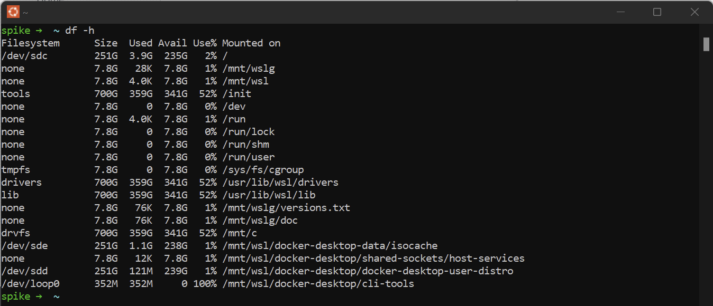
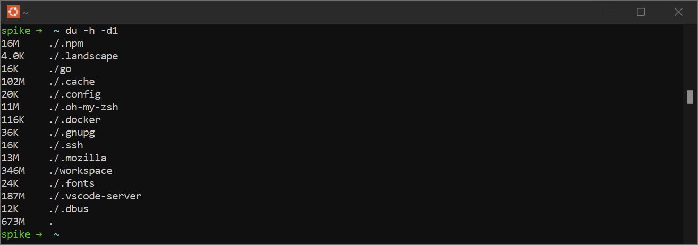
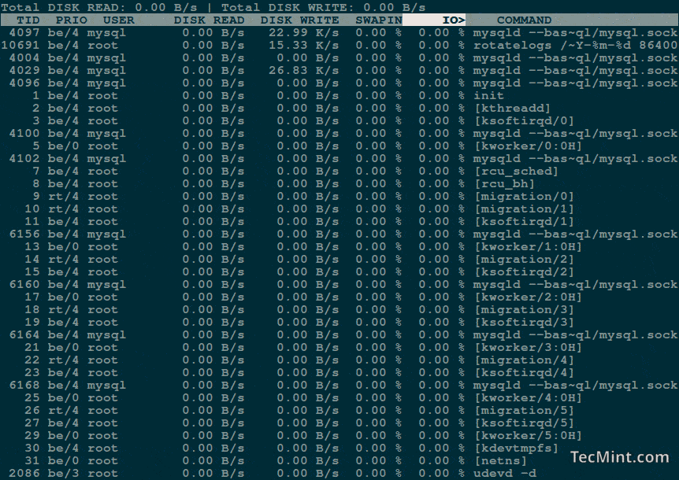
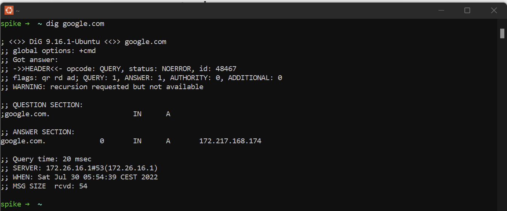
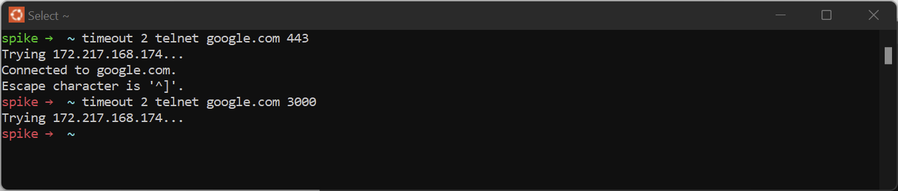
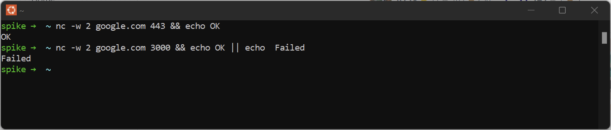
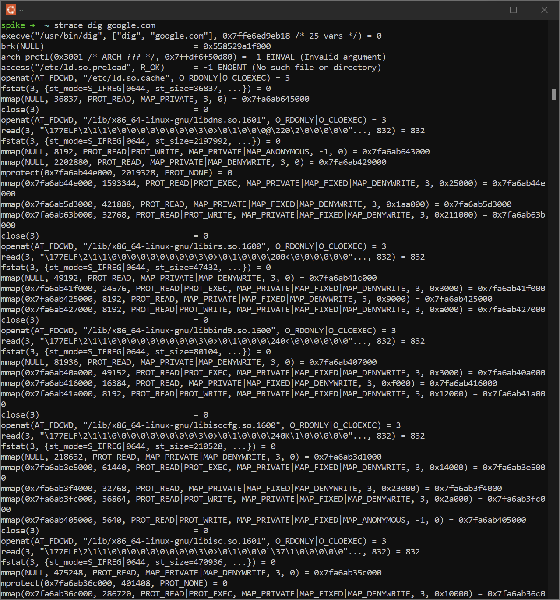
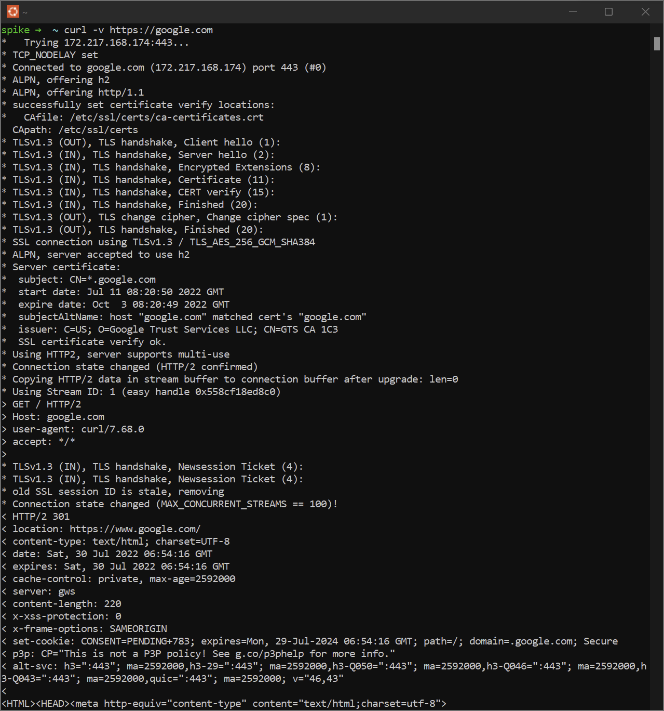

문제의 원인을 조사하는 것은 어려운 작업입니다.

하지만 유용한 리눅스 명령어들을 알고 있다면 문제의 원인을 찾는데 도움 받을 수 있습니다.

## Disk

### 디스크 용량 체크 `df`

> 파일 시스템의 디스크 사용량을 보여줍니다. <br >
> 즉, 마운트된 각 파티션의 총 크기, 사용된 공간 및 사용 가능한 공간을 표시합니다.



<br >

### 디스크 공간을 차지하는 항목 확인 `du`

> 파일별 공간 사용량을 추정합니다. <br >
> 아래 예제의 `-d1`은 현재 디렉토리만 확인하는 옵션입니다.



<br >

### 현재 I/O 모니터링 `iotop`

> 현재 쓰기, 일기를 가장 많이 수행하고 있는 프로세스를 확인합니다.



---

## Network

### tcpdump

> [CLI](https://en.wikipedia.org/wiki/Command-line_interface)에서 실행되는 데이터 네트워크 [패킷 분석](https://en.wikipedia.org/wiki/Packet_analyzer) 프로그램입니다. <br >
> 이를 통해 사용자는 네트워크를 통해 전송 또는 수신되는 [TCP/IP](https://en.wikipedia.org/wiki/Internet_protocol_suite) 및 기타 패킷을 확인할 수 있습니다. <br >
> BSD를 라이센스로 하며 무료 소프트웨어입니다.

문제의 원인이 클라이언트 측인지 서버 측인지 아니면 방화벽에 있는지 모르는 상황에서
`tcpdump`는 송수신된 각 패킷을 확인하여 문제점을 찾아낼 수 있습니다.

```bash
$ tcpdump 호스트 1.1.1.106:20:25.593207 IP 172.30.0.144.39270 >
one.one.one.one.domain:
12790+ A? google.com.
(28) 06:20:25.594510 IP one.one.one.one.domain > 172.30.0.144.39270:
12790 1/0/0 A 172.217.15.78 (44)
```

### dig

> DNS 조회용 유틸리티입니다.

두 가지 정도의 사용 방법이 있습니다.

첫째로 서버에서 주소를 찾을 수 있는지 확인하고, 둘째로 DNS가 설정되어 있는지 확인합니다.



### telnet / nc

> 포트가 열려 있는지 확인합니다.



<br >



---

## Application behavior

### strace

> 주어진 프로세스가 수행한 모든 시스템 호출과 프로세스가 수신한 신호를 캡처하고 기록합니다.



PID를 통해 실행 중인 특정 애플리케이션을 확인할 수도 있습니다.

```bash
strace -p 3569
```

### Check processes open files

현재 실행 중인 특정 프로세스를 확인하는 명령어는 `ps aux | grep APP_NAME` 입니다.
이를 통해 **PID** 를 가져올 수 있습니다.

그런 다음 `ls -l /proc/PID/fd` 를 통해 해당 프로세스의 파일 리스트를 확인할 수 있습니다.

### Visualize an API request

`curl`은 url 요청 시 발생되는 문제를 찾을 수 있게 도움을 줍니다. `-v`옵션을 추가하면 더 자세한 내용을 볼 수 있습니다.



---

## 결론

이 명령어들이 도움이 되기를 바랍니다.

```toc

```
