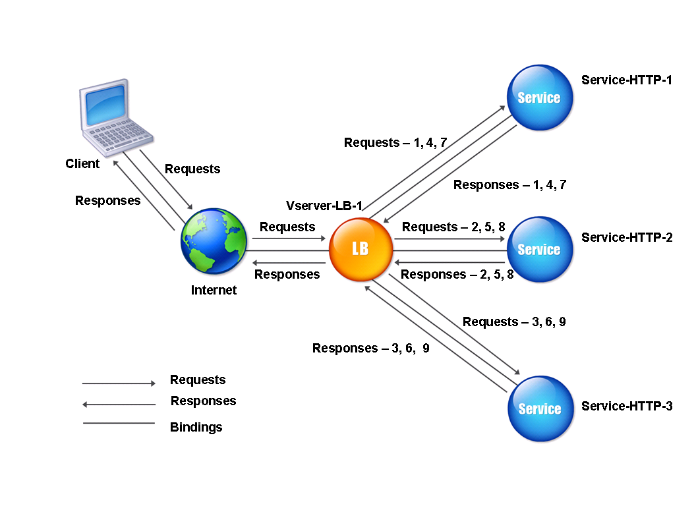
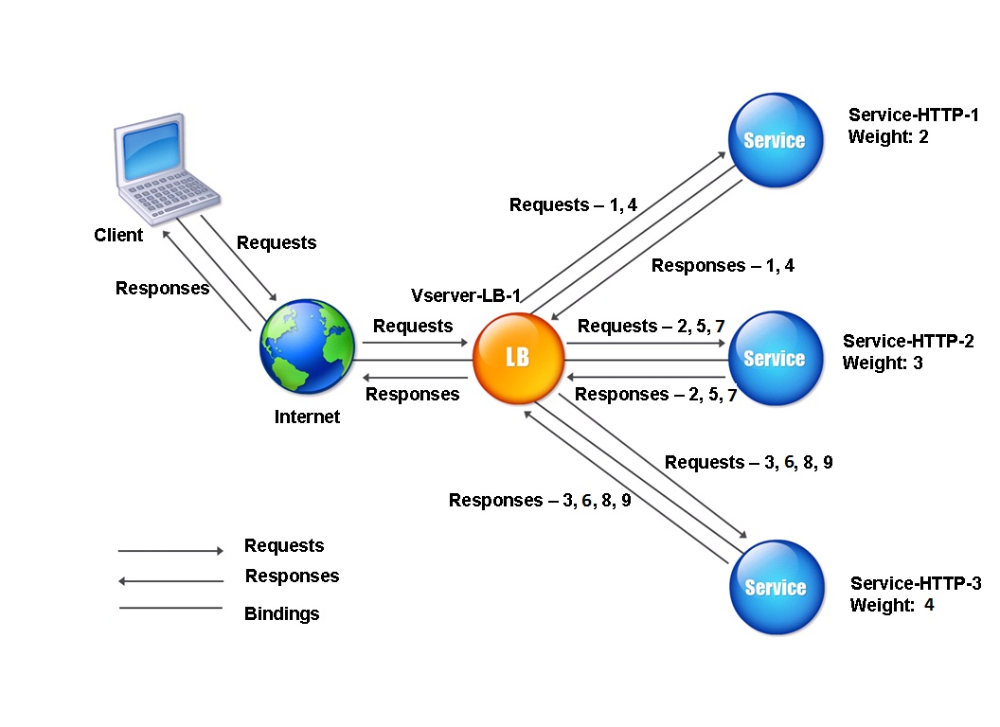
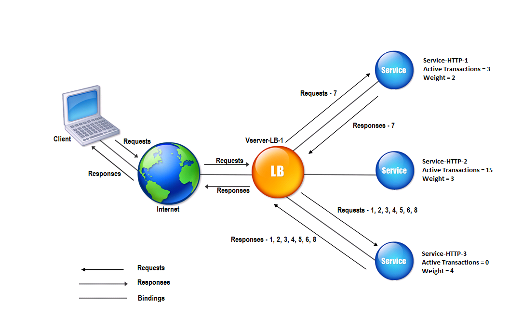

## 로드 밸런싱 알고리즘

### Round Robin

클라이언트 요청이 각 서버에 순차적으로 전송되는 알고리즘입니다.

> 라운드 로빈의 가장 큰 문제점은 요청이 전송된 서버가 모두 같은 스펙을 갖고 있다고 가정하는 것입니다. <br > 서버의 CPU, RAM 등과 같은 스펙에 따라 요청을 분포하지 않고 순차적으로 전달합니다. <br > 따라서 서버의 스펙이 비슷한 경우에 최적화되어 있지만, 그렇지 않은 경우는 단점이 많아서 다른 알고리즘이 대신 사용됩니다.



<br >

### Weighted Round Robin

각 서버에 대한 가중치를 지정한 다음 가중치가 큰 서버가 가중치가 적은 서버보다 더 많은 요청을 받게 되는 알고리즘입니다.



<br >

### Hash

요청의 IP나 URL에 해시 함수가 적용되고 적용 결과에 기초하여 관련 서버로 라우팅되는 알고리즘입니다.

> 일관된 해싱(COnsistent Hashing)은 아주 자주 언급되는 개념이며, 주로 재구성에 최적화되는 방식으로 서버 수에 독립적인 집합에 요청을 배포하는 방식입니다.


<br >

### Least Connections

동시 연결이 가장 적은 서버로 먼저 라우팅되는 알고리즘입니다.



<br >

### Least Response Time

응답 시간이 가장 빠른 서버로 요청이 전송되는 알고리즘입니다.


---

```toc

```
